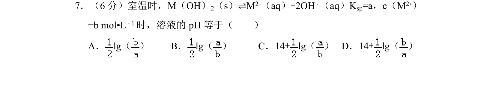
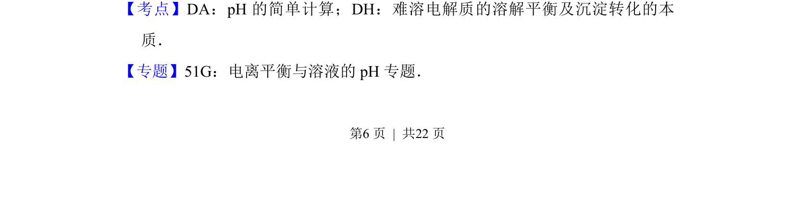
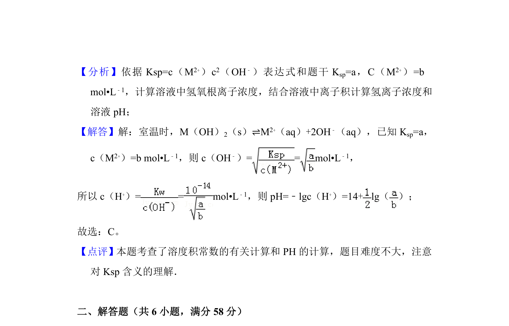

## 题面

## 摘要

该题考查难溶电解质溶解平衡与溶液pH的计算关系，需结合溶度积常数求算氢氧根浓度进而确定pH。

## 关联考点

- [[316-pH计算|pH计算]]
- [[762-溶度积|溶度积]]
- [[764-溶解平衡|溶解平衡]]

## 答案与解析

> 📄 原 PDF 第 6 页：`素材/真题/吉林/2008-2024·（吉林）化学高考真题/2013年高考化学试卷（新课标Ⅱ）（解析卷）.pdf`

<!-- 题干文本-start -->
## 题干文本
7．（6分）室温时，M（OH） 2（s）⇌M2+（aq）+2OH﹣（aq）Ksp=a，c（M2+）
=b mol•L﹣1时，溶液的pH等于（　　）
A．lg（ ）B．lg（ ）C．14+lg（ ）D．14+lg（ ）
<!-- 题干文本-end -->

<!-- 解析文本-start -->
## 解析文本
【考点】DA：pH的简单计算；DH：难溶电解质的溶解平衡及沉淀转化的本
质．菁优网版权所有
【专题】51G：电离平衡与溶液的pH专题．
<!-- 解析文本-end -->
