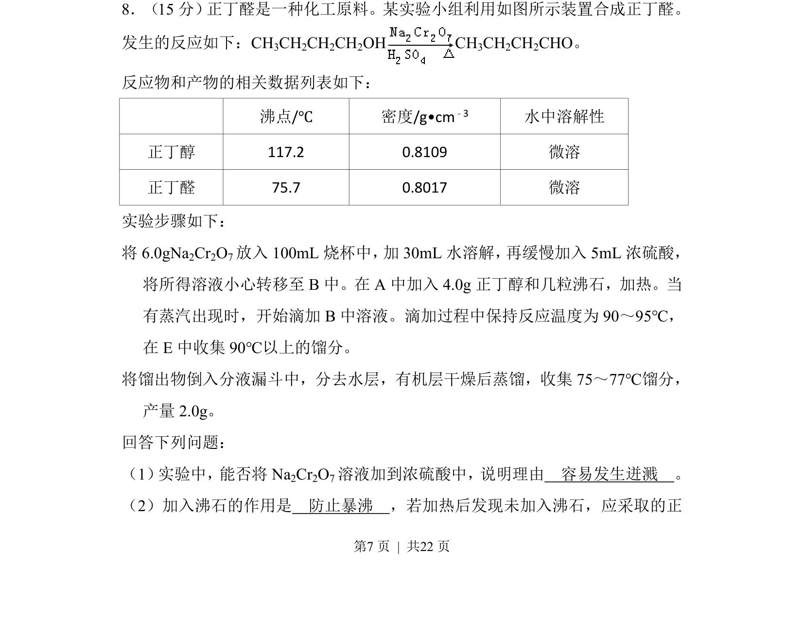
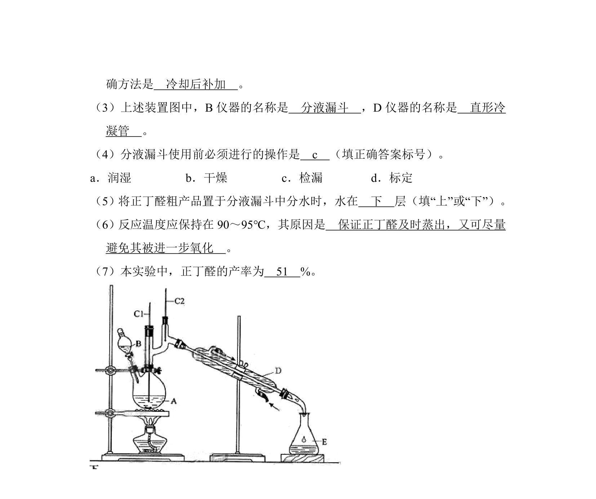
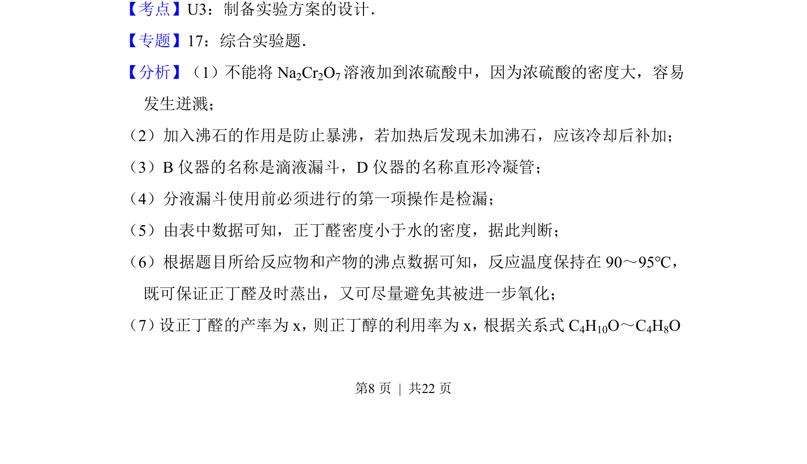
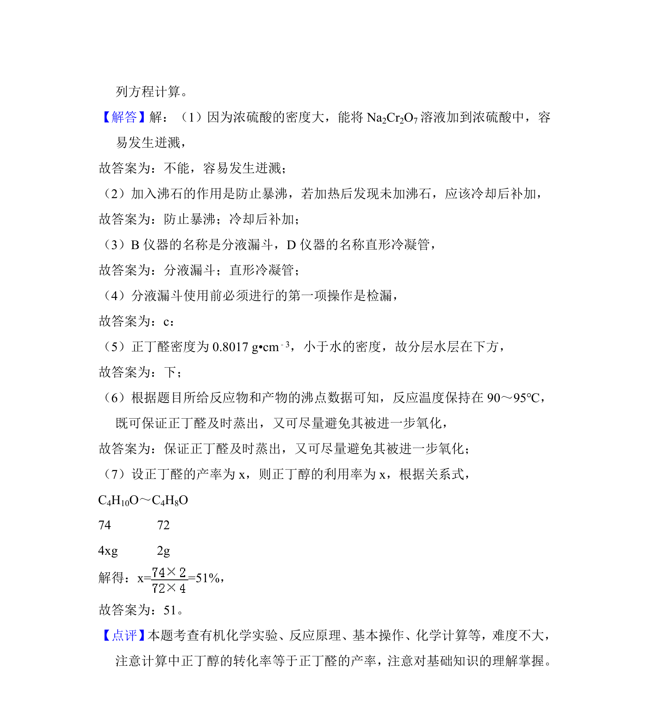

## 题面

## 摘要

合成了正丁醛实验，考查浓硫酸稀释操作、防暴沸措施及产物分离提纯。

## 关联考点

- [[754-浓硫酸稀释操作|浓硫酸稀释操作]]
- [[576-防暴沸|防暴沸]]
- [[079-蒸馏|蒸馏]]
- [[606-分液|分液]]

## 答案与解析

> 📄 原 PDF 第 7 页：`素材/真题/吉林/2008-2024·（吉林）化学高考真题/2013年高考化学试卷（新课标Ⅱ）（解析卷）.pdf`

<!-- 题干文本-start -->
## 题干文本
8．（15分） 正丁醛是一种化工原料。某实验小组利用如图所示装置合成正丁醛。
发生的反应如下：CH3CH2CH2CH2OH CH 3CH2CH2CHO。
反应物和产物的相关数据列表如下：
沸点/℃ 密度/g•cm﹣3 水中溶解性
正丁醇 117.2 0.8109 微溶
正丁醛 75.7 0.8017 微溶
实验步骤如下：
将6.0gNa 2Cr2O7放入100mL烧杯中， 加30mL水溶解， 再缓慢加入5mL浓硫酸，
将所得溶液小心转移至B中。在A中加入4.0g正丁醇和几粒沸石，加热。当
有蒸汽出现时，开始滴加B中溶液。滴加过程中保持反应温度为90～95℃，
在E中收集90℃以上的馏分。
将馏出物倒入分液漏斗中，分去水层，有机层干燥后蒸馏，收集75～77℃馏分，
产量2.0g。
回答下列问题：
（1） 实验中，能否将Na2Cr2O7溶液加到浓硫酸中，说明理由　容易发生迸溅　。
（2）加入沸石的作用是　防止暴沸　，若加热后发现未加入沸石，应采取的正
<!-- 题干文本-end -->

<!-- 解析文本-start -->
## 解析文本

<!-- 解析文本-end -->
