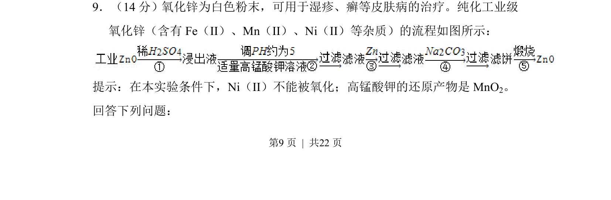
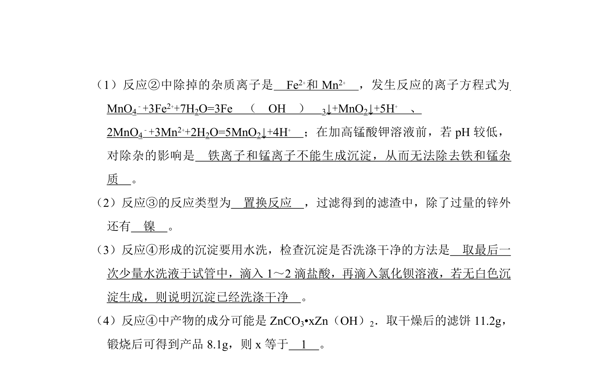
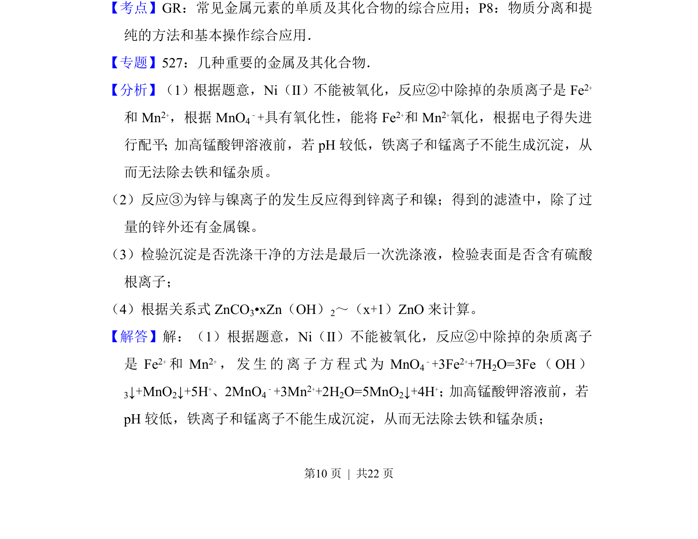
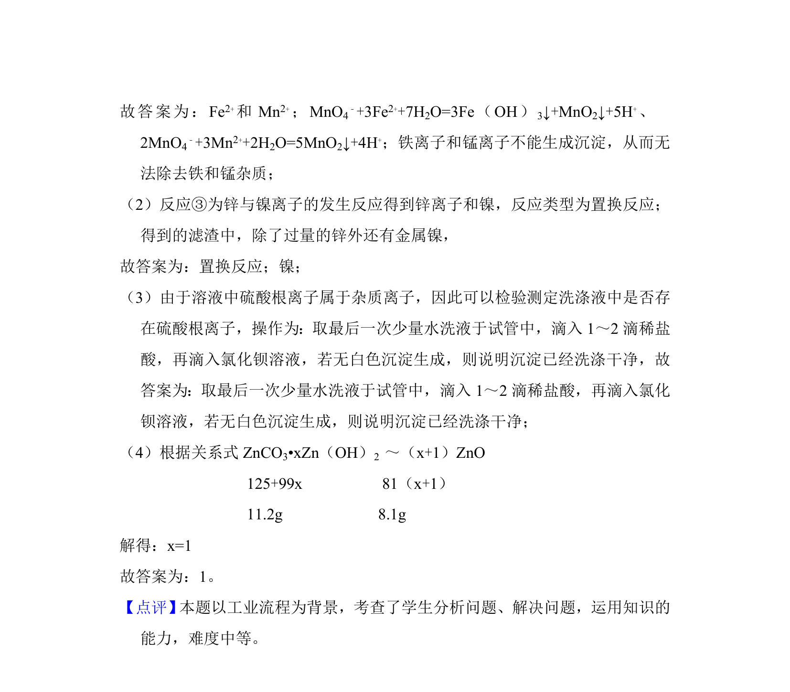

## 题面

## 摘要

工业流程题，考查利用高锰酸钾氧化除杂及沉淀分离的原理与操作。

## 关联考点

- [[162-氧化还原反应|氧化还原反应]]
- [[812-离子除杂|离子除杂]]
- [[743-沉淀pH控制|沉淀pH控制]]
- [[550-流程分析|流程分析]]

## 答案与解析

> 📄 原 PDF 第 9 页：`素材/真题/吉林/2008-2024·（吉林）化学高考真题/2013年高考化学试卷（新课标Ⅱ）（解析卷）.pdf`
