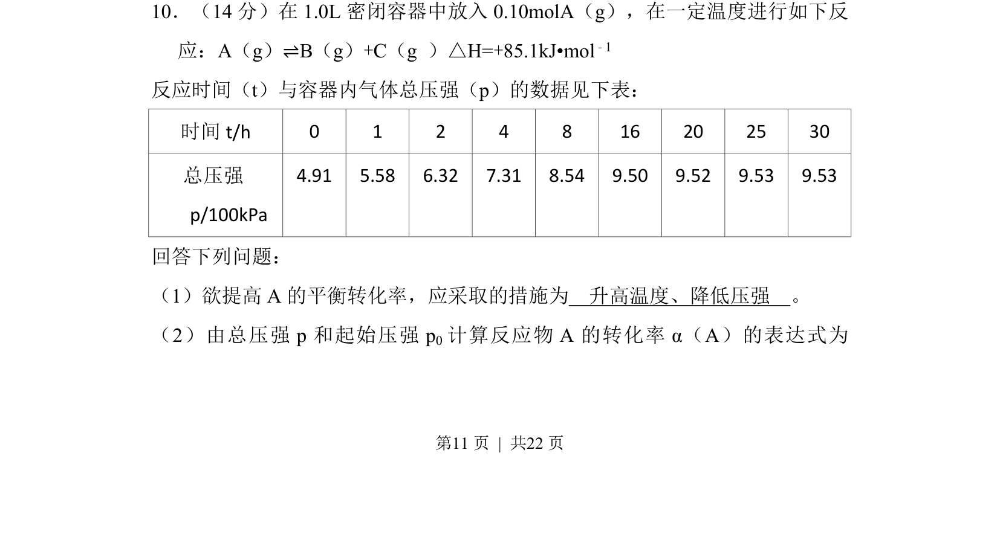

## 题面

## 摘要

化学平衡计算题，涉及转化率表达式推导及平衡移动影响因素分析。

## 关联考点

- [[284-化学平衡|化学平衡]]
- [[356-转化率|转化率]]
- [[282-勒夏特列原理|勒夏特列原理]]
- [[压强计算]]

## 答案与解析

> 📄 原 PDF 第 11 页：`素材/真题/吉林/2008-2024·（吉林）化学高考真题/2013年高考化学试卷（新课标Ⅱ）（解析卷）.pdf`
