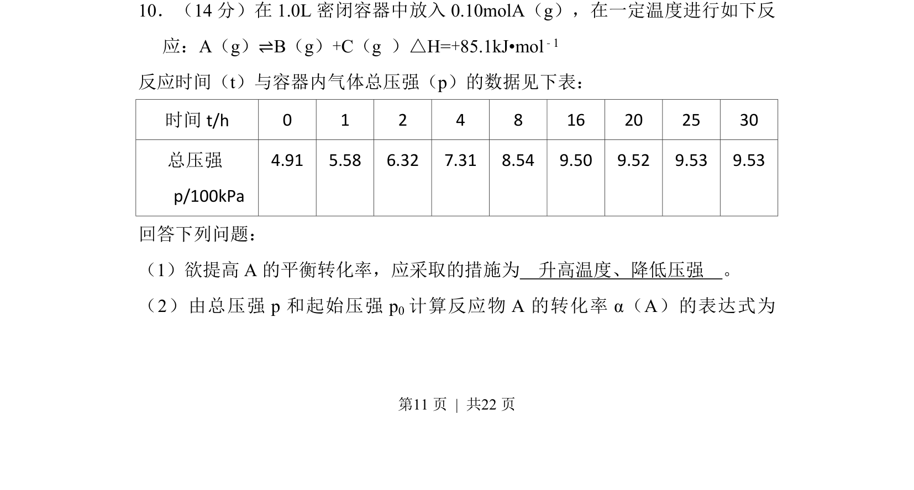
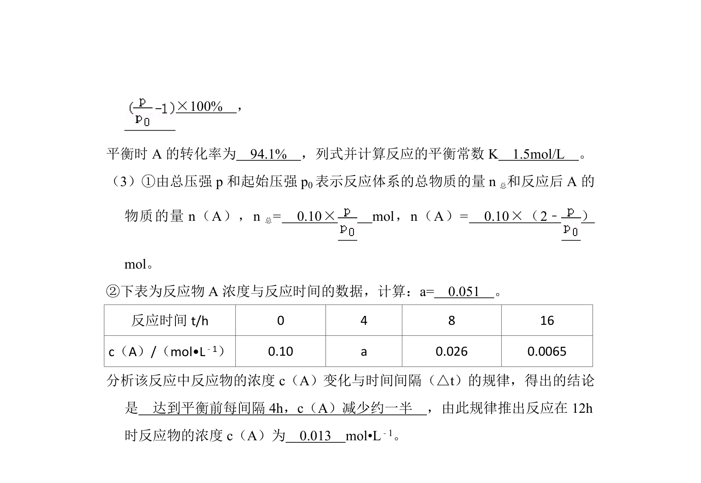
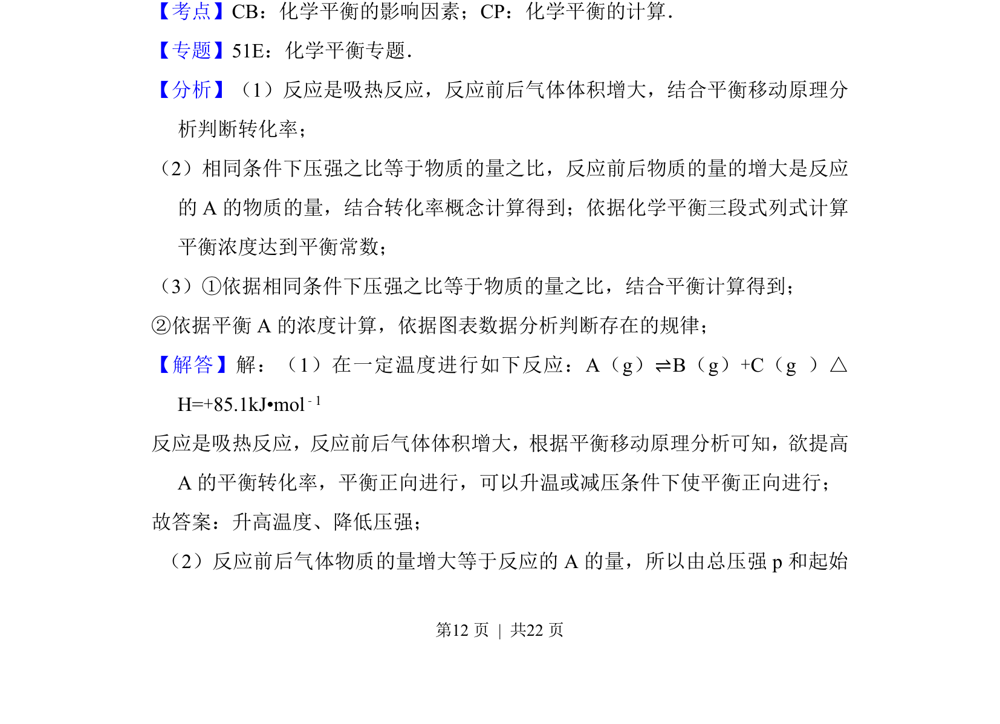
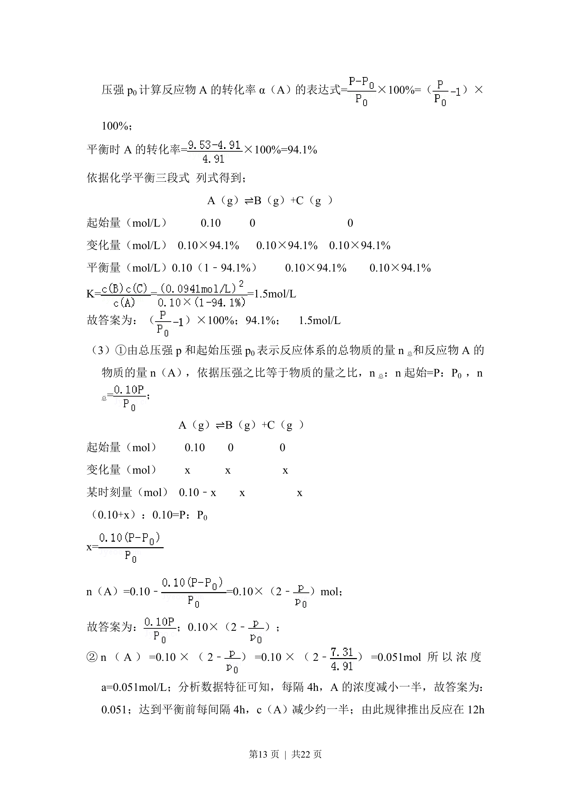
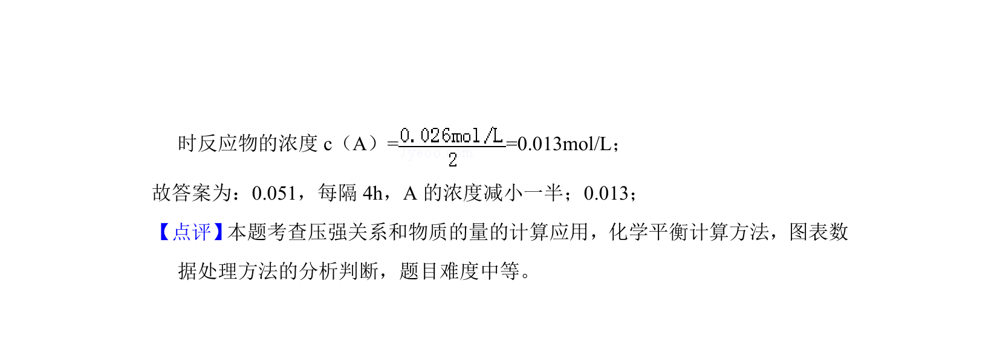

## 题面

## 摘要

化学平衡计算题，涉及转化率表达式推导及平衡移动影响因素分析。

## 关联考点

- [[284-化学平衡|化学平衡]]
- [[356-转化率|转化率]]
- [[282-勒夏特列原理|勒夏特列原理]]
- [[550-压强计算|压强计算]]

## 答案与解析

> 📄 原 PDF 第 11 页：`素材/真题/吉林/2008-2024·（吉林）化学高考真题/2013年高考化学试卷（新课标Ⅱ）（解析卷）.pdf`

<!-- 题干文本-start -->
## 题干文本
10．（14分）在1.0L密闭容器中放入0.10molA（g），在一定温度进行如下反
应：A（g）⇌B（g）+C（g ）△H=+85.1kJ•mol ﹣1
反应时间（t）与容器内气体总压强（p）的数据见下表：
时间t/h 0 1 2 4 8 16 20 25 30
总压强
p/100kPa
4.91 5.58 6.32 7.31 8.54 9.50 9.52 9.53 9.53
回答下列问题：
（1）欲提高A的平衡转化率，应采取的措施为　升高温度、降低压强　。
（2）由总压强p和起始压强p 0计算反应物A的转化率α（A）的表达式为
<!-- 题干文本-end -->

<!-- 解析文本-start -->
## 解析文本

<!-- 解析文本-end -->
