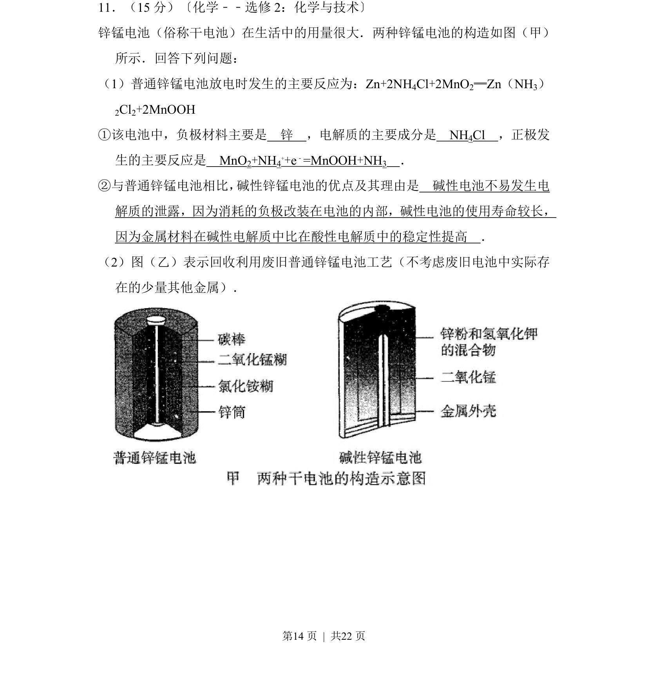
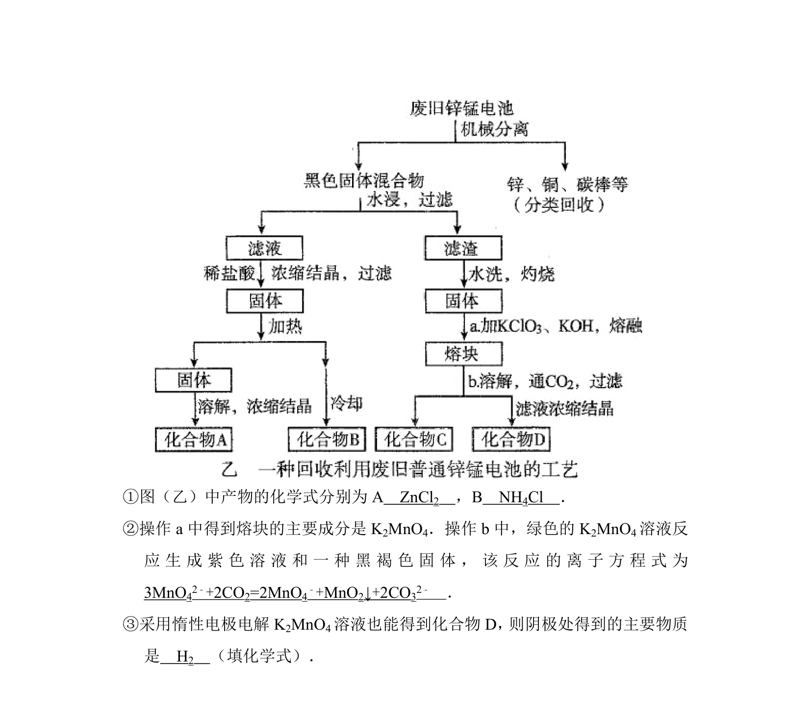
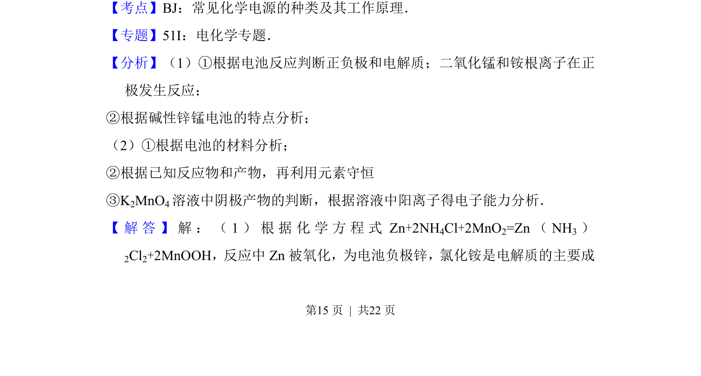
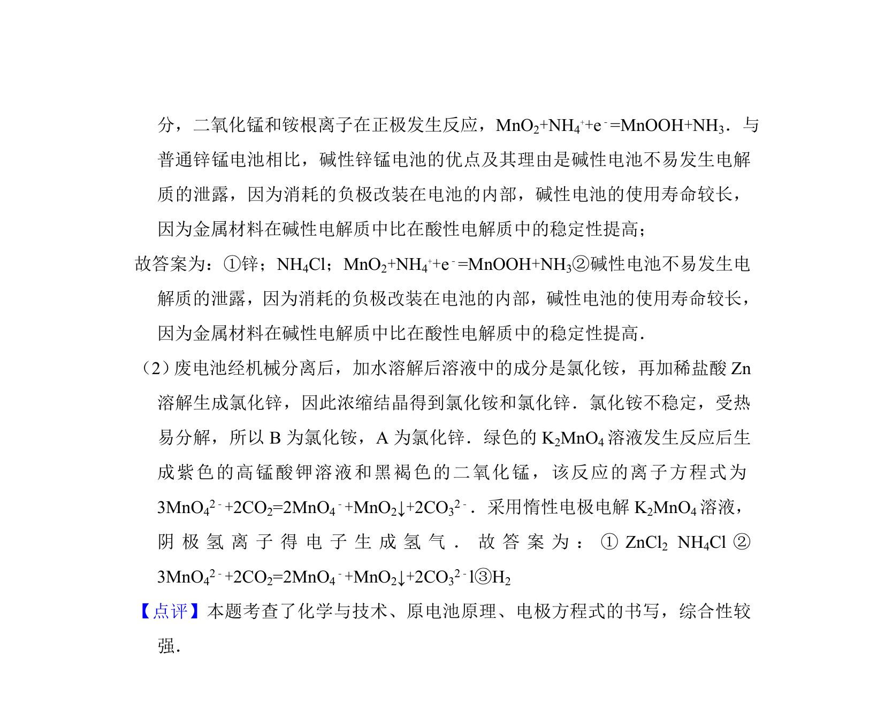

## 题面

## 摘要

原电池原理与废旧电池回收工艺，涉及电极反应书写及碱性电池优缺点比较。

## 关联考点

- [[287-原电池|原电池]]
- [[794-电极反应|电极反应]]
- [[167-电解质|电解质]]
- [[857-金属回收|金属回收]]

## 答案与解析

> 📄 原 PDF 第 14 页：`素材/真题/吉林/2008-2024·（吉林）化学高考真题/2013年高考化学试卷（新课标Ⅱ）（解析卷）.pdf`
