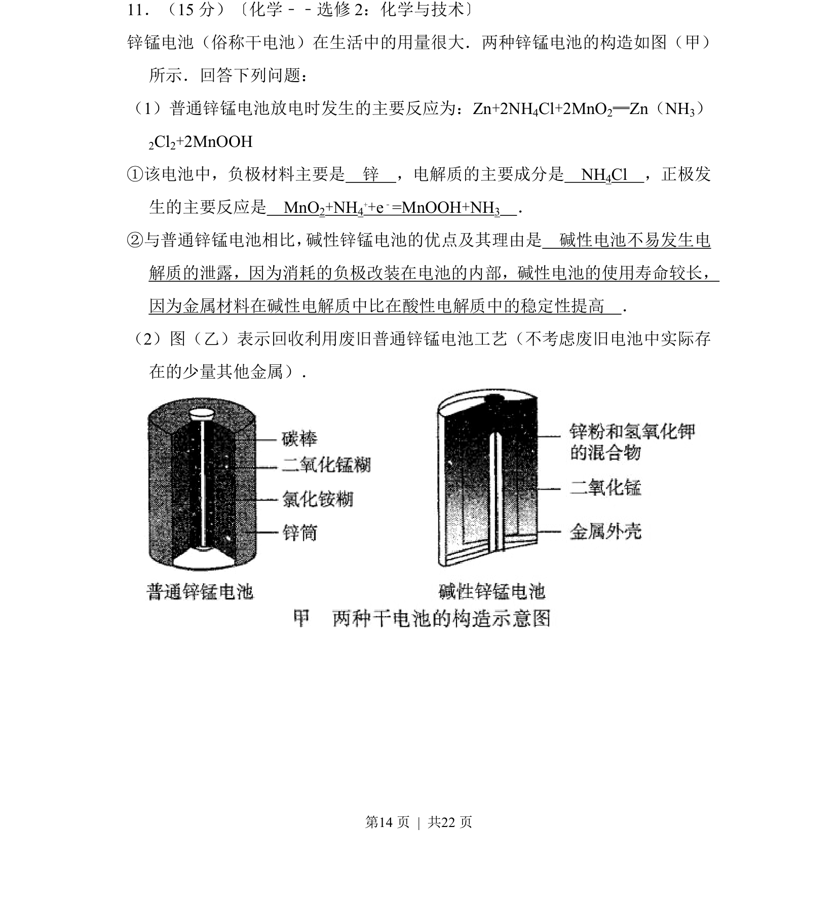
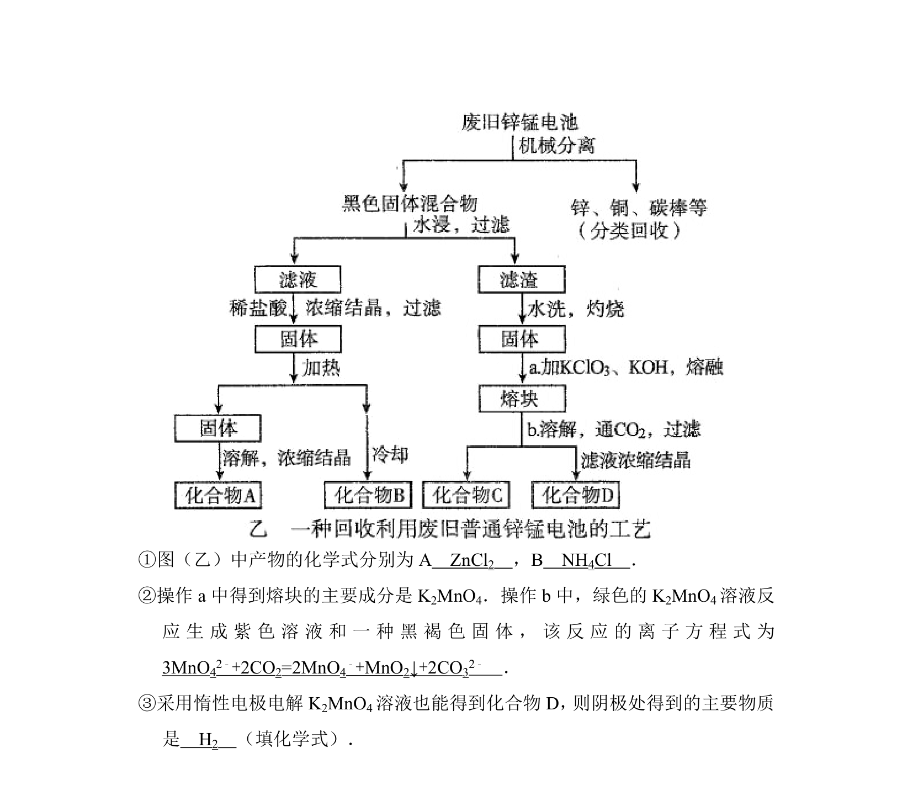
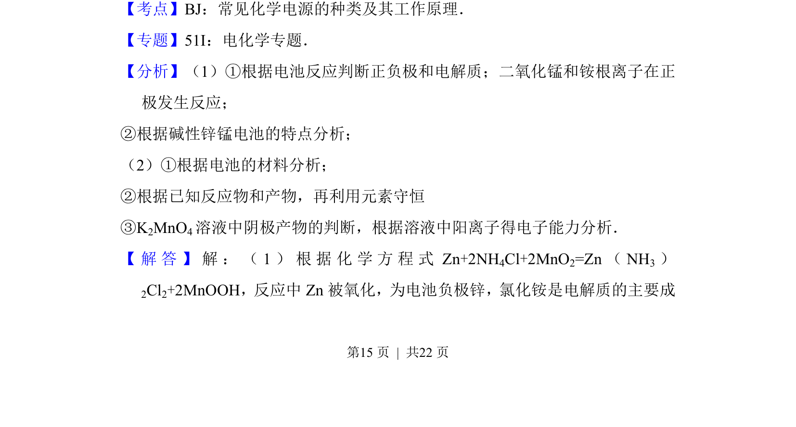
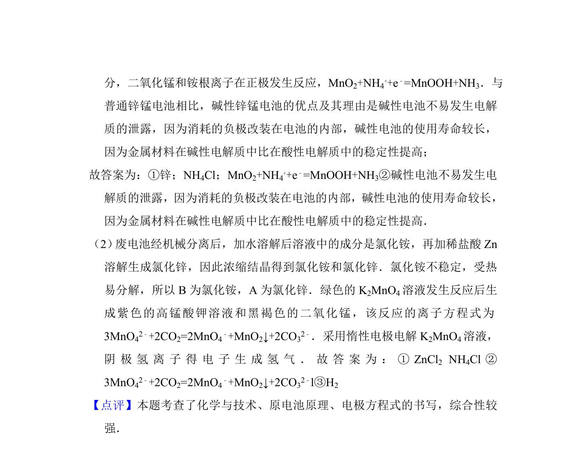

## 题面

## 摘要

原电池原理与废旧电池回收工艺，涉及电极反应书写及碱性电池优缺点比较。

## 关联考点

- [[287-原电池|原电池]]
- [[793-电极反应|电极反应]]
- [[167-电解质|电解质]]
- [[856-金属回收|金属回收]]

## 答案与解析

> 📄 原 PDF 第 14 页：`素材/真题/吉林/2008-2024·（吉林）化学高考真题/2013年高考化学试卷（新课标Ⅱ）（解析卷）.pdf`

<!-- 题干文本-start -->
## 题干文本
11．（15分）〔化学﹣﹣选修2：化学与技术〕
锌锰电池（俗称干电池）在生活中的用量很大．两种锌锰电池的构造如图（甲）
所示．回答下列问题：
（1）普通锌锰电池放电时发生的主要反应为：Zn+2NH4Cl+2MnO2═Zn（NH3）
2Cl2+2MnOOH
①该电池中，负极材料主要是　锌　，电解质的主要成分是　NH4Cl　，正极发
生的主要反应是　MnO2+NH4
++e﹣=MnOOH+NH3　．
②与普通锌锰电池相比， 碱性锌锰电池的优点及其理由是　碱性电池不易发生电
解质的泄露，因为消耗的负极改装在电池的内部，碱性电池的使用寿命较长，
因为金属材料在碱性电解质中比在酸性电解质中的稳定性提高　．
（2）图（乙）表示回收利用废旧普通锌锰电池工艺（不考虑废旧电池中实际存
在的少量其他金属）．
<!-- 题干文本-end -->

<!-- 解析文本-start -->
## 解析文本

<!-- 解析文本-end -->
