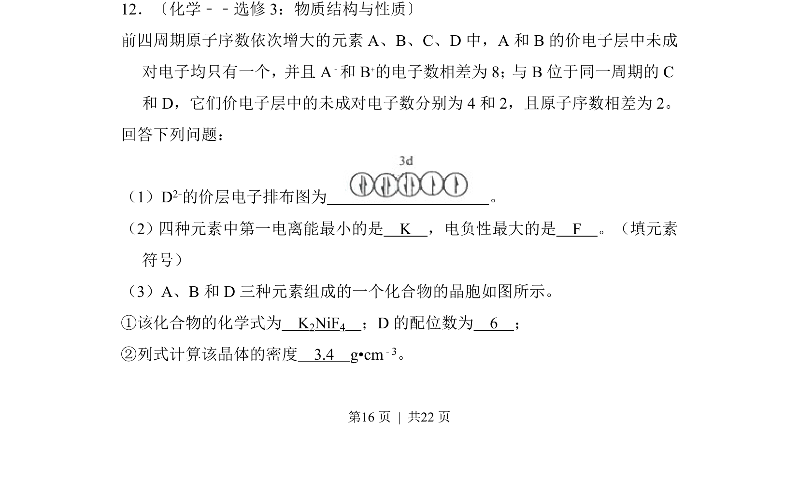
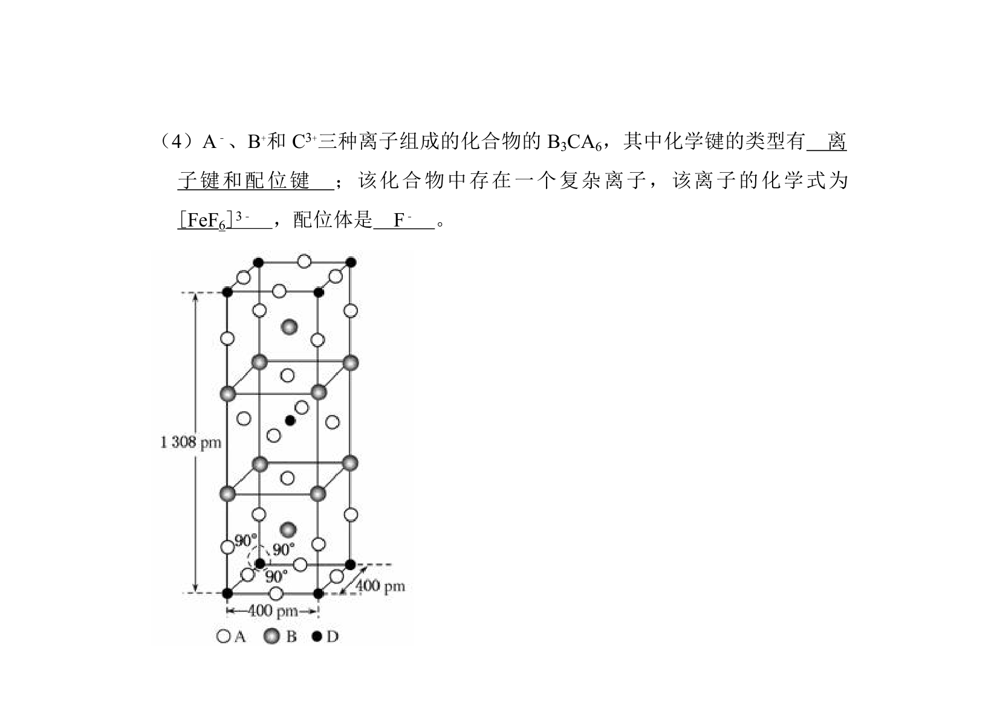
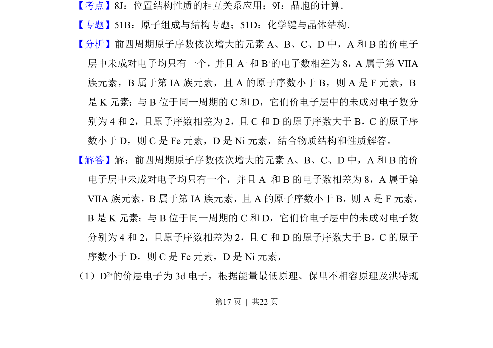
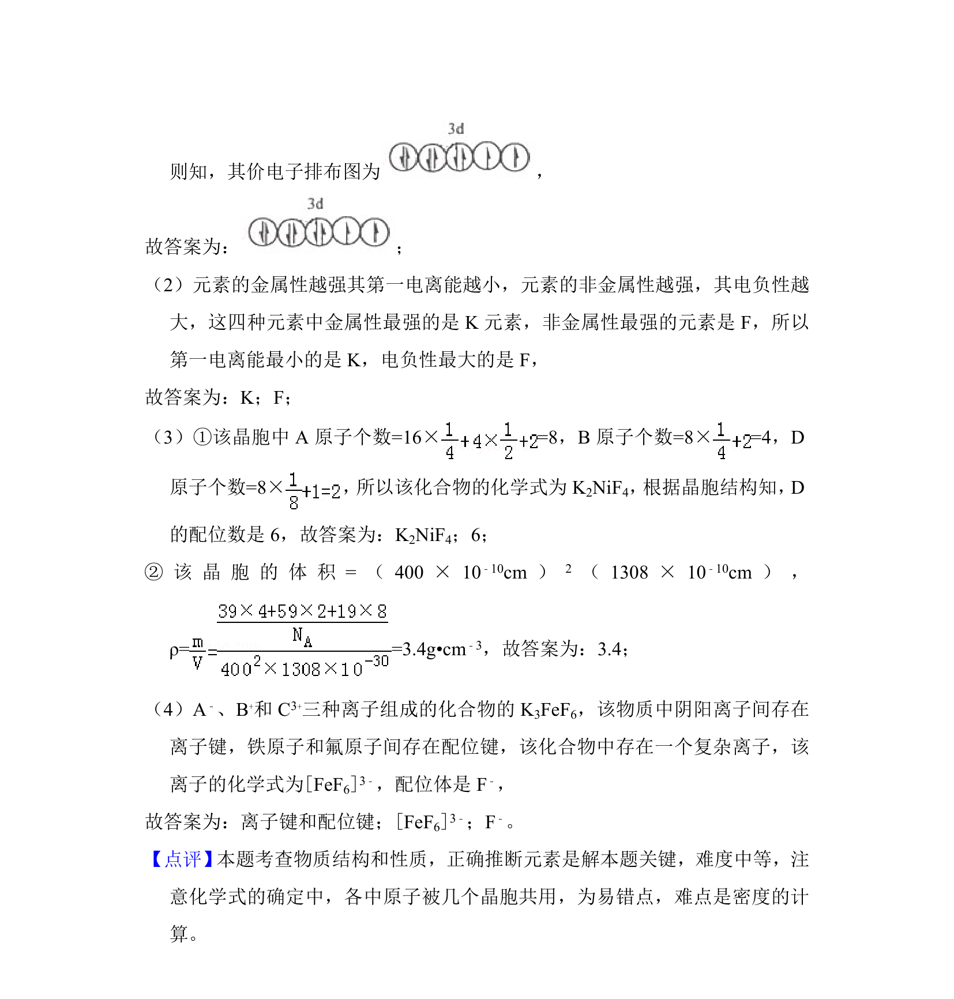

## 题面

## 摘要

通过未成对电子数和电子层结构推断前四周期元素，考查电离能、电负性比较及晶胞计算

## 关联考点

- [[638-原子结构与元素推断|原子结构与元素推断]]
- [[393-第一电离能|第一电离能]]
- [[391-电负性|电负性]]
- [[698-晶体密度计算|晶体密度计算]]

## 答案与解析

> 📄 原 PDF 第 16 页：`素材/真题/吉林/2008-2024·（吉林）化学高考真题/2013年高考化学试卷（新课标Ⅱ）（解析卷）.pdf`
