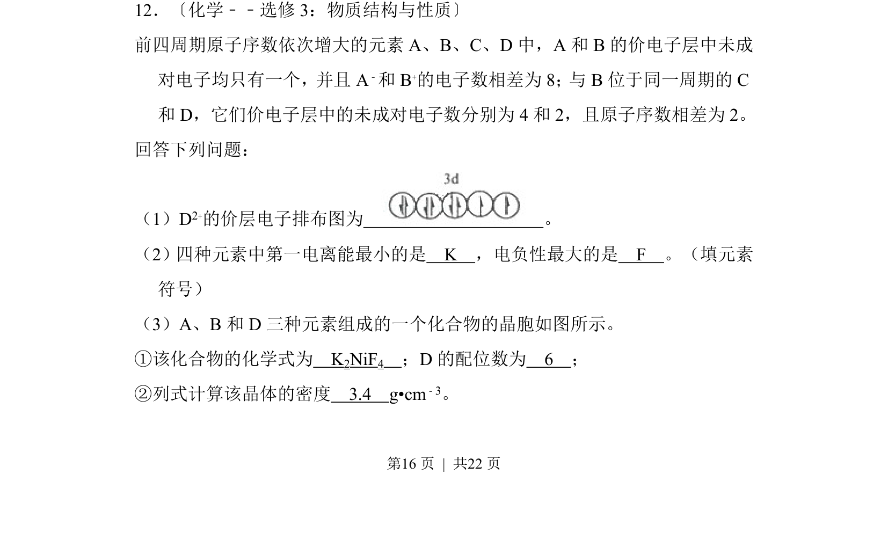
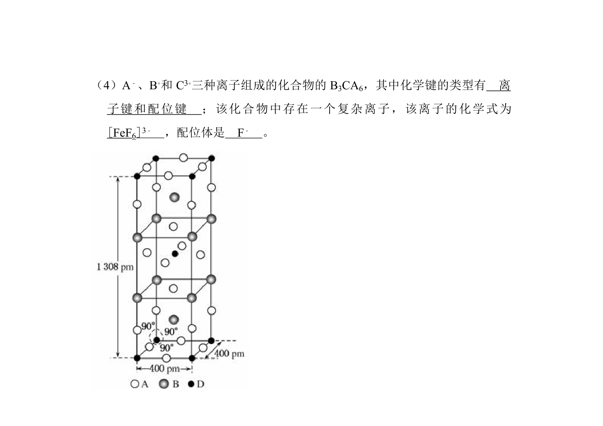
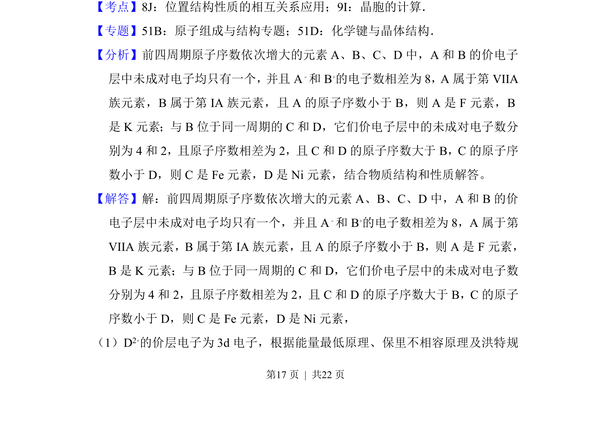
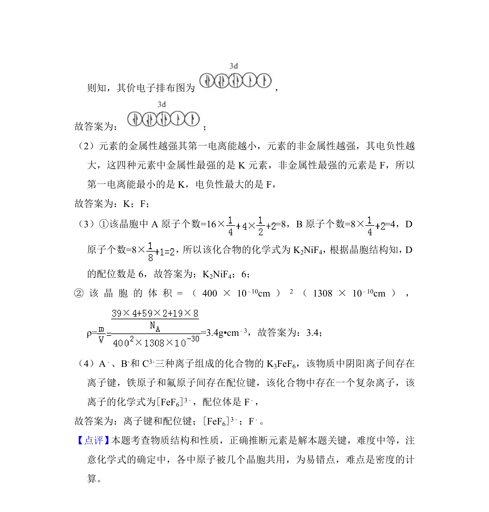

## 题面

## 摘要

通过未成对电子数和电子层结构推断前四周期元素，考查电离能、电负性比较及晶胞计算

## 关联考点

- [[638-原子结构与元素推断|原子结构与元素推断]]
- [[393-第一电离能|第一电离能]]
- [[391-电负性|电负性]]
- [[698-晶体密度计算|晶体密度计算]]

## 答案与解析

> 📄 原 PDF 第 16 页：`素材/真题/吉林/2008-2024·（吉林）化学高考真题/2013年高考化学试卷（新课标Ⅱ）（解析卷）.pdf`

<!-- 题干文本-start -->
## 题干文本
12．〔化学﹣﹣选修3：物质结构与性质〕
前四周期原子序数依次增大的元素A、B、C、D中，A和B的价电子层中未成
对电子均只有一个，并且A﹣和B +的电子数相差为8； 与B位于同一周期的C
和D，它们价电子层中的未成对电子数分别为4和2，且原子序数相差为2。
回答下列问题：
（1）D2+的价层电子排布图为　 　。
（2）四种元素中第一电离能最小的是　K　，电负性最大的是　F　。（填元素
符号）
（3）A、B和D三种元素组成的一个化合物的晶胞如图所示。
①该化合物的化学式为　K2NiF4　；D的配位数为　6　；
②列式计算该晶体的密度　3.4　g•cm﹣3。
<!-- 题干文本-end -->

<!-- 解析文本-start -->
## 解析文本

<!-- 解析文本-end -->
