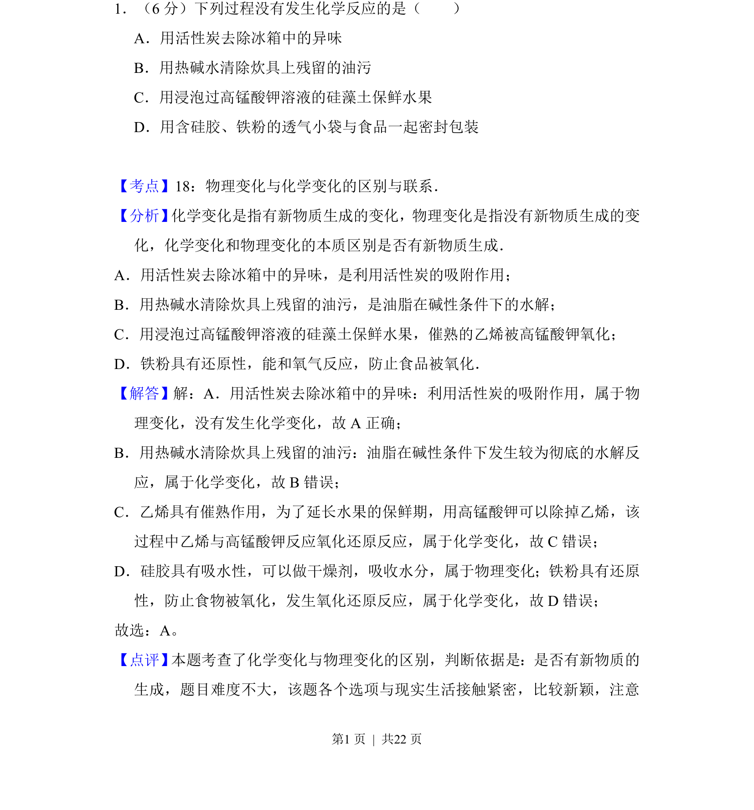
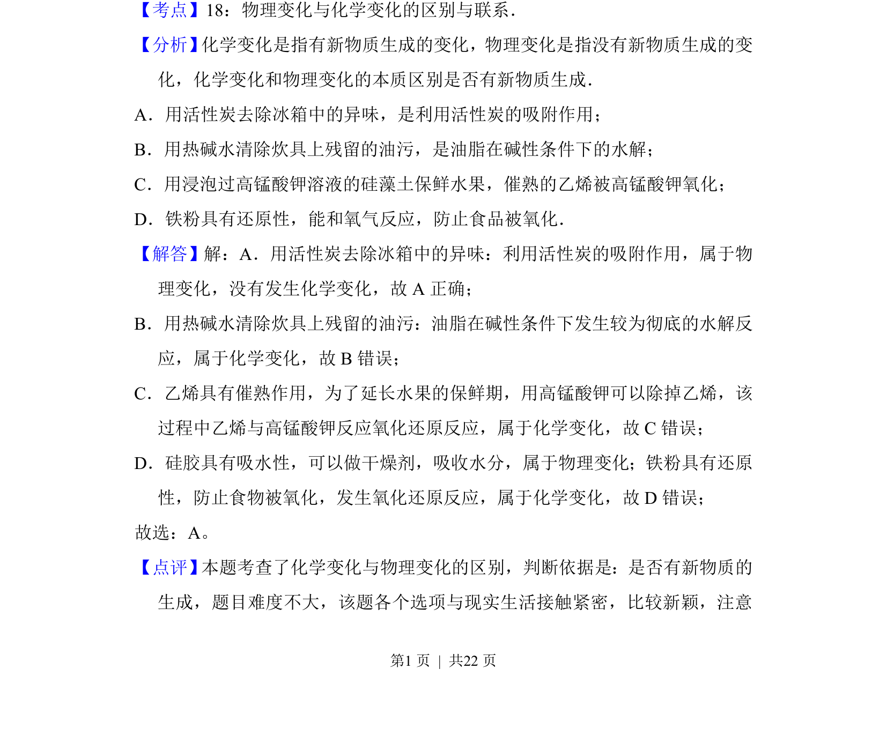

## 题面

## 摘要

本题通过生活实例考查物理变化与化学变化的本质区别，判断是否有新物质生成。

## 关联考点

- [[004-物理变化|物理变化]]
- [[001-化学变化|化学变化]]
- [[526-化学反应判断|化学反应判断]]

## 答案与解析

> 📄 原 PDF 第 1 页：`素材/真题/吉林/2008-2024·（吉林）化学高考真题/2014年高考化学试卷（新课标Ⅱ）（解析卷）.pdf`
