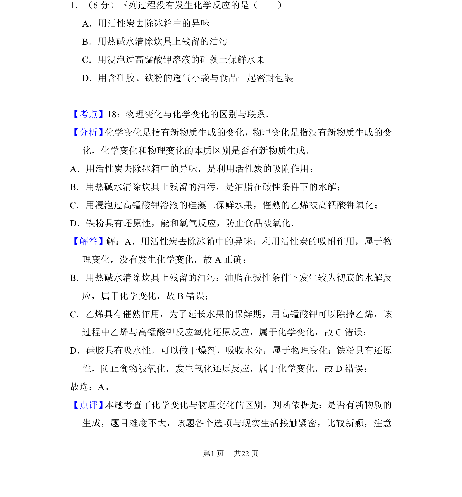
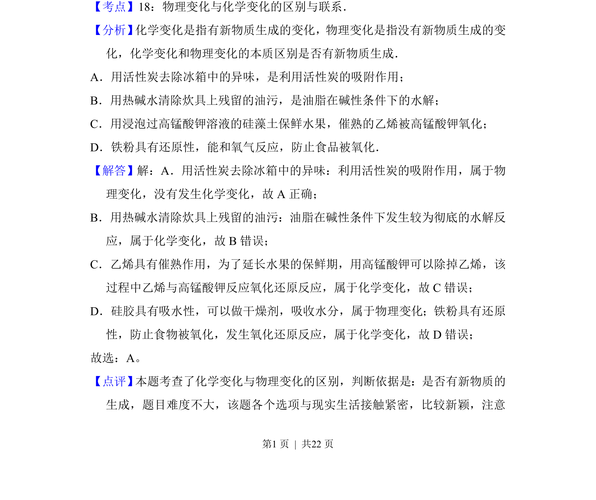

## 题面

## 摘要

本题通过生活实例考查物理变化与化学变化的本质区别，判断是否有新物质生成。

## 关联考点

- [[004-物理变化|物理变化]]
- [[001-化学变化|化学变化]]
- [[526-化学反应判断|化学反应判断]]

## 答案与解析

> 📄 原 PDF 第 1 页：`素材/真题/吉林/2008-2024·（吉林）化学高考真题/2014年高考化学试卷（新课标Ⅱ）（解析卷）.pdf`

<!-- 题干文本-start -->
## 题干文本
1．（6分）下列过程没有发生化学反应的是（　　）
A．用活性炭去除冰箱中的异味
B．用热碱水清除炊具上残留的油污
C．用浸泡过高锰酸钾溶液的硅藻土保鲜水果
D．用含硅胶、铁粉的透气小袋与食品一起密封包装
<!-- 题干文本-end -->

<!-- 解析文本-start -->
## 解析文本
【考点】18：物理变化与化学变化的区别与联系．菁优网版权所有
【分析】 化学变化是指有新物质生成的变化，物理变化是指没有新物质生成的变
化，化学变化和物理变化的本质区别是否有新物质生成．
A．用活性炭去除冰箱中的异味，是利用活性炭的吸附作用；
B．用热碱水清除炊具上残留的油污，是油脂在碱性条件下的水解；
C．用浸泡过高锰酸钾溶液的硅藻土保鲜水果，催熟的乙烯被高锰酸钾氧化；
D．铁粉具有还原性，能和氧气反应，防止食品被氧化．
【解答】解：A．用活性炭去除冰箱中的异味：利用活性炭的吸附作用，属于物
理变化，没有发生化学变化，故A正确；
B．用热碱水清除炊具上残留的油污：油脂在碱性条件下发生较为彻底的水解反
应，属于化学变化，故B错误；
C．乙烯具有催熟作用，为了延长水果的保鲜期，用高锰酸钾可以除掉乙烯，该
过程中乙烯与高锰酸钾反应氧化还原反应，属于化学变化，故C错误；
D．硅胶具有吸水性，可以做干燥剂，吸收水分，属于物理变化；铁粉具有还原
性，防止食物被氧化，发生氧化还原反应，属于化学变化，故D错误；
故选：A。
【点评】 本题考查了化学变化与物理变化的区别，判断依据是：是否有新物质的
生成，题目难度不大，该题各个选项与现实生活接触紧密，比较新颖，注意
<!-- 解析文本-end -->
