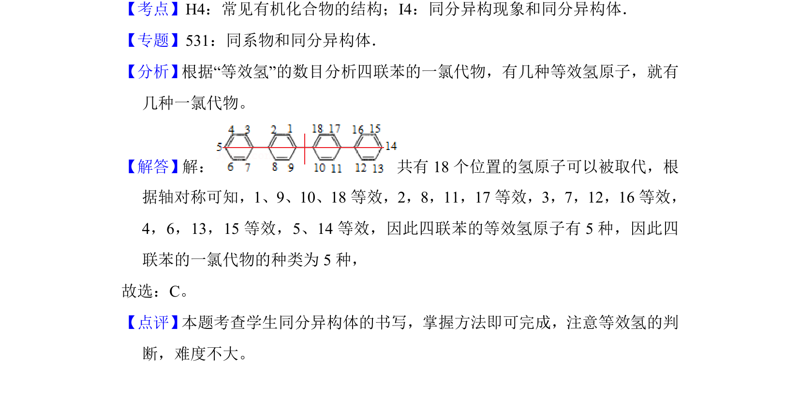

## 题面

## 摘要

根据等效氢判断四联苯的一氯代物同分异构体数目。

## 关联考点

- [[446-同分异构体|同分异构体]]
- [[885-等效氢|等效氢]]
- [[883-一氯代物|一氯代物]]

## 答案与解析

> 📄 原 PDF 第 2 页：`素材/真题/吉林/2008-2024·（吉林）化学高考真题/2014年高考化学试卷（新课标Ⅱ）（解析卷）.pdf`

<!-- 题干文本-start -->
## 题干文本
2．（6分）四联苯 的一氯代物有（　　）
A．3种B．4种C．5种D．6种
<!-- 题干文本-end -->

<!-- 解析文本-start -->
## 解析文本
【考点】H4：常见有机化合物的结构；I4：同分异构现象和同分异构体．菁优网版权所有
【专题】531：同系物和同分异构体．
【分析】 根据“等效氢”的数目分析四联苯的一氯代物，有几种等效氢原子，就有
几种一氯代物。
【解答】解： 共有18个位置的氢原子可以被取代，根
据轴对称可知，1、9、10、18等效，2，8，11，17等效，3，7，12，16等效，
4，6，13，15等效，5、14等效，因此四联苯的等效氢原子有5种，因此四
联苯的一氯代物的种类为5种，
故选：C。
【点评】 本题考查学生同分异构体的书写，掌握方法即可完成，注意等效氢的判
断，难度不大。
<!-- 解析文本-end -->
