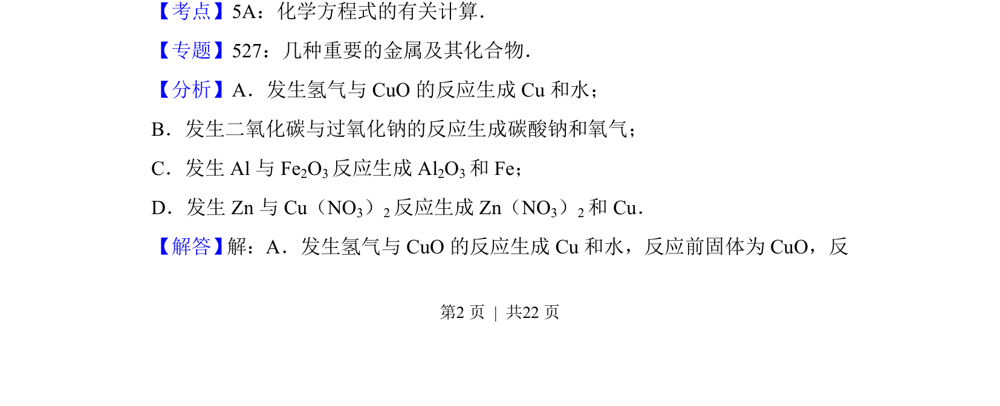
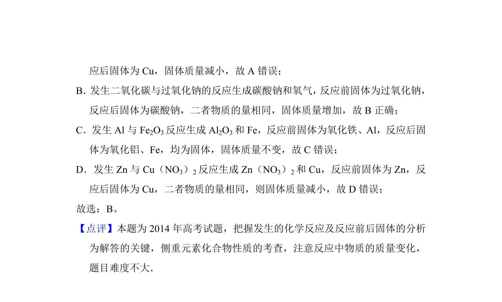

## 题面

## 摘要

本题通过分析固体物质在化学反应前后的质量变化判断增重情况。

## 关联考点

- [[645-反应物质量计算|反应物质量计算]]
- [[967-物质转化关系|物质转化关系]]
- [[681-差量法|差量法]]

## 答案与解析

> 📄 原 PDF 第 2 页：`素材/真题/吉林/2008-2024·（吉林）化学高考真题/2014年高考化学试卷（新课标Ⅱ）（解析卷）.pdf`

<!-- 题干文本-start -->
## 题干文本
3．（6分）下列反应中，反应后固体物质增重的是（　　）
A．氢气通过灼热的CuO粉末B．二氧化碳通过Na 2O2粉末
C．铝与Fe 2O3发生铝热反应D．将锌粒投入Cu（NO 3）2溶液
<!-- 题干文本-end -->

<!-- 解析文本-start -->
## 解析文本
【考点】5A：化学方程式的有关计算．菁优网版权所有
【专题】527：几种重要的金属及其化合物．
【分析】A．发生氢气与CuO的反应生成Cu和水；
B．发生二氧化碳与过氧化钠的反应生成碳酸钠和氧气；
C．发生Al与Fe 2O3反应生成Al 2O3和Fe；
D．发生Zn与Cu（NO 3）2反应生成Zn（NO 3）2和Cu．
【解答】 解：A．发生氢气与CuO的反应生成Cu和水，反应前固体为CuO，反
<!-- 解析文本-end -->
