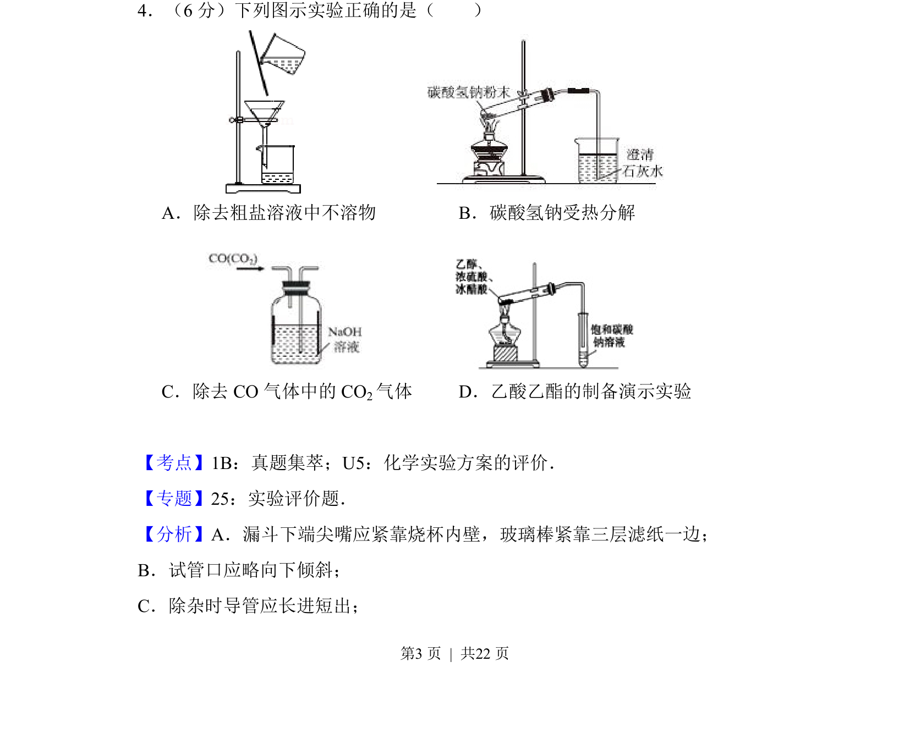
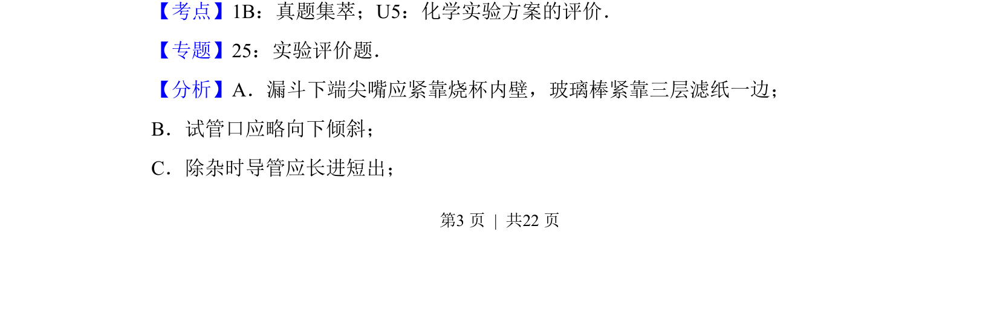
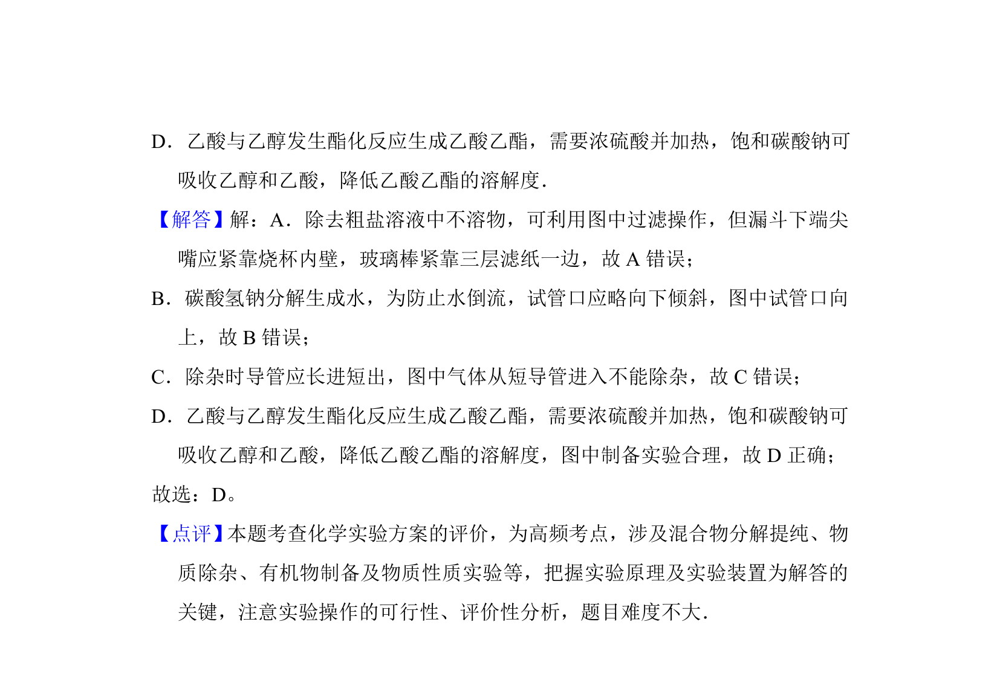

## 题面

## 摘要

该题通过四个图示考查常见化学实验操作的正误评价，涉及过滤、固体加热、洗气除杂和乙酸乙酯制备。

## 关联考点

- [[化学实验方案的评价]]
- [[080-过滤|过滤]]
- [[固体加热]]
- [[洗气除杂]]
- [[乙酸乙酯的制备]]

## 答案与解析

> 📄 原 PDF 第 3 页：`素材/真题/吉林/2008-2024·（吉林）化学高考真题/2014年高考化学试卷（新课标Ⅱ）（解析卷）.pdf`
