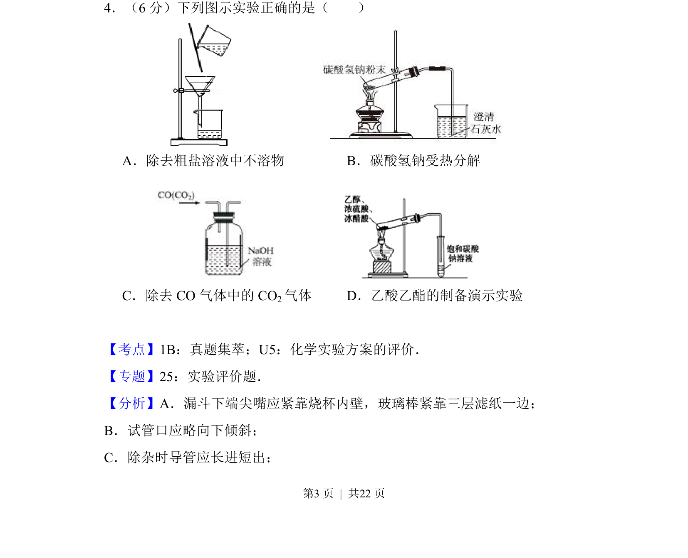
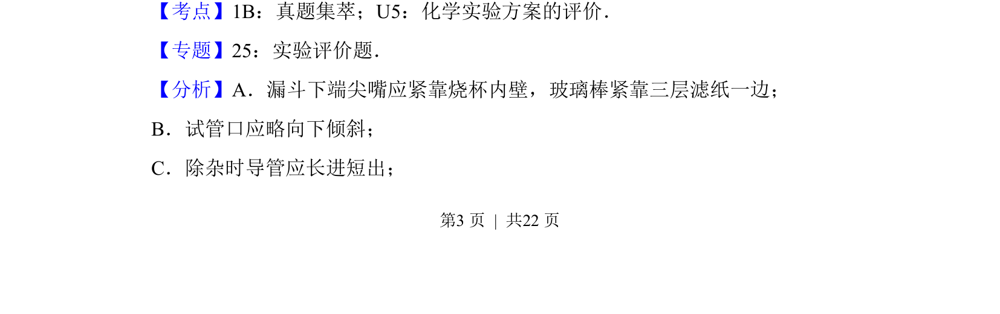
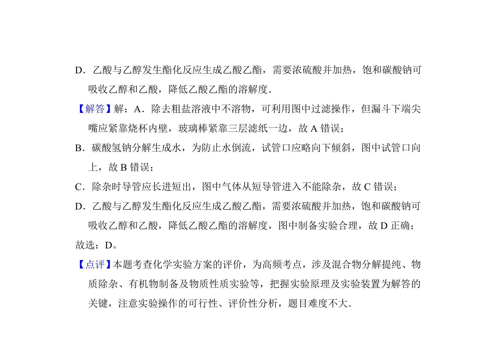

## 题面

## 摘要

该题通过四个图示考查常见化学实验操作的正误评价，涉及过滤、固体加热、洗气除杂和乙酸乙酯制备。

## 关联考点

- [[613-化学实验方案评价|化学实验方案的评价]]
- [[080-过滤|过滤]]
- [[660-固体加热|固体加热]]
- [[750-洗气除杂|洗气除杂]]
- [[587-乙酸乙酯的制备|乙酸乙酯的制备]]

## 答案与解析

> 📄 原 PDF 第 3 页：`素材/真题/吉林/2008-2024·（吉林）化学高考真题/2014年高考化学试卷（新课标Ⅱ）（解析卷）.pdf`

<!-- 题干文本-start -->
## 题干文本
4．（6分）下列图示实验正确的是（　　）
             
A．除去粗盐溶液中不溶物B．碳酸氢钠受热分解
          
C．除去CO气体中的CO 2气体D．乙酸乙酯的制备演示实验
<!-- 题干文本-end -->

<!-- 解析文本-start -->
## 解析文本
【考点】1B：真题集萃；U5：化学实验方案的评价．菁优网版权所有
【专题】25：实验评价题．
【分析】A．漏斗下端尖嘴应紧靠烧杯内壁，玻璃棒紧靠三层滤纸一边；
B．试管口应略向下倾斜；
C．除杂时导管应长进短出；
<!-- 解析文本-end -->
