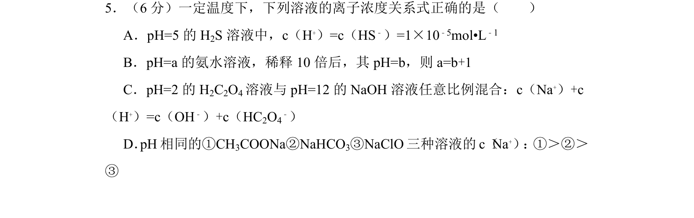
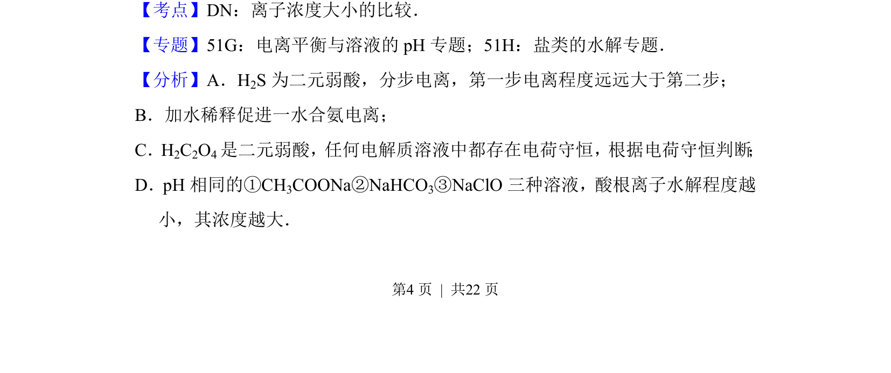
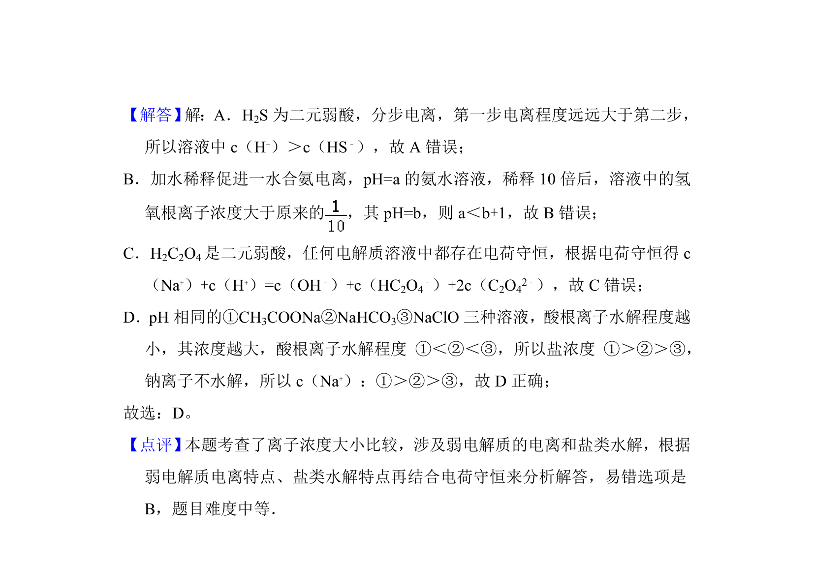

## 题面

## 摘要

本题通过离子浓度关系判断，考查弱电解质电离平衡、盐类水解及电荷守恒应用。

## 关联考点

- [[544-弱电解质电离平衡|弱电解质电离平衡]]
- [[336-盐类水解|盐类水解]]
- [[337-离子浓度比较|离子浓度大小比较]]
- [[690-电荷数守恒|电荷守恒]]

## 答案与解析

> 📄 原 PDF 第 4 页：`素材/真题/吉林/2008-2024·（吉林）化学高考真题/2014年高考化学试卷（新课标Ⅱ）（解析卷）.pdf`
