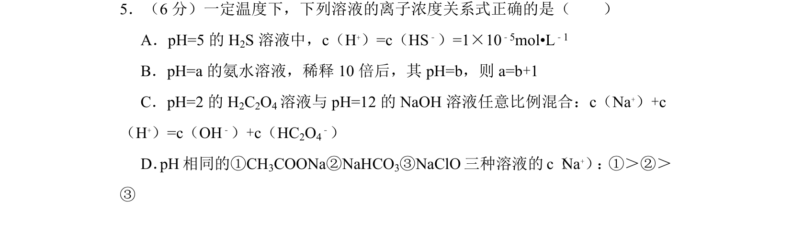
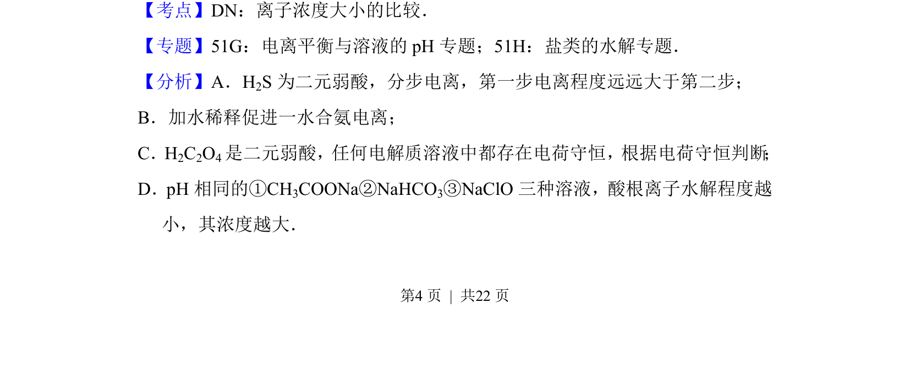
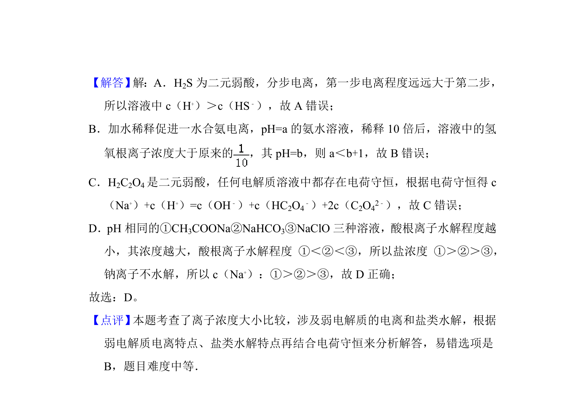

## 题面

## 摘要

本题通过离子浓度关系判断，考查弱电解质电离平衡、盐类水解及电荷守恒应用。

## 关联考点

- [[928-弱电解质的电离平衡|弱电解质电离平衡]]
- [[336-盐类水解|盐类水解]]
- [[337-离子浓度比较|离子浓度大小比较]]
- [[689-电荷数守恒|电荷守恒]]

## 答案与解析

> 📄 原 PDF 第 4 页：`素材/真题/吉林/2008-2024·（吉林）化学高考真题/2014年高考化学试卷（新课标Ⅱ）（解析卷）.pdf`

<!-- 题干文本-start -->
## 题干文本
5．（6分）一定温度下，下列溶液的离子浓度关系式正确的是（　　）
A．pH=5的H 2S溶液中，c（H +）=c（HS﹣）=1×10﹣5mol•L﹣1
B．pH=a的氨水溶液，稀释10倍后，其pH=b，则a=b+1
C．pH=2的H 2C2O4溶液与pH=12的NaOH溶液任意比例混合：c（Na +）+c
（H+）=c（OH﹣）+c（HC2O4
﹣）
D．pH相同的①CH3COONa②NaHCO3③NaClO三种溶液的c（Na+） ： ①＞②＞
③
<!-- 题干文本-end -->

<!-- 解析文本-start -->
## 解析文本
【考点】DN：离子浓度大小的比较．菁优网版权所有
【专题】51G：电离平衡与溶液的pH专题；51H：盐类的水解专题．
【分析】A．H2S为二元弱酸，分步电离，第一步电离程度远远大于第二步；
B．加水稀释促进一水合氨电离；
C．H2C2O4是二元弱酸，任何电解质溶液中都存在电荷守恒，根据电荷守恒判断 ；
D．pH相同的①CH 3COONa②NaHCO3③NaClO三种溶液，酸根离子水解程度越
小，其浓度越大．
<!-- 解析文本-end -->
