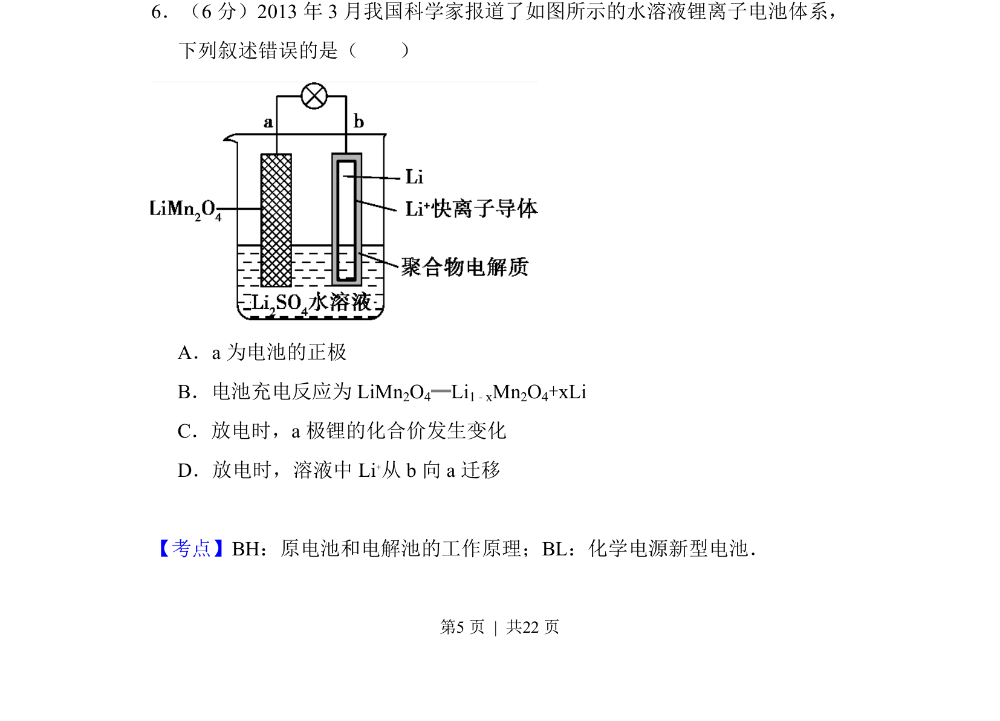
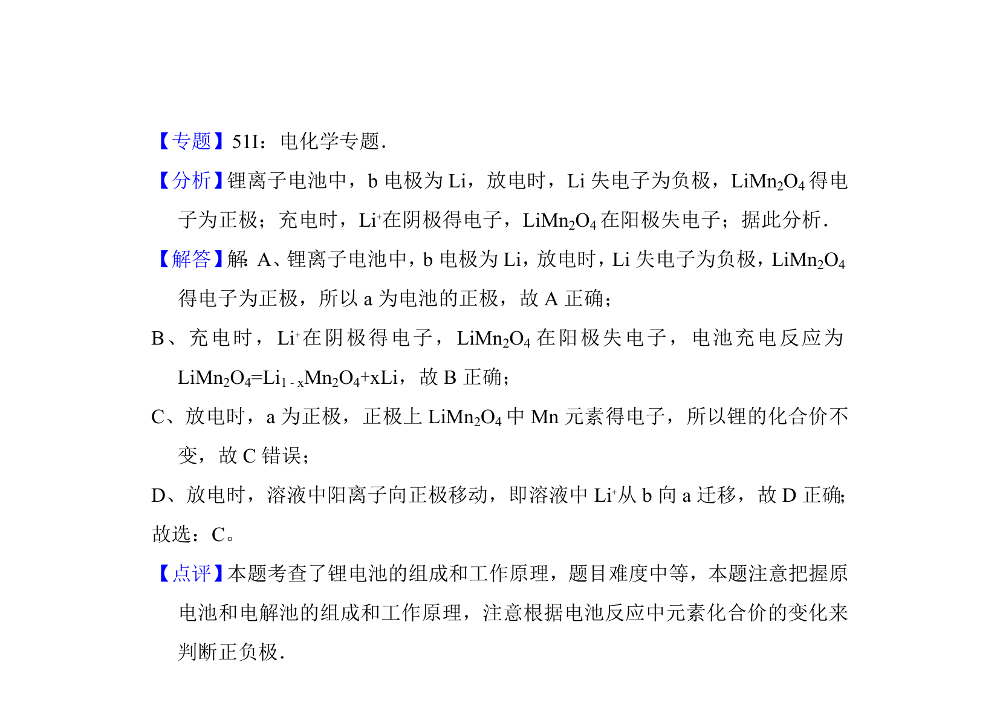

## 题面

## 摘要

本题考查水溶液锂离子电池体系，要求判断关于原电池充放电反应的错误叙述。

## 关联考点

- [[532-原电池和电解池的工作原理|原电池和电解池的工作原理]]
- [[625-化学电源新型电池|化学电源新型电池]]

## 答案与解析

> 📄 原 PDF 第 5 页：`素材/真题/吉林/2008-2024·（吉林）化学高考真题/2014年高考化学试卷（新课标Ⅱ）（解析卷）.pdf`
