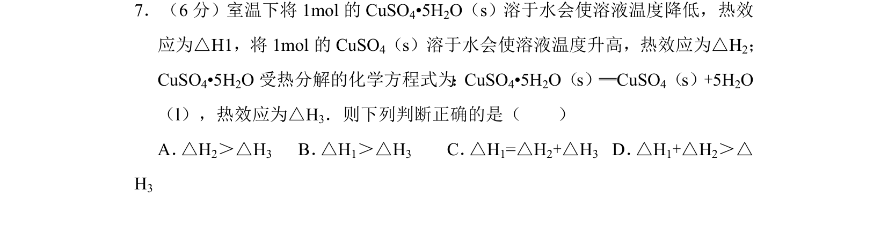
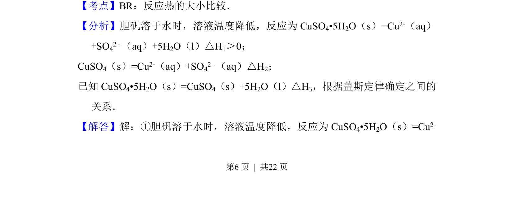
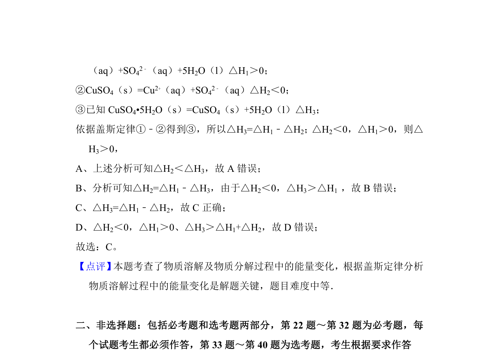

## 题面

## 摘要

该题通过胆矾溶解、无水硫酸铜溶解及胆矾分解的热效应，利用盖斯定律比较反应热大小。

## 关联考点

- [[877-反应热大小比较|反应热大小比较]]
- [[311-盖斯定律|盖斯定律]]

## 答案与解析

> 📄 原 PDF 第 6 页：`素材/真题/吉林/2008-2024·（吉林）化学高考真题/2014年高考化学试卷（新课标Ⅱ）（解析卷）.pdf`
