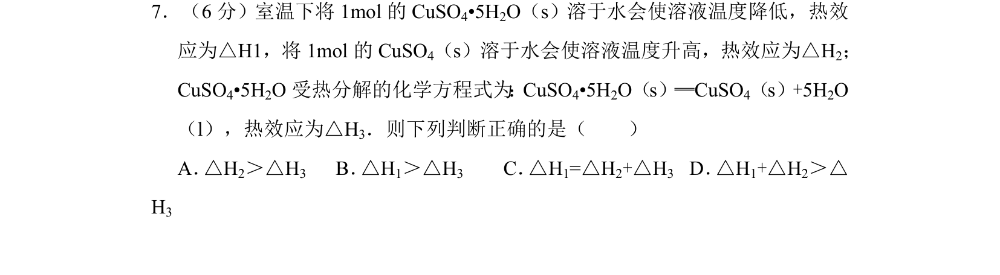
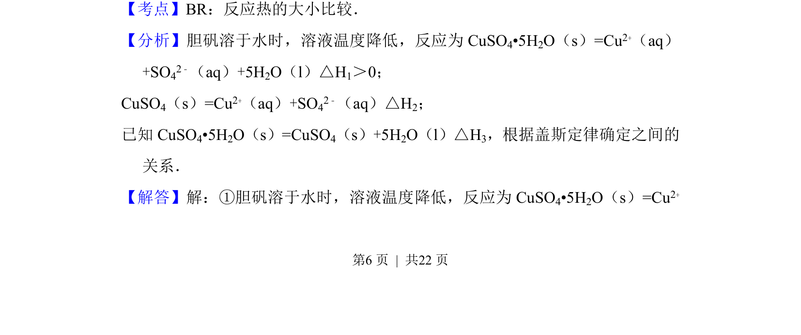
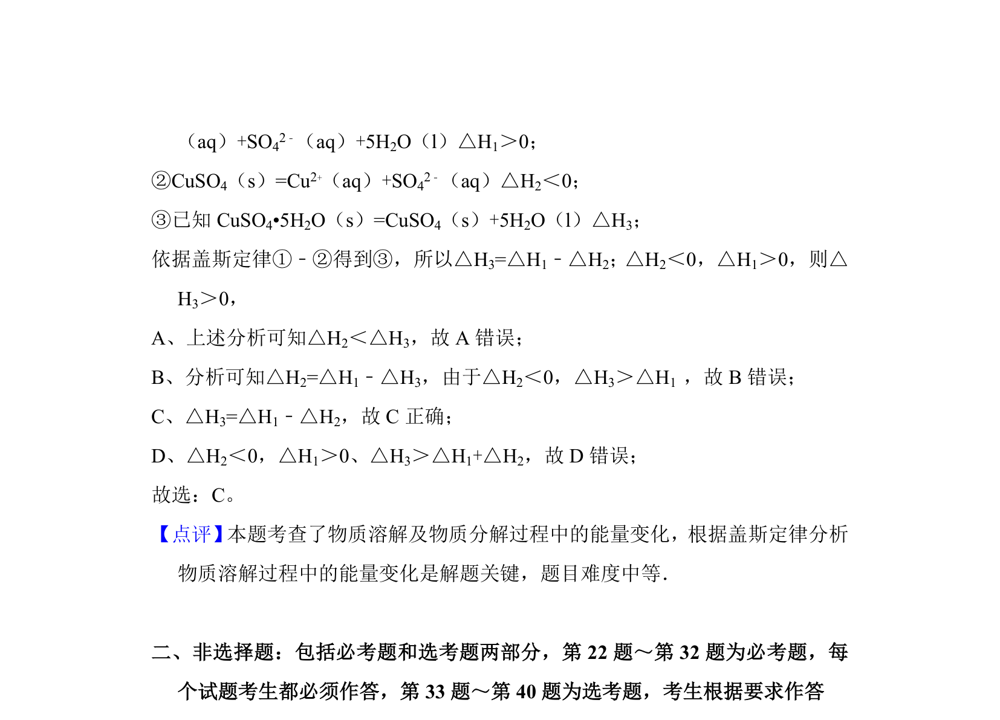

## 题面

## 摘要

该题通过胆矾溶解、无水硫酸铜溶解及胆矾分解的热效应，利用盖斯定律比较反应热大小。

## 关联考点

- [[876-反应热大小比较|反应热大小比较]]
- [[311-盖斯定律|盖斯定律]]

## 答案与解析

> 📄 原 PDF 第 6 页：`素材/真题/吉林/2008-2024·（吉林）化学高考真题/2014年高考化学试卷（新课标Ⅱ）（解析卷）.pdf`

<!-- 题干文本-start -->
## 题干文本
7．（6分）室温下将1mol的CuSO 4•5H2O（s）溶于水会使溶液温度降低，热效
应为△H1，将1mol的CuSO 4（s）溶于水会使溶液温度升高，热效应为△H2；
CuSO4•5H2O受热分解的化学方程式为 ：CuSO4•5H2O（s）═CuSO4（s）+5H2O
（l），热效应为△H3．则下列判断正确的是（　　）
A． △H2＞△H3 B． △H1＞△H3 C． △H1=△H2+△H3 D． △H1+△H2＞△
H3
<!-- 题干文本-end -->

<!-- 解析文本-start -->
## 解析文本
【考点】BR：反应热的大小比较．菁优网版权所有
【分析】胆矾溶于水时，溶液温度降低，反应为CuSO 4•5H2O（s）=Cu2+（aq）
+SO42﹣（aq）+5H2O（l）△H1＞0；
CuSO4（s）=Cu2+（aq）+SO42﹣（aq）△H2；
已知CuSO 4•5H2O（s）=CuSO4（s）+5H2O（l）△H3，根据盖斯定律确定之间的
关系．
【解答】解：①胆矾溶于水时，溶液温度降低，反应为CuSO 4•5H2O（s）=Cu2+
<!-- 解析文本-end -->
