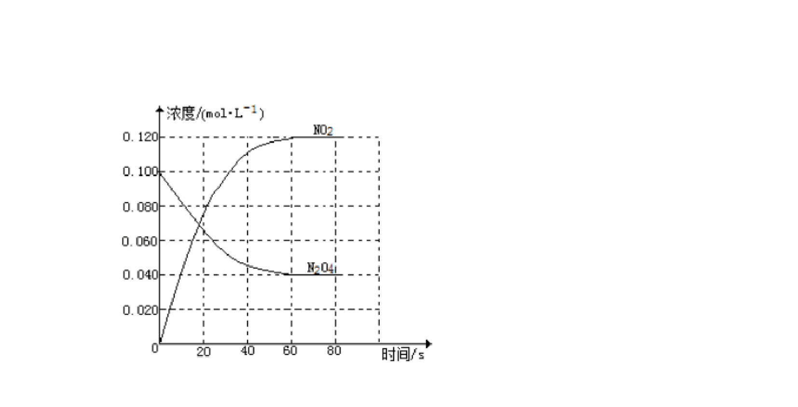
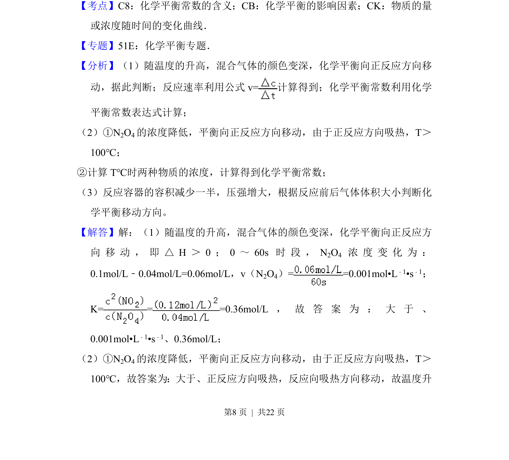
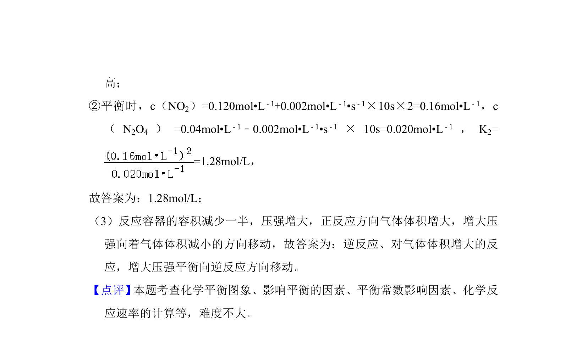

## 题面

## 摘要

考查N2O4分解反应的热效应、反应速率、平衡常数计算及温度、压强对平衡的影响。

## 关联考点

- [[焓变判断]]
- [[化学反应速率计算]]
- [[化学平衡常数计算]]
- [[282-勒夏特列原理|勒夏特列原理]]

## 答案与解析

> 📄 原 PDF 第 7 页：`素材/真题/吉林/2008-2024·（吉林）化学高考真题/2014年高考化学试卷（新课标Ⅱ）（解析卷）.pdf`
