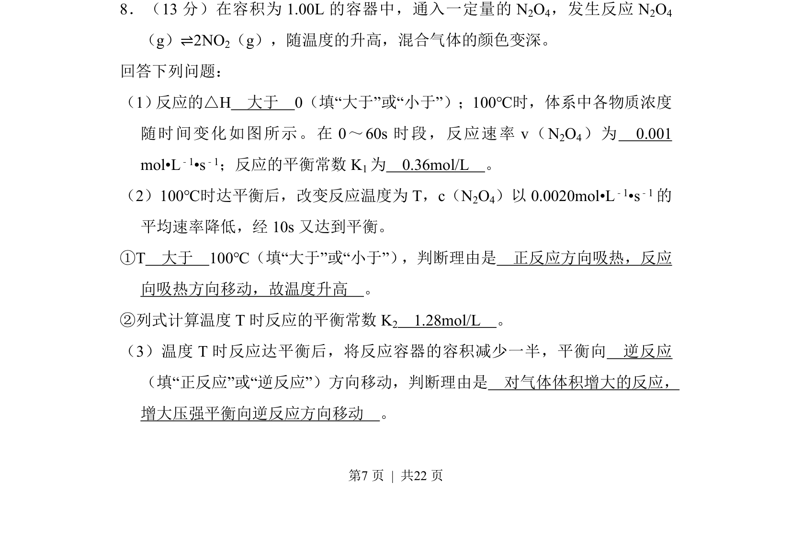

## 题面

## 摘要

该题通过化学平衡图像和浓度变化数据，考查化学反应速率计算、平衡常数计算及温度压强对平衡的影响。

## 关联考点

- [[计算]]
- [[代数运算]]
- [[列方程求解]]
- [[037-推理|逻辑推理]]

## 答案与解析

> 📄 原 PDF 第 7 页：`素材/真题/吉林/2008-2024·（吉林）化学高考真题/2014年高考化学试卷（新课标Ⅱ）（解析卷）.pdf`
