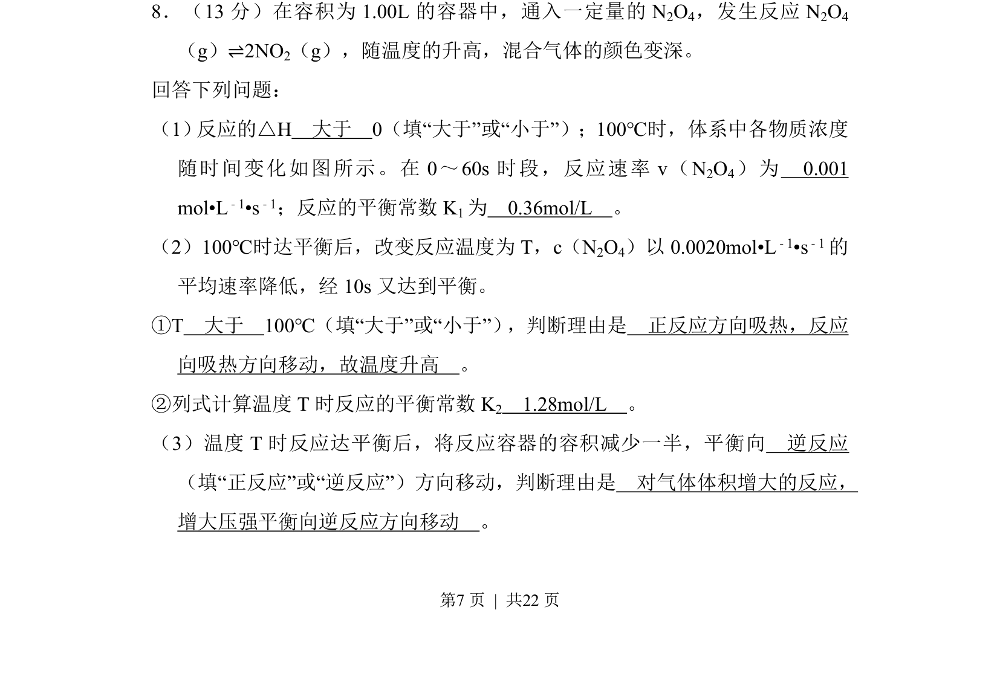
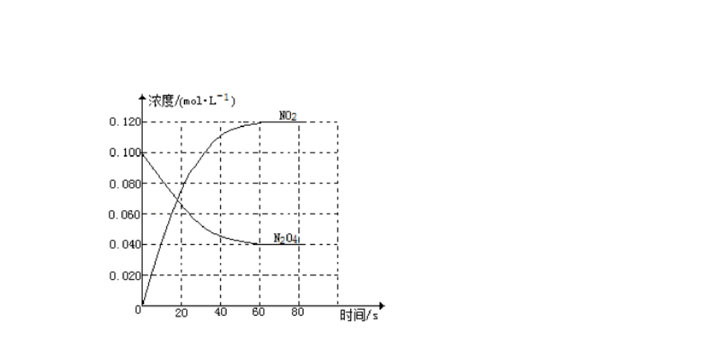
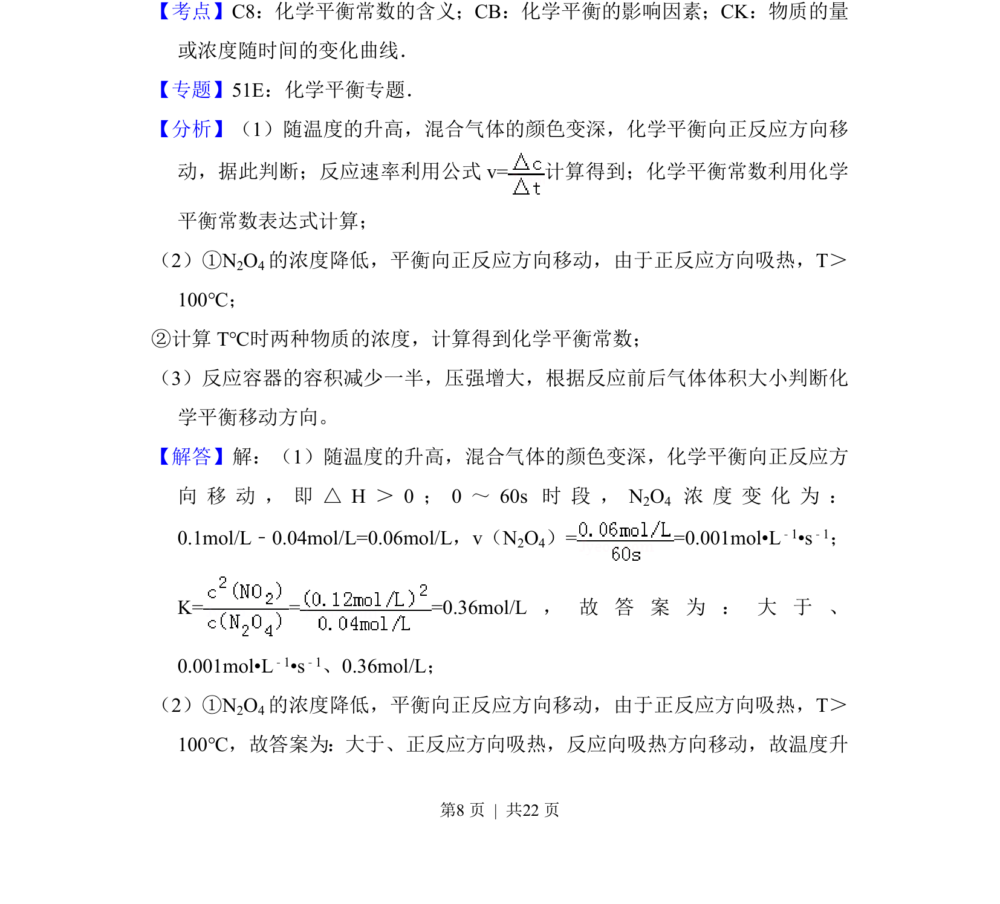
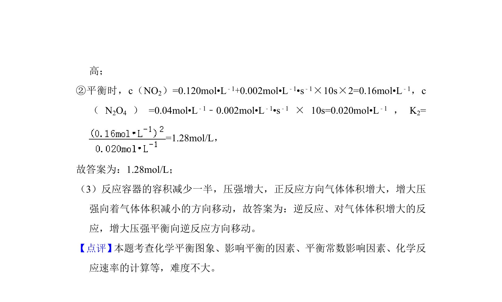

## 题面

## 摘要

考查N2O4分解反应的热效应、反应速率、平衡常数计算及温度、压强对平衡的影响。

## 关联考点

- [[552-焓变判断|焓变判断]]
- [[610-化学反应速率计算|化学反应速率计算]]
- [[618-化学平衡常数计算|化学平衡常数计算]]
- [[282-勒夏特列原理|勒夏特列原理]]

## 答案与解析

> 📄 原 PDF 第 7 页：`素材/真题/吉林/2008-2024·（吉林）化学高考真题/2014年高考化学试卷（新课标Ⅱ）（解析卷）.pdf`

<!-- 题干文本-start -->
## 题干文本
8．（13分）在容积为1.00L的容器中，通入一定量的N 2O4，发生反应N 2O4
（g）⇌2NO2（g），随温度的升高，混合气体的颜色变深。
回答下列问题：
（1） 反应的△H　大于　0（填“大于”或“小于”）；100℃时，体系中各物质浓度
随时间变化如图所示。在0～60s时段，反应速率v（N 2O4）为　0.001　
mol•L﹣1•s﹣1；反应的平衡常数K 1为　0.36mol/L　。
（2）100℃时达平衡后，改变反应温度为T，c（N 2O4）以0.0020mol•L ﹣1•s﹣1的
平均速率降低，经10s又达到平衡。
①T　大于　100℃（填“大于”或“小于”） ，判断理由是　正反应方向吸热，反应
向吸热方向移动，故温度升高　。
②列式计算温度T时反应的平衡常数K 2　1.28mol/L　。
（3）温度T时反应达平衡后，将反应容器的容积减少一半，平衡向　逆反应　
（填“正反应”或“逆反应”）方向移动，判断理由是　对气体体积增大的反应，
增大压强平衡向逆反应方向移动　。
<!-- 题干文本-end -->

<!-- 解析文本-start -->
## 解析文本

<!-- 解析文本-end -->
