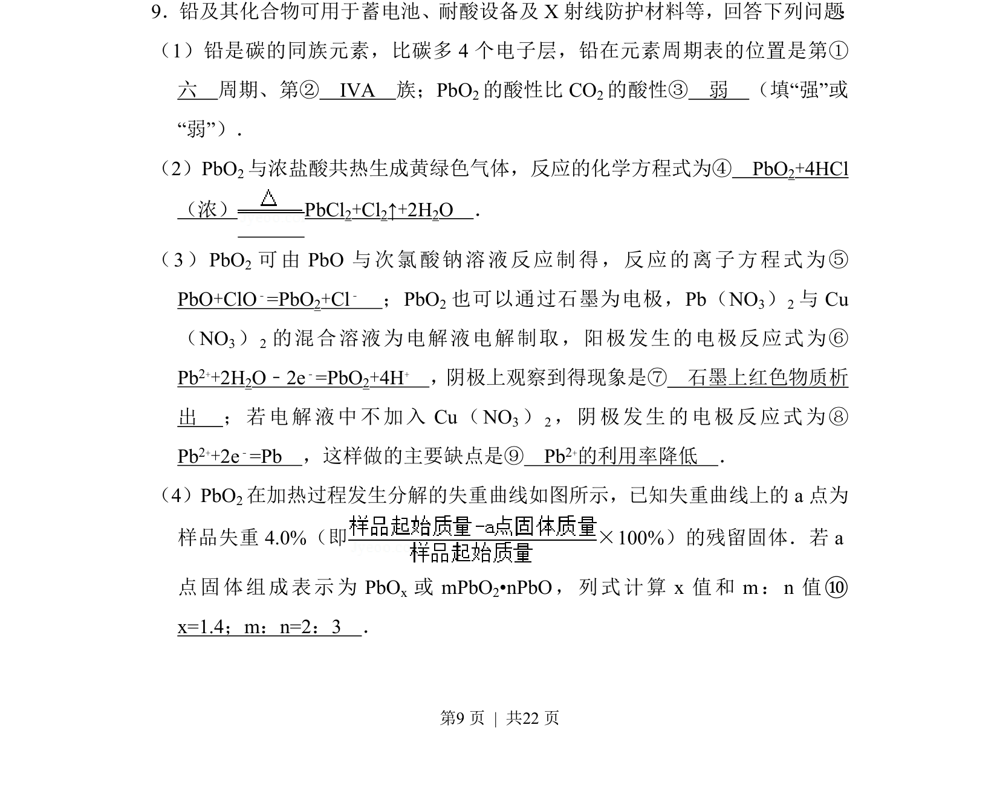
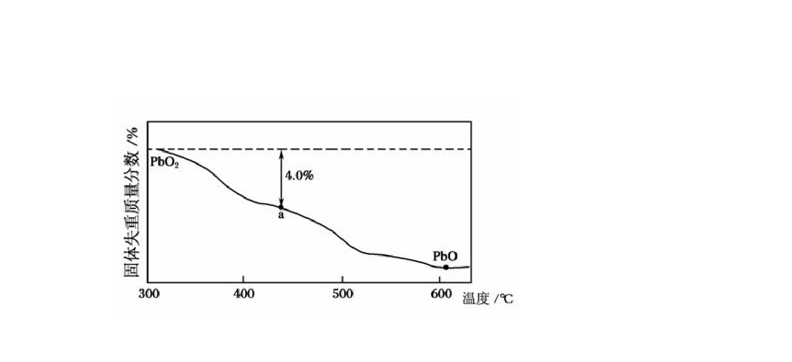
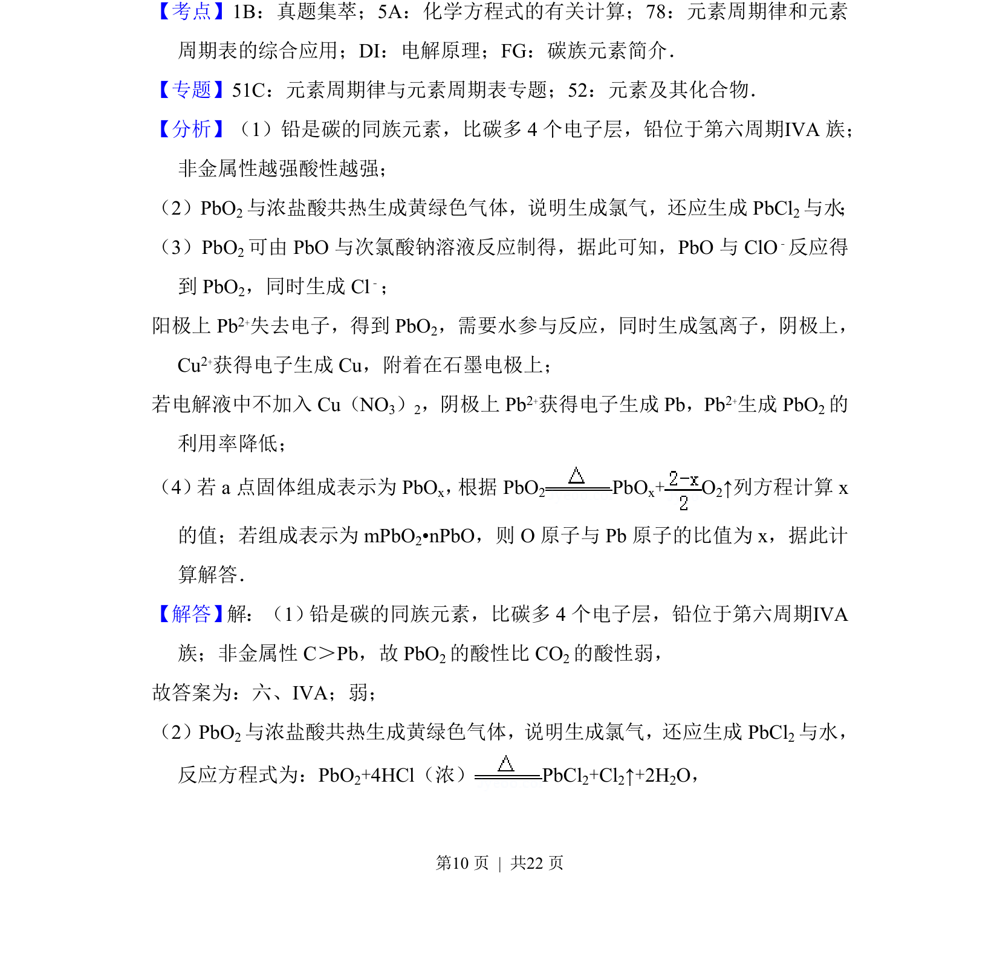
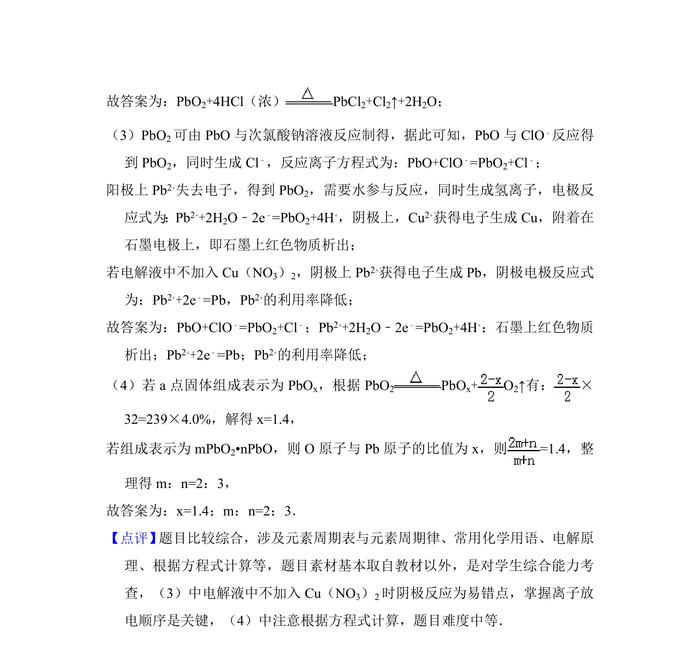

## 题面

## 摘要

铅及其化合物的性质与应用，涵盖周期表位置、酸性比较、氧化还原反应、电解及热分解计算。

## 关联考点

- [[252-元素周期律|元素周期律]]
- [[162-氧化还原反应|氧化还原反应]]
- [[789-电化学|电化学]]
- [[626-化学计算|化学计算]]

## 答案与解析

> 📄 原 PDF 第 9 页：`素材/真题/吉林/2008-2024·（吉林）化学高考真题/2014年高考化学试卷（新课标Ⅱ）（解析卷）.pdf`

<!-- 题干文本-start -->
## 题干文本
9．铅及其化合物可用于蓄电池、耐酸设备及X射线防护材料等，回答下列问题 ：
（1）铅是碳的同族元素，比碳多4个电子层，铅在元素周期表的位置是第①　
六　周期、第②　ⅣA　族；PbO 2的酸性比CO 2的酸性③　弱　（填“强”或
“弱”）．
（2）PbO2与浓盐酸共热生成黄绿色气体，反应的化学方程式为④　PbO2+4HCl
（浓） PbCl2+Cl2↑+2H2O　．
（3）PbO 2 可由PbO与次氯酸钠溶液反应制得，反应的离子方程式为⑤　
PbO+ClO﹣=PbO2+Cl﹣　；PbO 2也可以通过石墨为电极，Pb（NO 3）2与Cu
（NO 3） 2 的混合溶液为电解液电解制取，阳极发生的电极反应式为⑥　
Pb2++2H2O﹣2e﹣=PbO2+4H+　，阴极上观察到得现象是⑦　石墨上红色物质析
出　；若电解液中不加入Cu（NO 3） 2，阴极发生的电极反应式为⑧　
Pb2++2e﹣=Pb　，这样做的主要缺点是⑨　Pb2+的利用率降低　．
（4）PbO2在加热过程发生分解的失重曲线如图所示，已知失重曲线上的a点为
样品失重4.0%（即×100%）的残留固体．若a
点固体组成表示为PbO x 或mPbO 2•nPbO，列式计算x值和m：n值⑩　
x=1.4；m：n=2：3　．
<!-- 题干文本-end -->

<!-- 解析文本-start -->
## 解析文本

<!-- 解析文本-end -->
