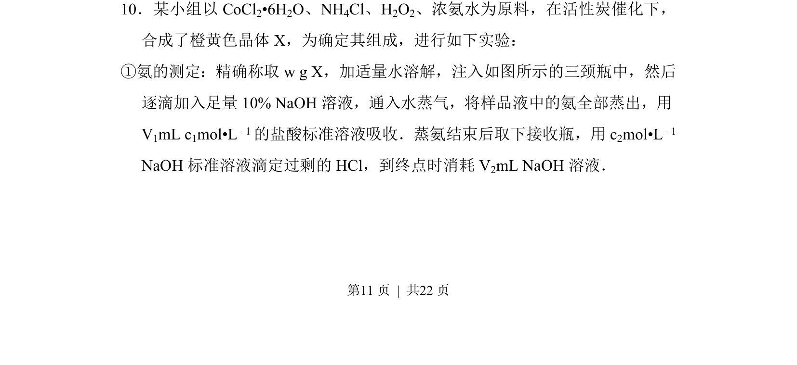
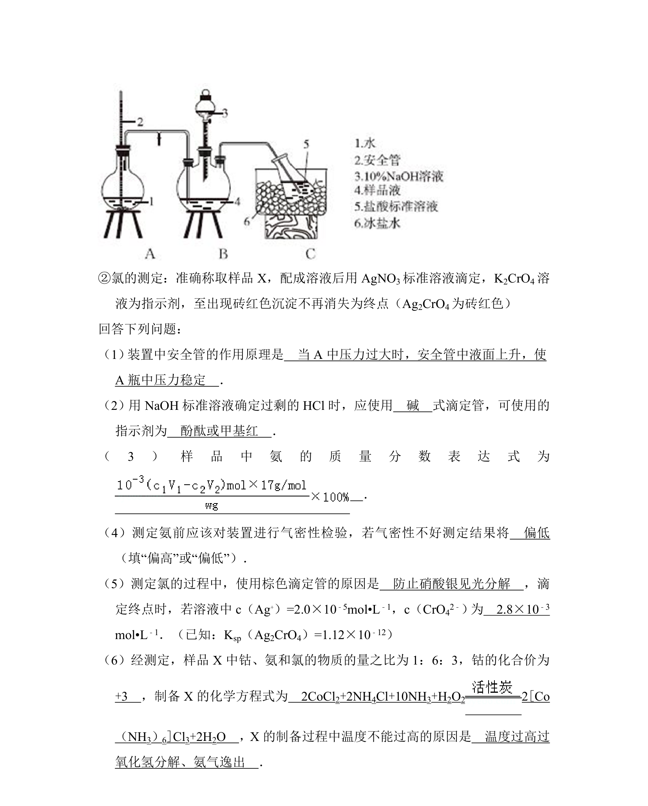
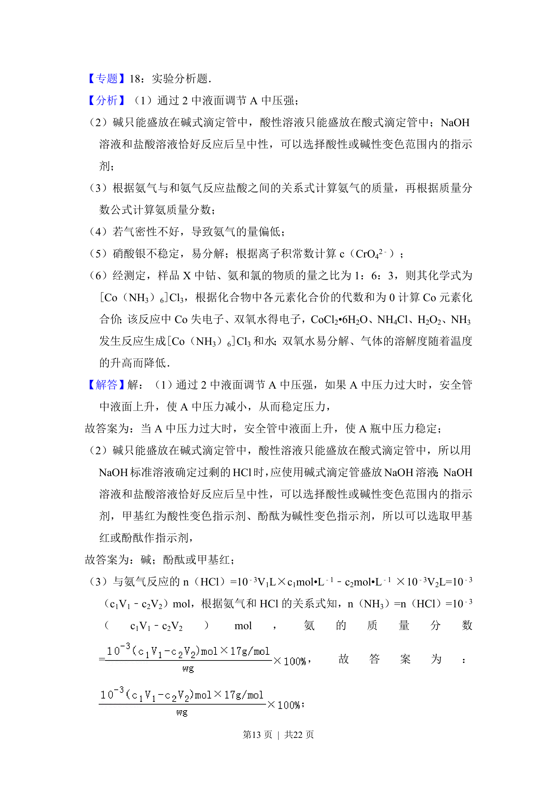
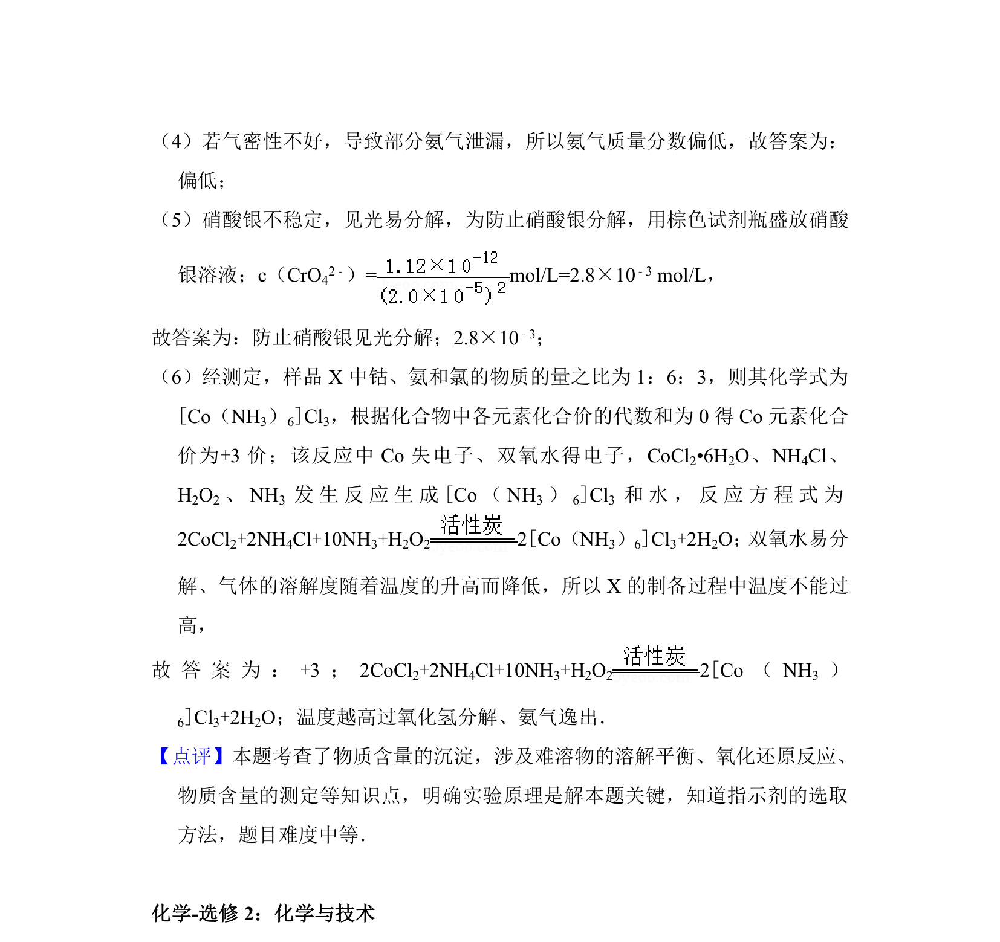

## 题面

## 摘要

以蒸馏和酸碱滴定法测定钴氨配合物中氨含量，涉及定量实验与计算。

## 关联考点

- [[835-蒸馏法测定氨|蒸馏法测定氨]]
- [[854-酸碱滴定|酸碱滴定]]
- [[539-定量分析|定量分析]]
- [[847-配合物组成测定|配合物组成测定]]

## 答案与解析

> 📄 原 PDF 第 11 页：`素材/真题/吉林/2008-2024·（吉林）化学高考真题/2014年高考化学试卷（新课标Ⅱ）（解析卷）.pdf`

<!-- 题干文本-start -->
## 题干文本
10．某小组以CoCl 2•6H2O、NH4Cl、H2O2、浓氨水为原料，在活性炭催化下，
合成了橙黄色晶体X，为确定其组成，进行如下实验：
①氨的测定：精确称取w g X，加适量水溶解，注入如图所示的三颈瓶中，然后
逐滴加入足量10% NaOH溶液，通入水蒸气，将样品液中的氨全部蒸出，用
V1mL c1mol•L﹣1的盐酸标准溶液吸收．蒸氨结束后取下接收瓶，用c 2mol•L﹣1 
NaOH标准溶液滴定过剩的HCl，到终点时消耗V 2mL NaOH溶液．
<!-- 题干文本-end -->

<!-- 解析文本-start -->
## 解析文本

<!-- 解析文本-end -->
