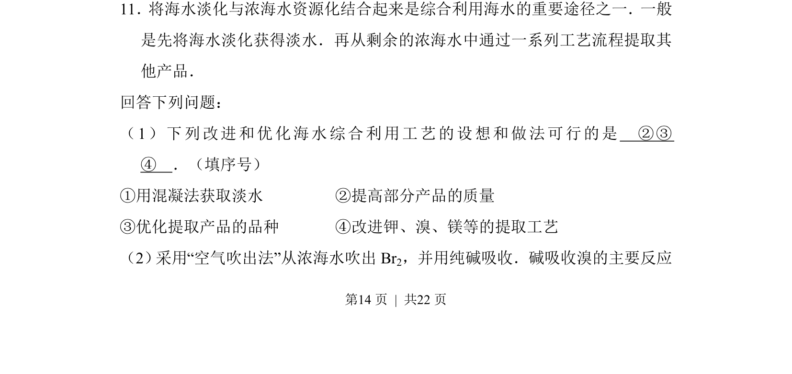
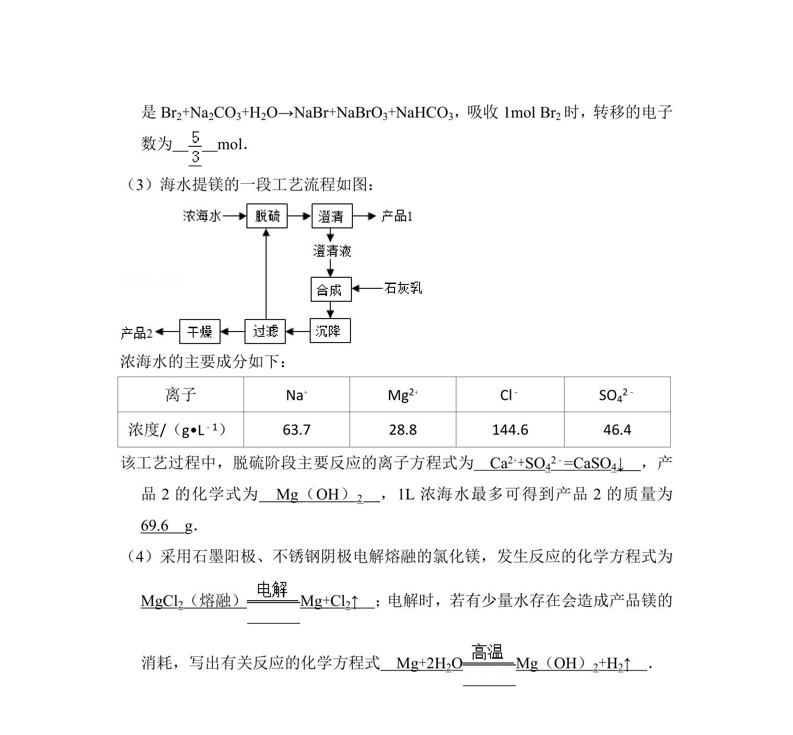
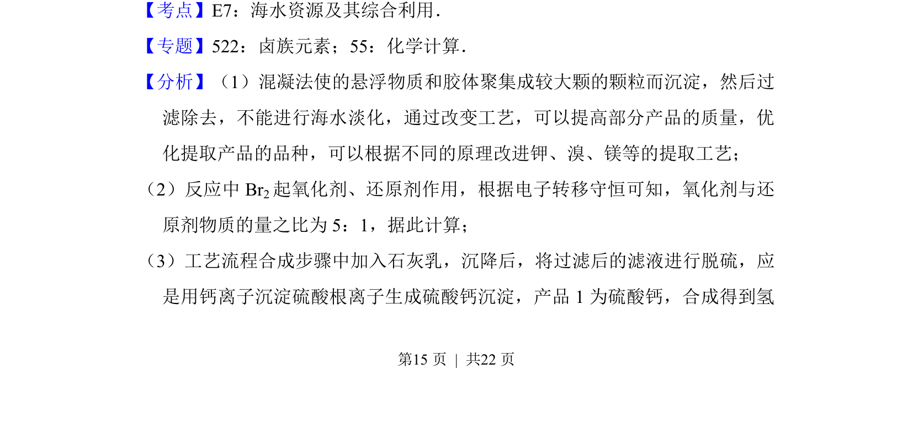
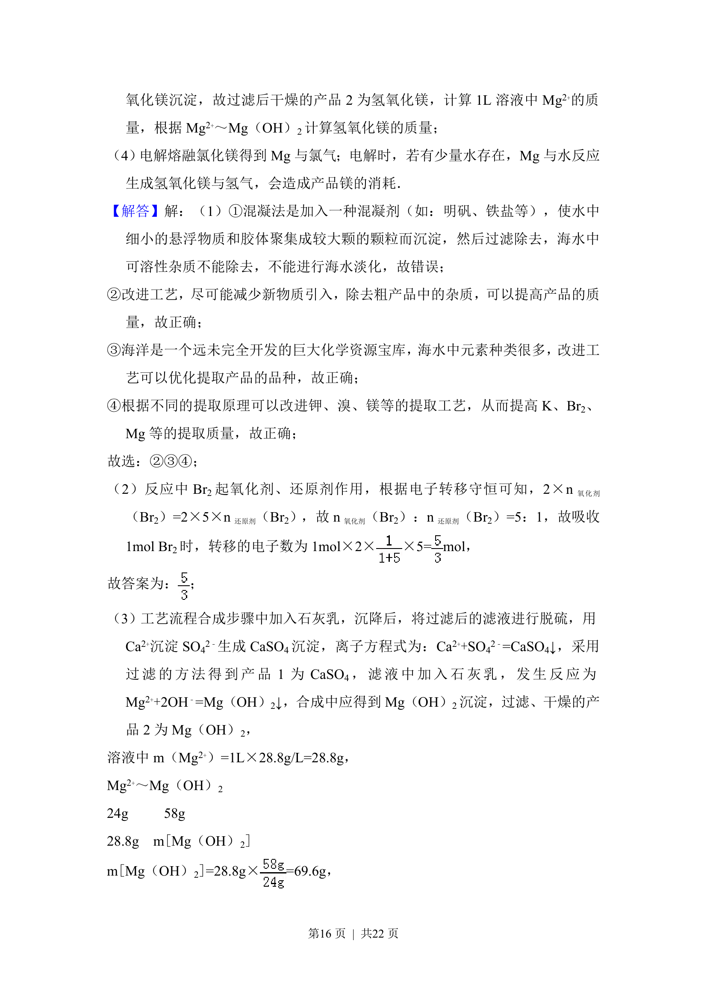
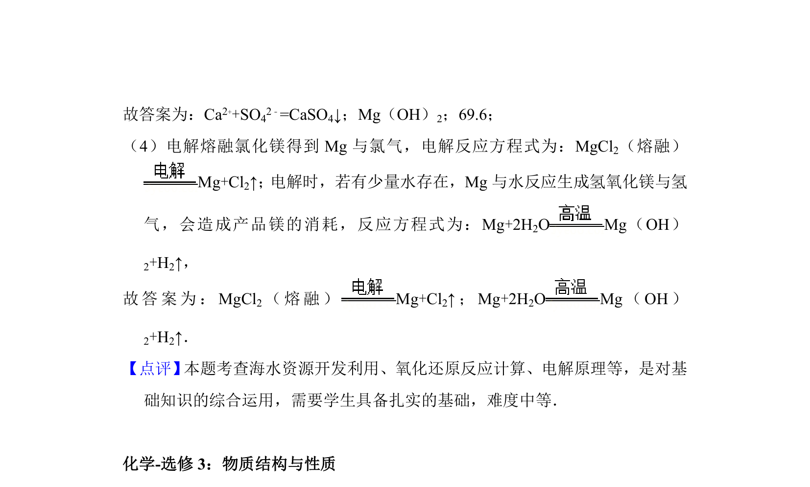

## 题面

## 摘要

该题考查海水淡化与浓海水资源化利用的工艺选择及空气吹出法提溴的原理。

## 关联考点

- [[871-海水淡化|海水淡化]]
- [[274-海水提溴|海水提溴]]
- [[841-资源综合利用|资源综合利用]]
- [[542-工艺流程优化|工艺流程优化]]

## 答案与解析

> 📄 原 PDF 第 14 页：`素材/真题/吉林/2008-2024·（吉林）化学高考真题/2014年高考化学试卷（新课标Ⅱ）（解析卷）.pdf`
