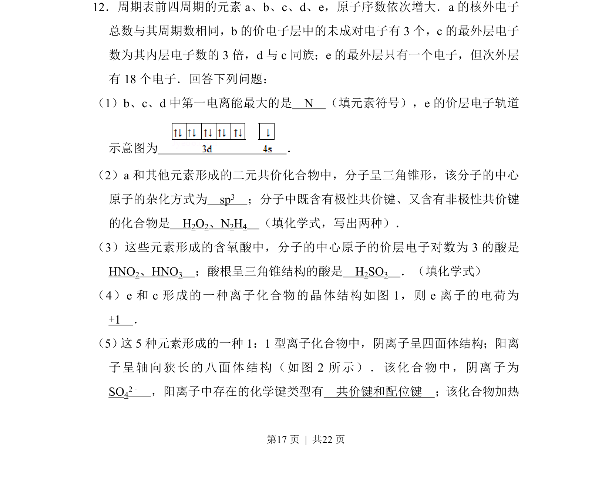
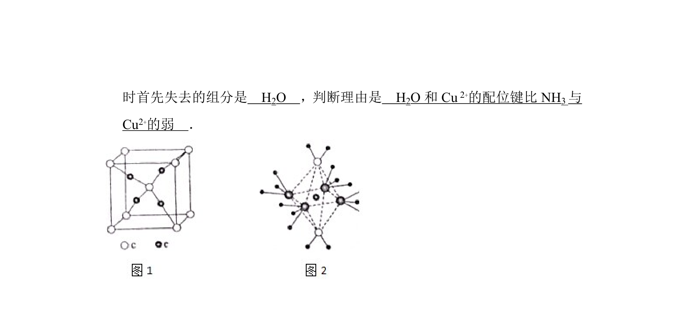
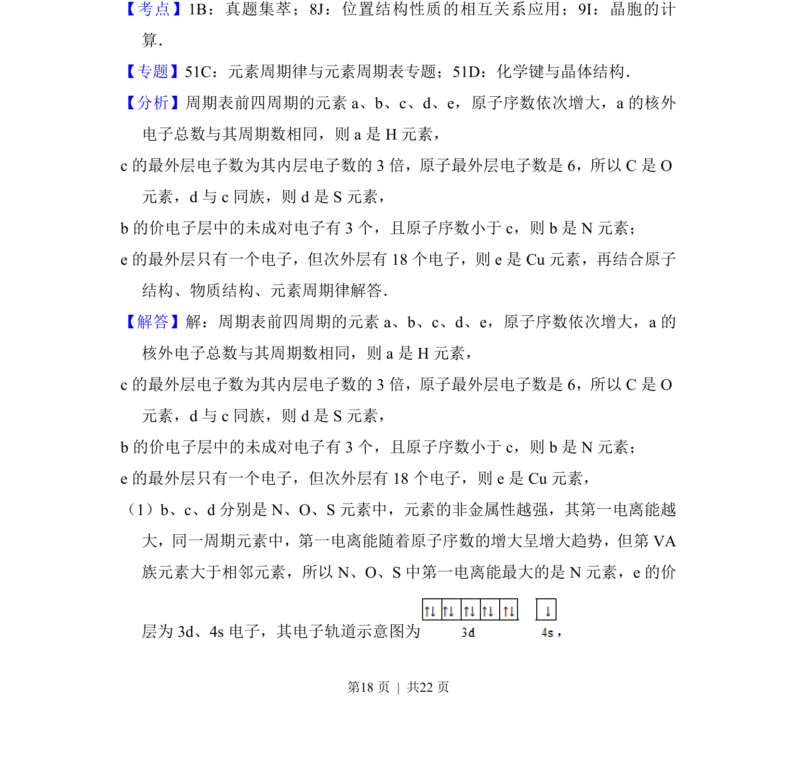
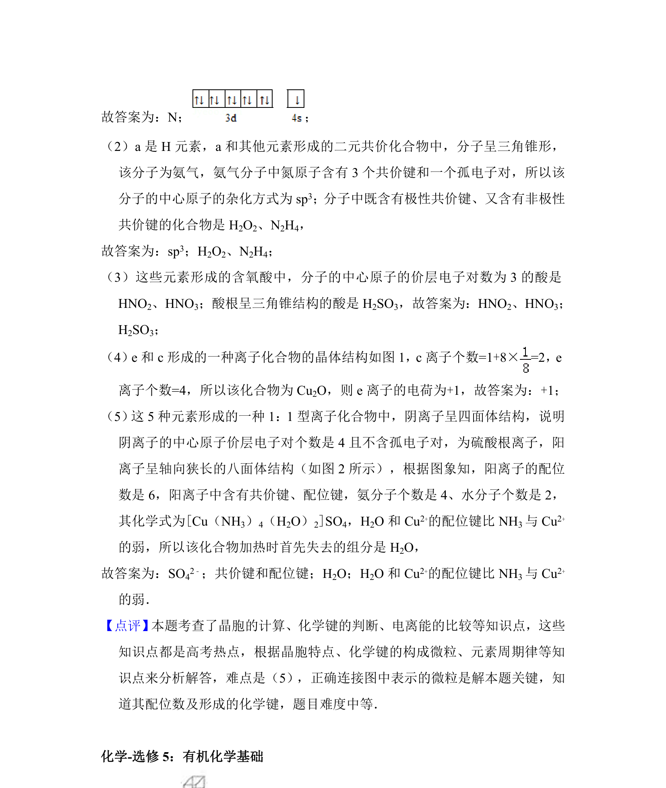

## 题面

## 摘要

本题考查元素推断、第一电离能比较、分子空间构型与杂化、化学键类型及晶胞结构分析。

## 关联考点

- [[252-元素周期律|元素周期律]]
- [[604-分子结构与杂化|分子结构与杂化]]
- [[631-化学键类型|化学键类型]]
- [[700-晶体结构计算|晶体结构计算]]

## 答案与解析

> 📄 原 PDF 第 17 页：`素材/真题/吉林/2008-2024·（吉林）化学高考真题/2014年高考化学试卷（新课标Ⅱ）（解析卷）.pdf`
