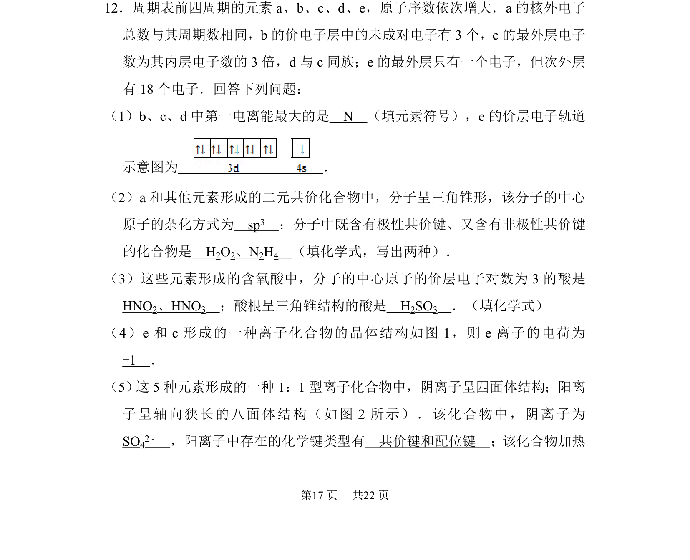
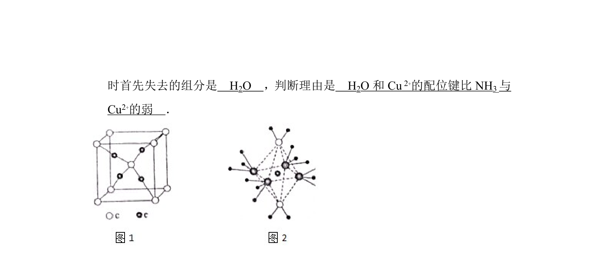
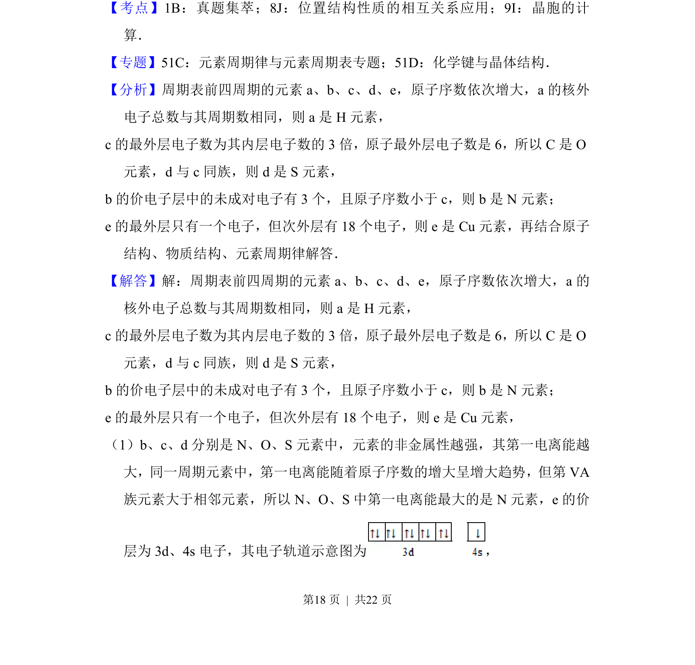
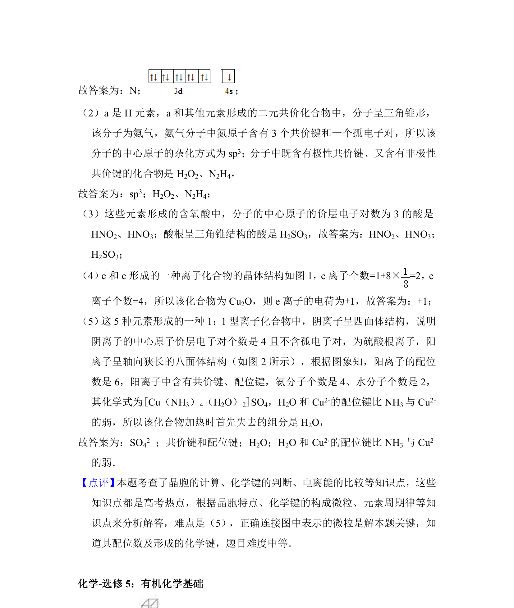

## 题面

## 摘要

本题考查元素推断、第一电离能比较、分子空间构型与杂化、化学键类型及晶胞结构分析。

## 关联考点

- [[252-元素周期律|元素周期律]]
- [[604-分子结构与杂化|分子结构与杂化]]
- [[631-化学键类型|化学键类型]]
- [[700-晶体结构计算|晶体结构计算]]

## 答案与解析

> 📄 原 PDF 第 17 页：`素材/真题/吉林/2008-2024·（吉林）化学高考真题/2014年高考化学试卷（新课标Ⅱ）（解析卷）.pdf`

<!-- 题干文本-start -->
## 题干文本
12．周期表前四周期的元素a、b、c、d、e，原子序数依次增大．a的核外电子
总数与其周期数相同，b的价电子层中的未成对电子有3个，c的最外层电子
数为其内层电子数的3倍，d与c同族；e的最外层只有一个电子，但次外层
有18个电子．回答下列问题：
（1）b、c、d中第一电离能最大的是　N　（填元素符号），e的价层电子轨道
示意图为　 　．
（2）a和其他元素形成的二元共价化合物中，分子呈三角锥形，该分子的中心
原子的杂化方式为　sp3　；分子中既含有极性共价键、又含有非极性共价键
的化合物是　H2O2、N2H4　（填化学式，写出两种）．
（3）这些元素形成的含氧酸中，分子的中心原子的价层电子对数为3的酸是　
HNO2、HNO3　；酸根呈三角锥结构的酸是　H2SO3　．（填化学式）
（4）e和c形成的一种离子化合物的晶体结构如图1，则e离子的电荷为　
+1　．
（5） 这5种元素形成的一种1：1型离子化合物中，阴离子呈四面体结构；阳离
子呈轴向狭长的八面体结构（如图2所示）．该化合物中，阴离子为　
SO42﹣　，阳离子中存在的化学键类型有　共价键和配位键　；该化合物加热
<!-- 题干文本-end -->

<!-- 解析文本-start -->
## 解析文本

<!-- 解析文本-end -->
