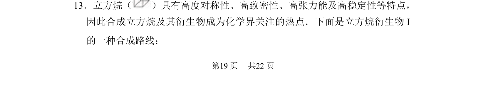
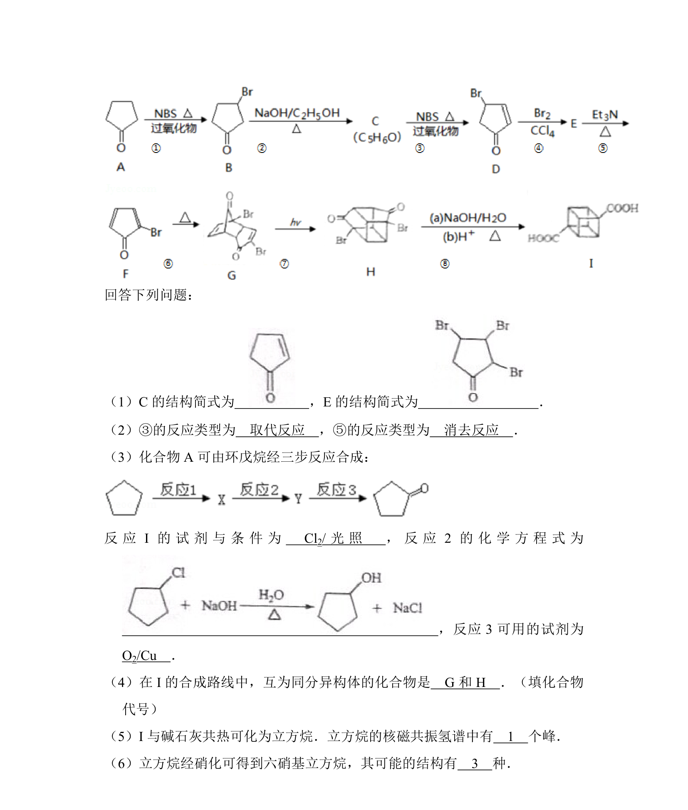
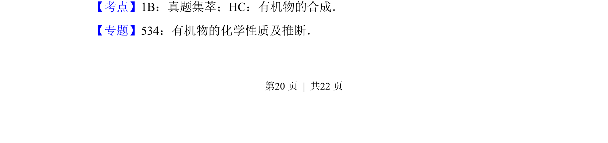
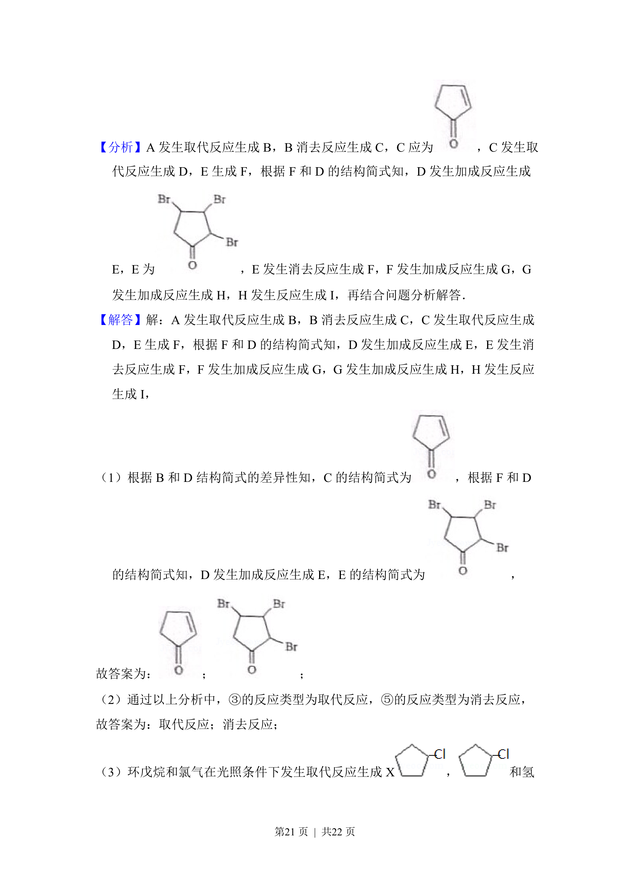
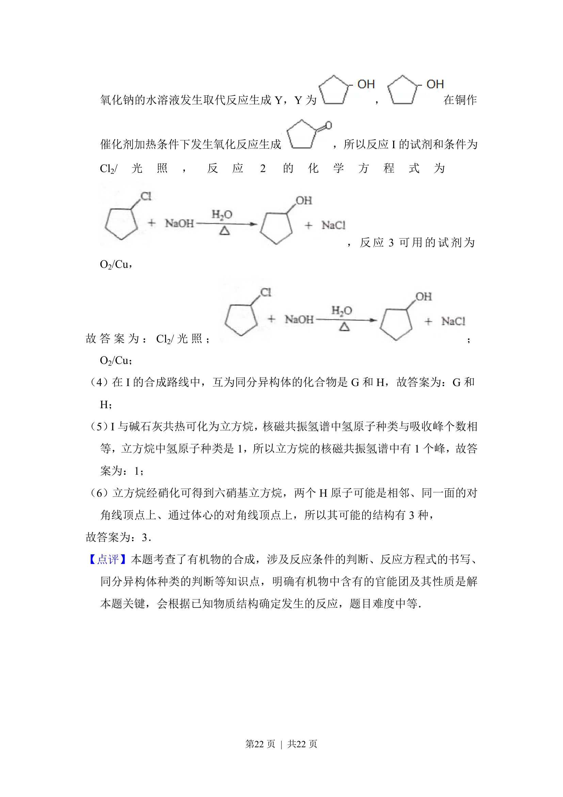

## 题面

## 摘要

有机合成路线分析，以立方烷结构特点与衍生物合成为例

## 关联考点

- [[271-化学合成|有机合成]]
- [[883-立方烷结构|立方烷结构]]
- [[647-反应类型|反应类型]]
- [[655-合成路线设计|合成路线设计]]

## 答案与解析

> 📄 原 PDF 第 19 页：`素材/真题/吉林/2008-2024·（吉林）化学高考真题/2014年高考化学试卷（新课标Ⅱ）（解析卷）.pdf`
