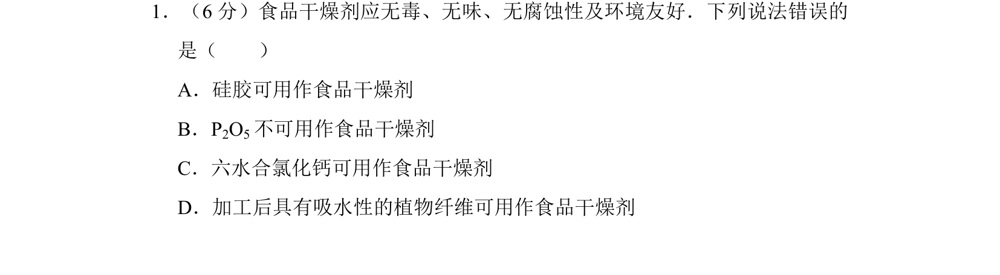
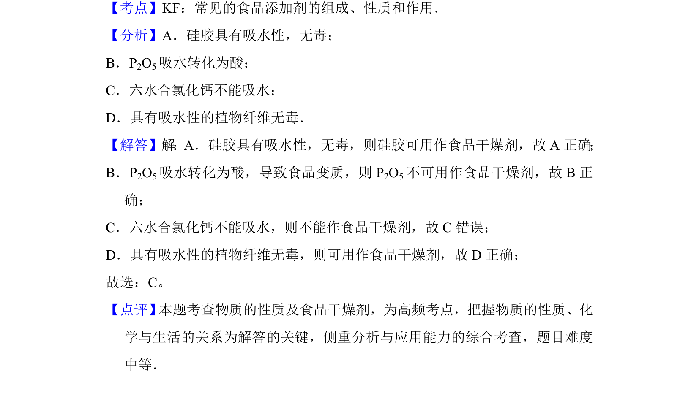

## 题面

## 摘要

考查常见物质用作食品干燥剂的适用性，基于其吸水性和安全性进行判断。

## 关联考点

- [[常见的食品添加剂的组成性质和作用]]
- [[干燥剂]]
- [[吸水性]]
- [[物质性质]]

## 答案与解析

> 📄 原 PDF 第 1 页：`素材/真题/吉林/2008-2024·（吉林）化学高考真题/2015年高考化学试卷（新课标Ⅱ）（解析卷）.pdf`
