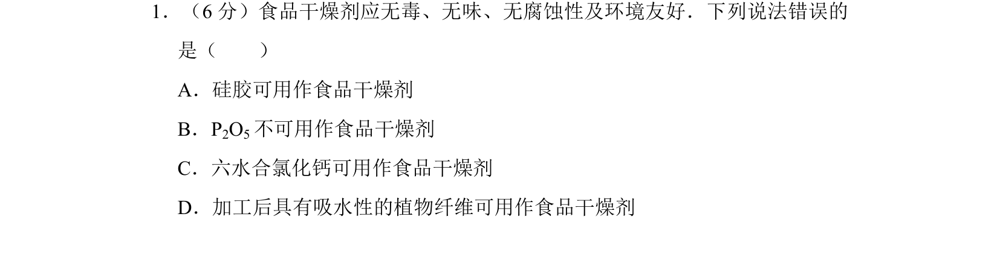
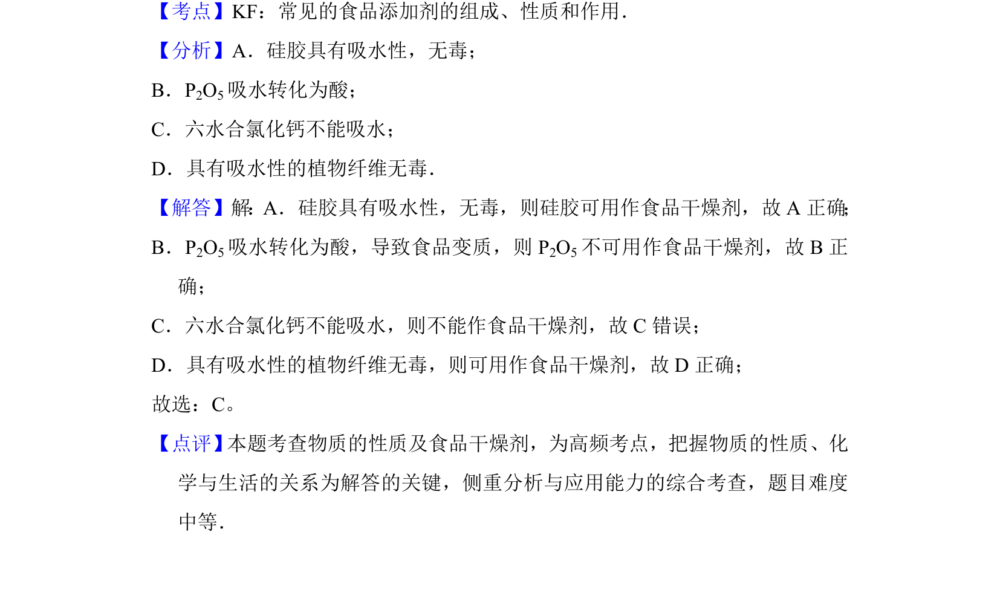

## 题面

## 摘要

考查常见物质用作食品干燥剂的适用性，基于其吸水性和安全性进行判断。

## 关联考点

- [[870-常见的食品添加剂的组成性质和作用|常见的食品添加剂的组成性质和作用]]
- [[543-干燥剂|干燥剂]]
- [[659-吸水性|吸水性]]
- [[774-物质性质|物质性质]]

## 答案与解析

> 📄 原 PDF 第 1 页：`素材/真题/吉林/2008-2024·（吉林）化学高考真题/2015年高考化学试卷（新课标Ⅱ）（解析卷）.pdf`

<!-- 题干文本-start -->
## 题干文本
1．（6分）食品干燥剂应无毒、无味、无腐蚀性及环境友好．下列说法错误的
是（　　）
A．硅胶可用作食品干燥剂
B．P2O5不可用作食品干燥剂
C．六水合氯化钙可用作食品干燥剂
D．加工后具有吸水性的植物纤维可用作食品干燥剂
<!-- 题干文本-end -->

<!-- 解析文本-start -->
## 解析文本
【考点】KF：常见的食品添加剂的组成、性质和作用．菁优网版权所有
【分析】A．硅胶具有吸水性，无毒；
B．P2O5吸水转化为酸；
C．六水合氯化钙不能吸水；
D．具有吸水性的植物纤维无毒．
【解答】解：A．硅胶具有吸水性，无毒，则硅胶可用作食品干燥剂，故A正确；
B．P2O5吸水转化为酸，导致食品变质，则P 2O5不可用作食品干燥剂，故B正
确；
C．六水合氯化钙不能吸水，则不能作食品干燥剂，故C错误；
D．具有吸水性的植物纤维无毒，则可用作食品干燥剂，故D正确；
故选：C。
【点评】 本题考查物质的性质及食品干燥剂，为高频考点，把握物质的性质、化
学与生活的关系为解答的关键，侧重分析与应用能力的综合考查，题目难度
中等．
<!-- 解析文本-end -->
