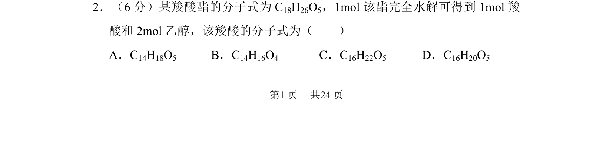
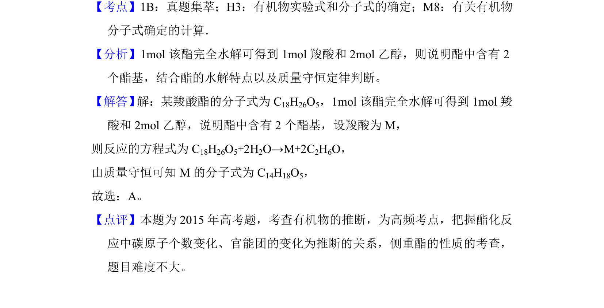

## 题面

## 摘要

通过酯的水解反应，利用原子守恒推算羧酸分子式。

## 关联考点

- [[851-酯的水解反应|酯的水解反应]]
- [[880-原子守恒|原子守恒]]
- [[601-分子式计算|分子式计算]]

## 答案与解析

> 📄 原 PDF 第 1 页：`素材/真题/吉林/2008-2024·（吉林）化学高考真题/2015年高考化学试卷（新课标Ⅱ）（解析卷）.pdf`
