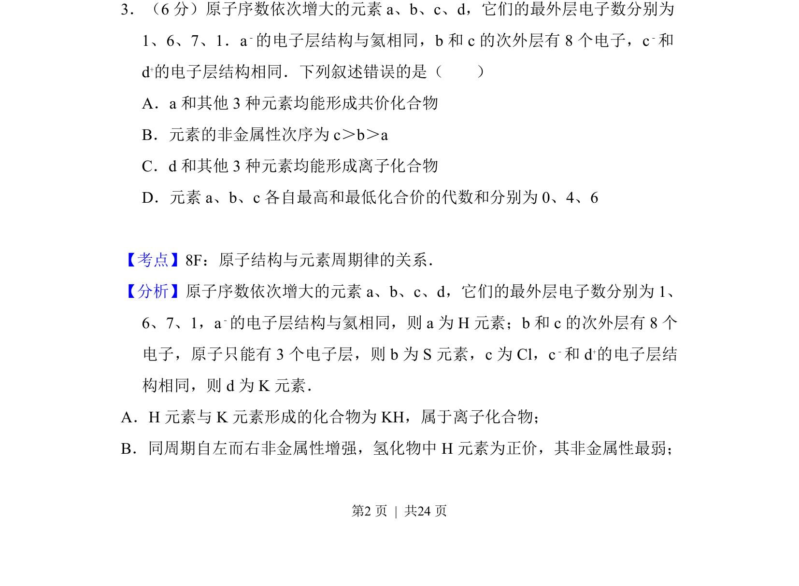
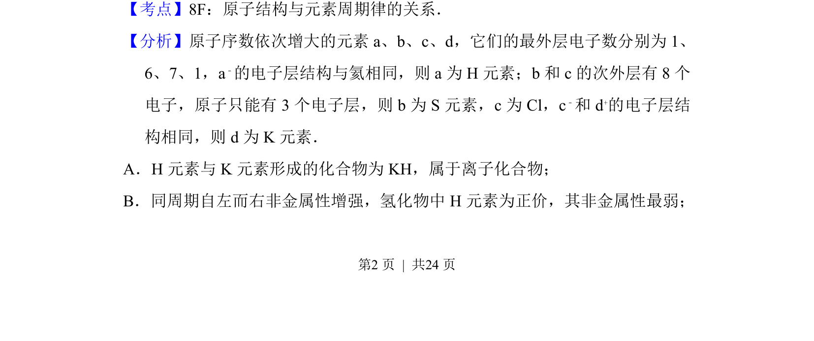
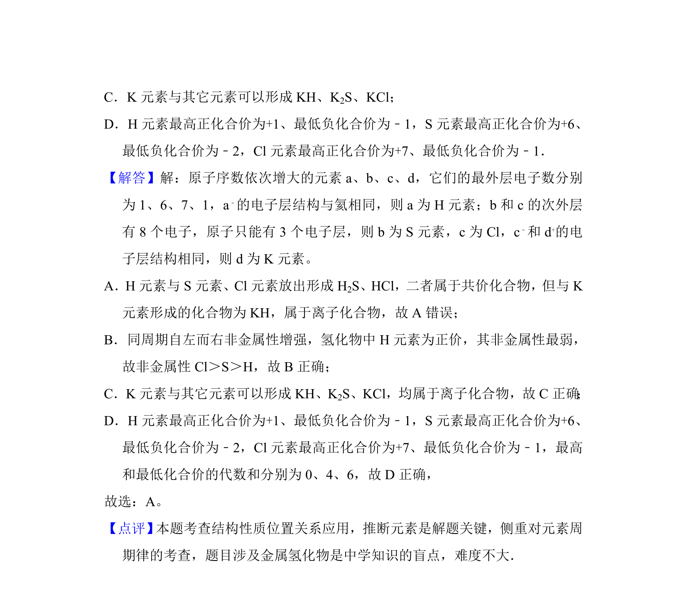

## 题面

## 摘要

推断元素H、S、Cl、K，考查原子结构、元素周期律及化学键类型判断

## 关联考点

- [[530-原子结构与元素周期律|原子结构与元素周期律]]
- [[598-元素非金属性比较|元素非金属性比较]]
- [[893-共价化合物与离子化合物|共价化合物与离子化合物]]

## 答案与解析

> 📄 原 PDF 第 2 页：`素材/真题/吉林/2008-2024·（吉林）化学高考真题/2015年高考化学试卷（新课标Ⅱ）（解析卷）.pdf`

<!-- 题干文本-start -->
## 题干文本
3．（6分）原子序数依次增大的元素a、b、c、d，它们的最外层电子数分别为
1、6、7、1．a﹣的电子层结构与氦相同，b和c的次外层有8个电子，c ﹣和
d+的电子层结构相同．下列叙述错误的是（　　）
A．a和其他3种元素均能形成共价化合物
B．元素的非金属性次序为c＞b＞a
C．d和其他3种元素均能形成离子化合物
D．元素a、b、c各自最高和最低化合价的代数和分别为0、4、6
<!-- 题干文本-end -->

<!-- 解析文本-start -->
## 解析文本
【考点】8F：原子结构与元素周期律的关系．菁优网版权所有
【分析】原子序数依次增大的元素a、b、c、d，它们的最外层电子数分别为1、
6、7、1，a﹣的电子层结构与氦相同，则a为H元素；b和c的次外层有8个
电子，原子只能有3个电子层，则b为S元素，c为Cl，c ﹣和d +的电子层结
构相同，则d为K元素．
A．H元素与K元素形成的化合物为KH，属于离子化合物；
B．同周期自左而右非金属性增强，氢化物中H元素为正价，其非金属性最弱；
<!-- 解析文本-end -->
