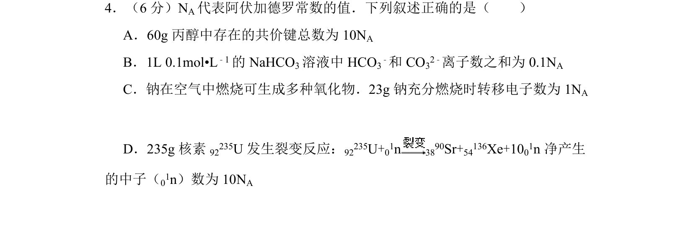
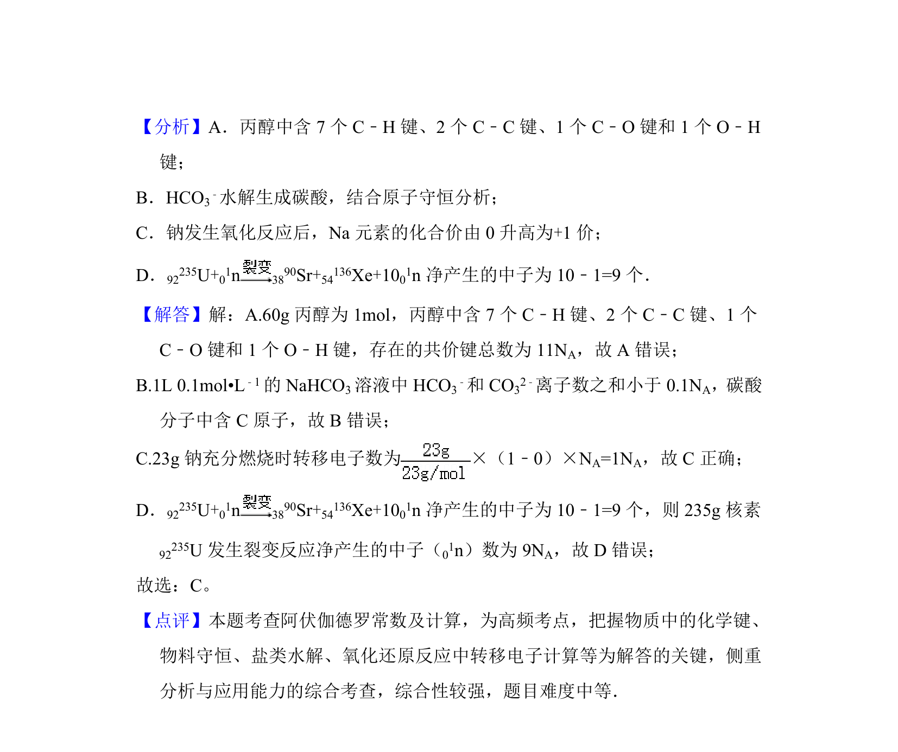

## 题面

## 摘要

本题考查阿伏加德罗常数的应用，包括共价键、离子数目及电子转移的计算。

## 关联考点

- [[450-阿伏伽德罗常数|阿伏加德罗常数]]
- [[779-物质的量|物质的量]]
- [[162-氧化还原反应|氧化还原反应]]
- [[258-化学键|化学键]]

## 答案与解析

> 📄 原 PDF 第 3 页：`素材/真题/吉林/2008-2024·（吉林）化学高考真题/2015年高考化学试卷（新课标Ⅱ）（解析卷）.pdf`
