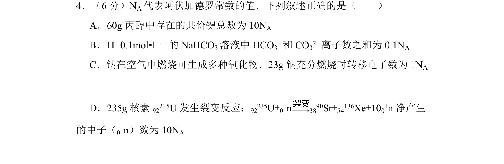
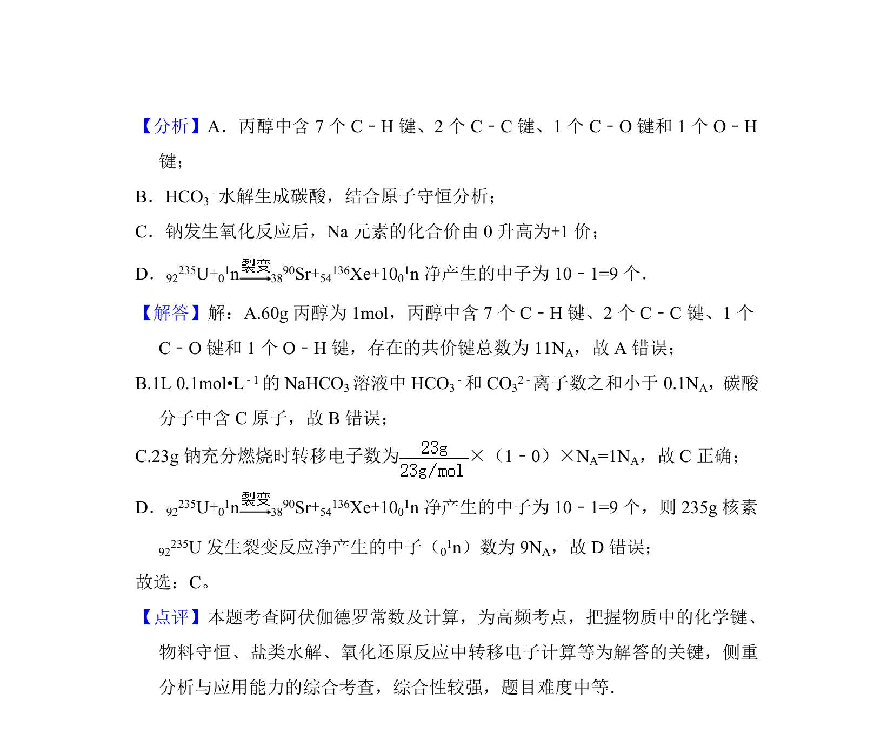

## 题面

## 摘要

本题考查阿伏加德罗常数的应用，包括共价键、离子数目及电子转移的计算。

## 关联考点

- [[450-阿伏伽德罗常数|阿伏加德罗常数]]
- [[779-物质的量|物质的量]]
- [[162-氧化还原反应|氧化还原反应]]
- [[258-化学键|化学键]]

## 答案与解析

> 📄 原 PDF 第 3 页：`素材/真题/吉林/2008-2024·（吉林）化学高考真题/2015年高考化学试卷（新课标Ⅱ）（解析卷）.pdf`

<!-- 题干文本-start -->
## 题干文本
4．（6分）N A代表阿伏加德罗常数的值．下列叙述正确的是（　　）
A．60g丙醇中存在的共价键总数为10N A
B．1L 0.1mol•L﹣1的NaHCO 3溶液中HCO 3
﹣和CO 32﹣离子数之和为0.1N A
C．钠在空气中燃烧可生成多种氧化物．23g钠充分燃烧时转移电子数为1N A
D．235g核素 92235U发生裂变反应： 92235U+01n 3890Sr+54136Xe+1001n净产生
的中子（01n）数为10N A
<!-- 题干文本-end -->

<!-- 解析文本-start -->
## 解析文本
【考点】1B：真题集萃；4F：阿伏加德罗常数．菁优网版权所有
【专题】518：阿伏加德罗常数和阿伏加德罗定律．
<!-- 解析文本-end -->
