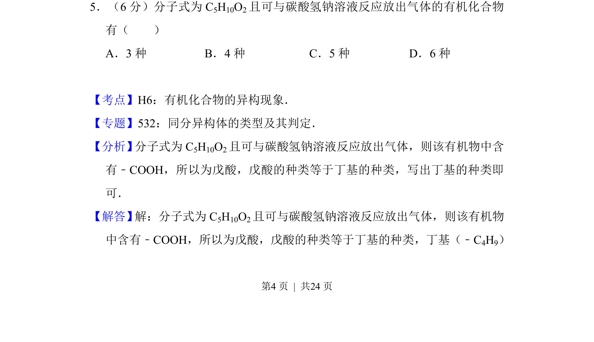
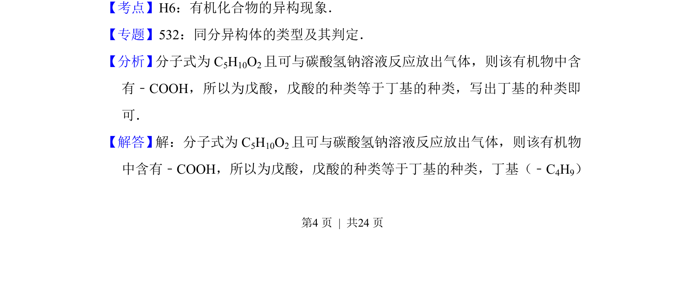
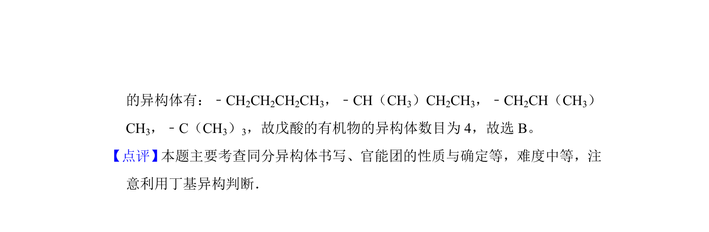

## 题面

## 摘要

分子式C5H10O2的戊酸同分异构体数目判断

## 关联考点

- [[446-同分异构体|同分异构体]]
- [[585-丁基种类|丁基种类]]

## 答案与解析

> 📄 原 PDF 第 4 页：`素材/真题/吉林/2008-2024·（吉林）化学高考真题/2015年高考化学试卷（新课标Ⅱ）（解析卷）.pdf`

<!-- 题干文本-start -->
## 题干文本
5．（6分）分子式为C 5H10O2且可与碳酸氢钠溶液反应放出气体的有机化合物
有（　　）
A．3种B．4种C．5种D．6种
<!-- 题干文本-end -->

<!-- 解析文本-start -->
## 解析文本
【考点】H6：有机化合物的异构现象．菁优网版权所有
【专题】532：同分异构体的类型及其判定．
【分析】 分子式为C5H10O2且可与碳酸氢钠溶液反应放出气体，则该有机物中含
有﹣COOH，所以为戊酸，戊酸的种类等于丁基的种类，写出丁基的种类即
可．
【解答】 解：分子式为C5H10O2且可与碳酸氢钠溶液反应放出气体，则该有机物
中含有﹣COOH，所以为戊酸，戊酸的种类等于丁基的种类，丁基（﹣C4H9）
<!-- 解析文本-end -->
