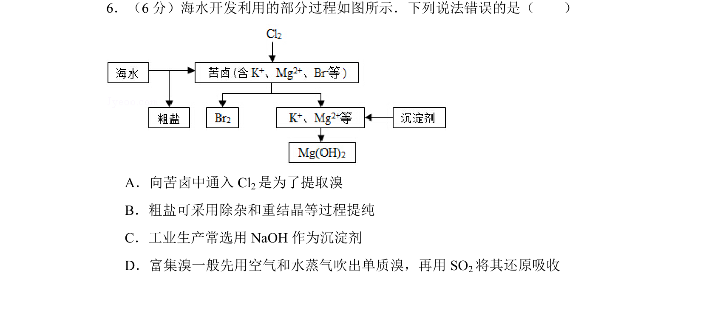
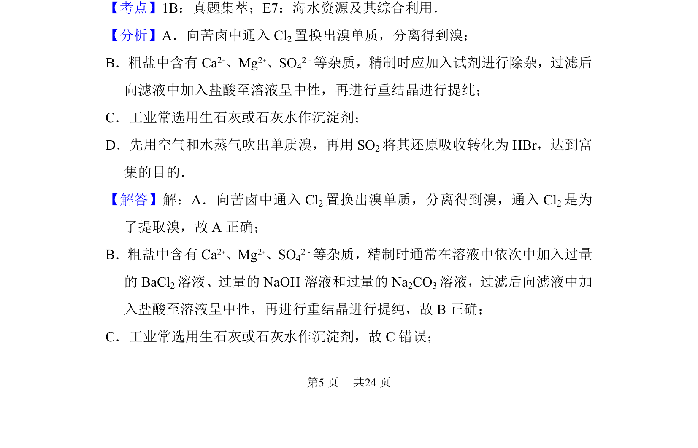

## 题面

## 摘要

该题考查海水资源综合利用中溴提取、粗盐提纯及沉淀剂选择的正误判断。

## 关联考点

- [[海水资源综合利用]]
- [[274-海水提溴|溴的提取]]
- [[粗盐提纯]]
- [[沉淀剂]]

## 答案与解析

> 📄 原 PDF 第 5 页：`素材/真题/吉林/2008-2024·（吉林）化学高考真题/2015年高考化学试卷（新课标Ⅱ）（解析卷）.pdf`
