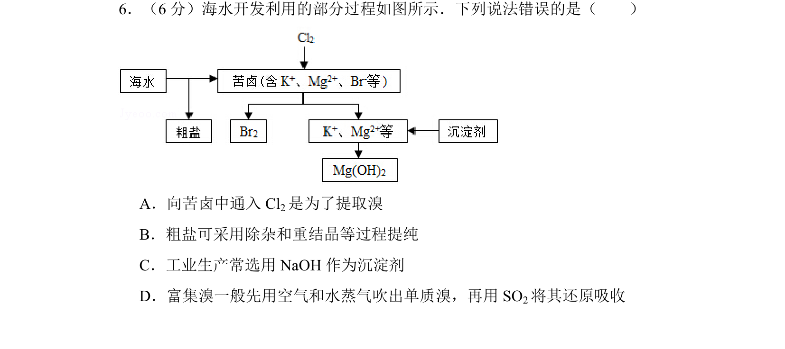
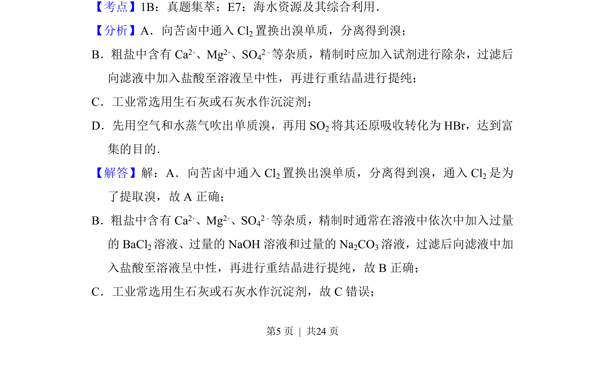
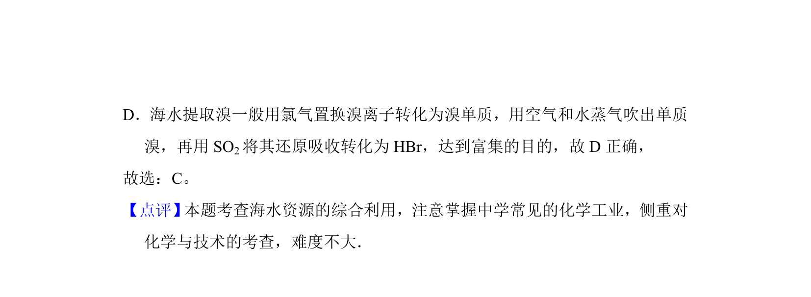

## 题面

## 摘要

该题考查海水资源综合利用中溴提取、粗盐提纯及沉淀剂选择的正误判断。

## 关联考点

- [[755-海水资源综合利用|海水资源综合利用]]
- [[274-海水提溴|溴的提取]]
- [[815-粗盐提纯|粗盐提纯]]
- [[744-沉淀剂|沉淀剂]]

## 答案与解析

> 📄 原 PDF 第 5 页：`素材/真题/吉林/2008-2024·（吉林）化学高考真题/2015年高考化学试卷（新课标Ⅱ）（解析卷）.pdf`

<!-- 题干文本-start -->
## 题干文本
6．（6分）海水开发利用的部分过程如图所示．下列说法错误的是（　　）
A．向苦卤中通入Cl 2是为了提取溴
B．粗盐可采用除杂和重结晶等过程提纯
C．工业生产常选用NaOH作为沉淀剂
D．富集溴一般先用空气和水蒸气吹出单质溴，再用SO 2将其还原吸收
<!-- 题干文本-end -->

<!-- 解析文本-start -->
## 解析文本
【考点】1B：真题集萃；E7：海水资源及其综合利用．菁优网版权所有
【分析】A．向苦卤中通入Cl 2置换出溴单质，分离得到溴；
B．粗盐中含有Ca 2+、Mg2+、SO42﹣等杂质，精制时应加入试剂进行除杂，过滤后
向滤液中加入盐酸至溶液呈中性，再进行重结晶进行提纯；
C．工业常选用生石灰或石灰水作沉淀剂；
D．先用空气和水蒸气吹出单质溴，再用SO 2将其还原吸收转化为HBr，达到富
集的目的．
【解答】解：A．向苦卤中通入Cl 2置换出溴单质，分离得到溴，通入Cl 2是为
了提取溴，故A正确；
B．粗盐中含有Ca 2+、Mg2+、SO42﹣等杂质，精制时通常在溶液中依次中加入过量
的BaCl 2溶液、过量的NaOH溶液和过量的Na 2CO3溶液，过滤后向滤液中加
入盐酸至溶液呈中性，再进行重结晶进行提纯，故B正确；
C．工业常选用生石灰或石灰水作沉淀剂，故C错误；
<!-- 解析文本-end -->
