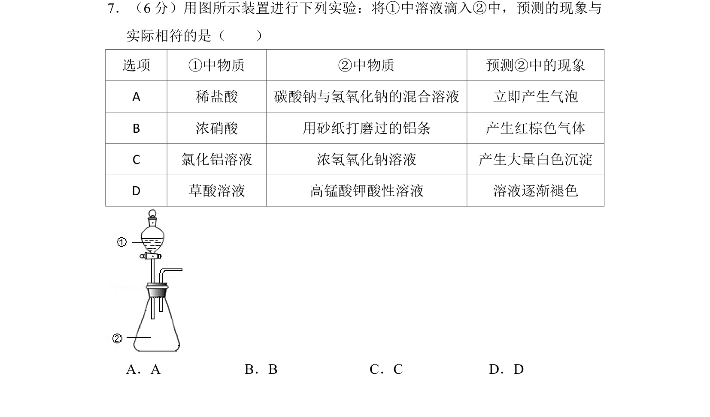
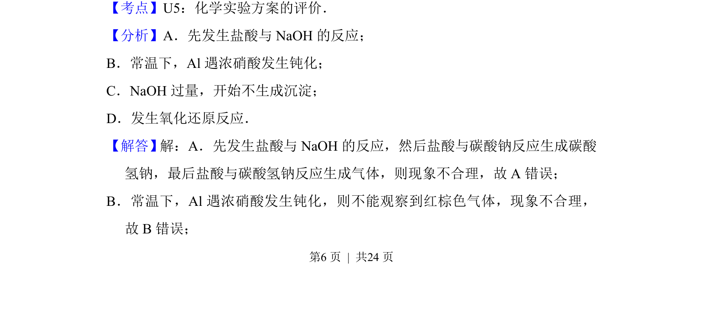

## 题面

## 摘要

考查化学实验方案评价，预测物质混合后的反应现象与实际是否相符。

## 关联考点

- [[化学实验方案评价]]
- [[反应顺序]]
- [[钝化]]
- [[162-氧化还原反应|氧化还原反应]]

## 答案与解析

> 📄 原 PDF 第 6 页：`素材/真题/吉林/2008-2024·（吉林）化学高考真题/2015年高考化学试卷（新课标Ⅱ）（解析卷）.pdf`
