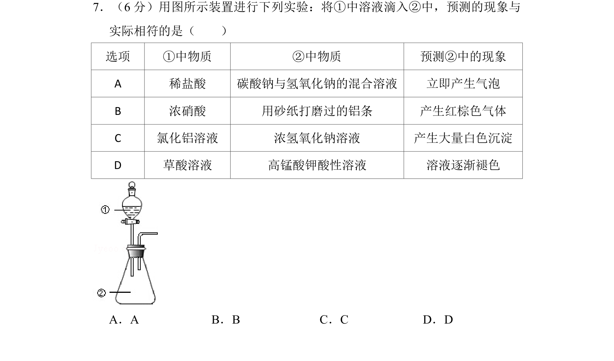
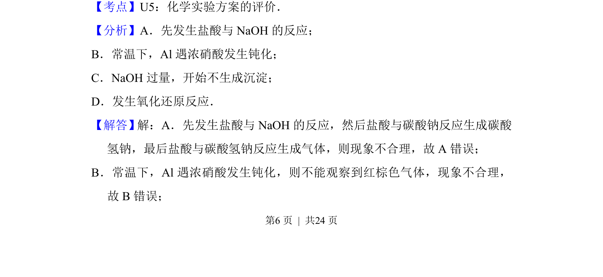
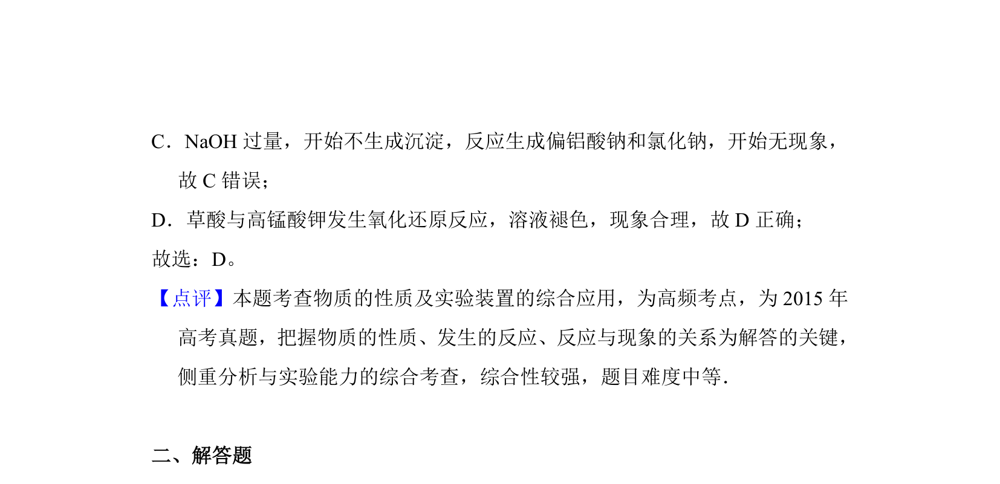

## 题面

## 摘要

考查化学实验方案评价，预测物质混合后的反应现象与实际是否相符。

## 关联考点

- [[613-化学实验方案评价|化学实验方案评价]]
- [[535-反应顺序|反应顺序]]
- [[860-钝化|钝化]]
- [[162-氧化还原反应|氧化还原反应]]

## 答案与解析

> 📄 原 PDF 第 6 页：`素材/真题/吉林/2008-2024·（吉林）化学高考真题/2015年高考化学试卷（新课标Ⅱ）（解析卷）.pdf`

<!-- 题干文本-start -->
## 题干文本
7．（6分）用图所示装置进行下列实验：将①中溶液滴入②中，预测的现象与
实际相符的是（　　） 
选项 ①中物质 ②中物质 预测②中的现象
A 稀盐酸 碳酸钠与氢氧化钠的混合溶液 立即产生气泡
B 浓硝酸 用砂纸打磨过的铝条 产生红棕色气体
C 氯化铝溶液 浓氢氧化钠溶液 产生大量白色沉淀
D 草酸溶液 高锰酸钾酸性溶液 溶液逐渐褪色
A．A B．B C．C D．D
<!-- 题干文本-end -->

<!-- 解析文本-start -->
## 解析文本
【考点】U5：化学实验方案的评价．菁优网版权所有
【分析】A．先发生盐酸与NaOH的反应；
B．常温下，Al遇浓硝酸发生钝化；
C．NaOH过量，开始不生成沉淀；
D．发生氧化还原反应．
【解答】解：A．先发生盐酸与NaOH的反应，然后盐酸与碳酸钠反应生成碳酸
氢钠，最后盐酸与碳酸氢钠反应生成气体，则现象不合理，故A错误；
B．常温下，Al遇浓硝酸发生钝化，则不能观察到红棕色气体，现象不合理，
故B错误；
<!-- 解析文本-end -->
