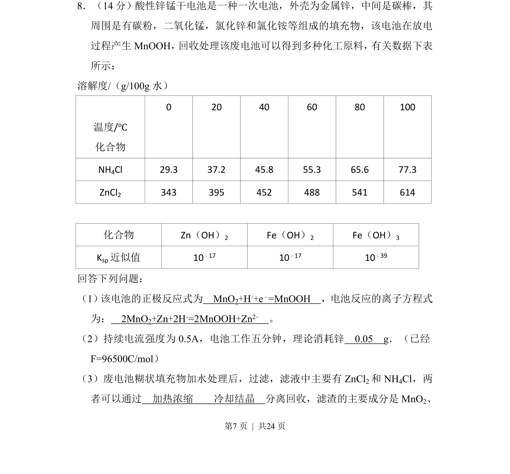
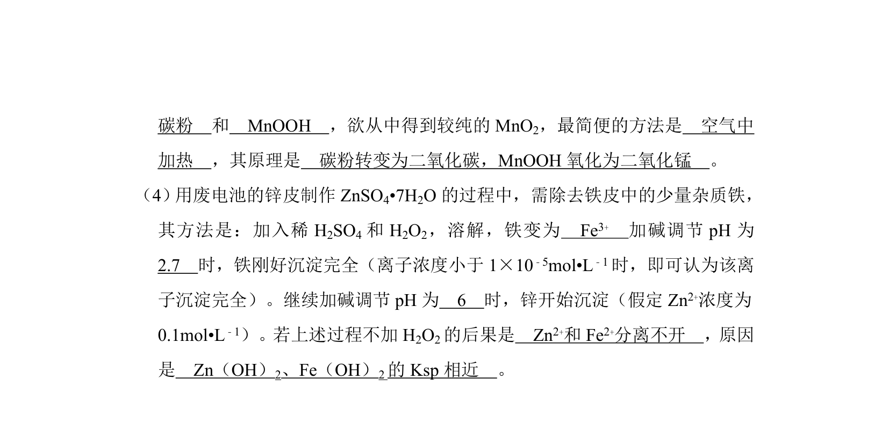
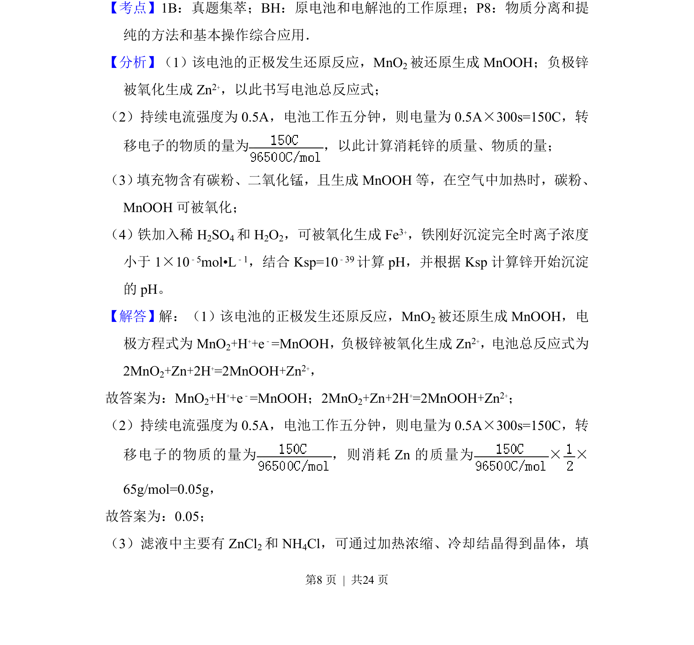
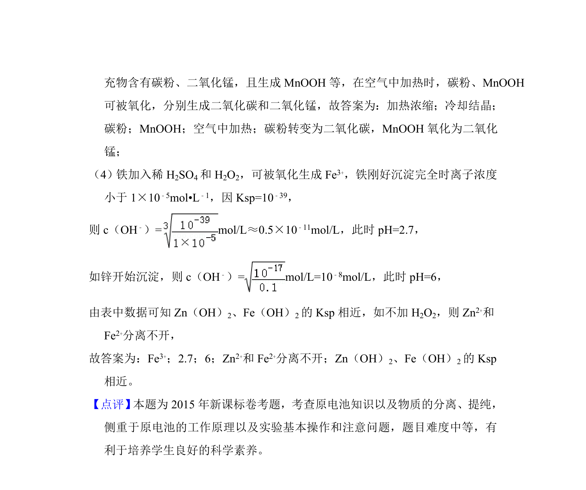

## 题面

## 摘要

第8题考查酸性锌锰干电池原理、电极反应书写及废料回收分离操作与简单计算。

## 关联考点

- [[789-电化学|电化学]]
- [[626-化学计算|化学计算]]
- [[555-物质分离|物质分离]]

## 答案与解析

> 📄 原 PDF 第 7 页：`素材/真题/吉林/2008-2024·（吉林）化学高考真题/2015年高考化学试卷（新课标Ⅱ）（解析卷）.pdf`

<!-- 题干文本-start -->
## 题干文本
8．（14分）酸性锌锰干电池是一种一次电池，外壳为金属锌，中间是碳棒，其
周围是有碳粉，二氧化锰，氯化锌和氯化铵等组成的填充物，该电池在放电
过程产生MnOOH， 回收处理该废电池可以得到多种化工原料， 有关数据下表
所示：
溶解度/（g/100g水）
温度/℃
化合物
0 20 40 60 80 100
NH4Cl 29.3 37.2 45.8 55.3 65.6 77.3
ZnCl2 343 395 452 488 541 614
化合物 Zn（OH）2 Fe（OH）2 Fe（OH）3
Ksp近似值 10﹣17 10﹣17 10﹣39
回答下列问题：
（1） 该电池的正极反应式为　MnO2+H++e﹣=MnOOH　，电池反应的离子方程式
为：　2MnO2+Zn+2H+=2MnOOH+Zn2+　。
（2）持续电流强度为0.5A，电池工作五分钟，理论消耗锌　0.05　g．（已经
F=96500C/mol）
（3）废电池糊状填充物加水处理后，过滤，滤液中主要有ZnCl 2和NH 4Cl，两
者可以通过　加热浓缩　　冷却结晶　分离回收，滤渣的主要成分是MnO 2、
<!-- 题干文本-end -->

<!-- 解析文本-start -->
## 解析文本

<!-- 解析文本-end -->
