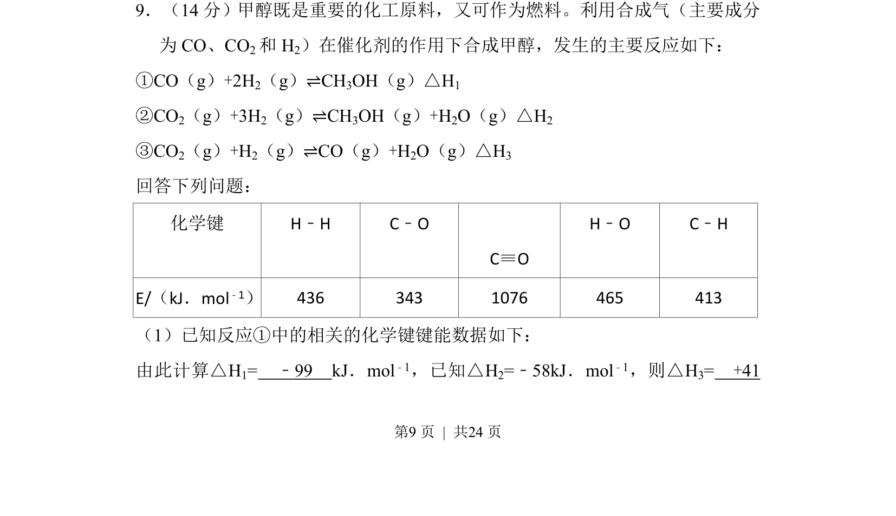

## 题面

## 摘要

该题通过键能数据计算反应①的焓变，并利用已知反应焓变结合盖斯定律求算反应③的焓变

## 关联考点

- [[反应热计算]]
- [[311-盖斯定律|盖斯定律]]
- [[315-键能|键能]]

## 答案与解析

> 📄 原 PDF 第 9 页：`素材/真题/吉林/2008-2024·（吉林）化学高考真题/2015年高考化学试卷（新课标Ⅱ）（解析卷）.pdf`
