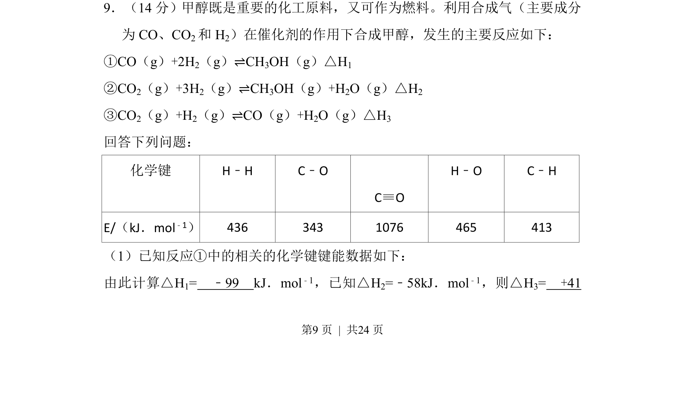
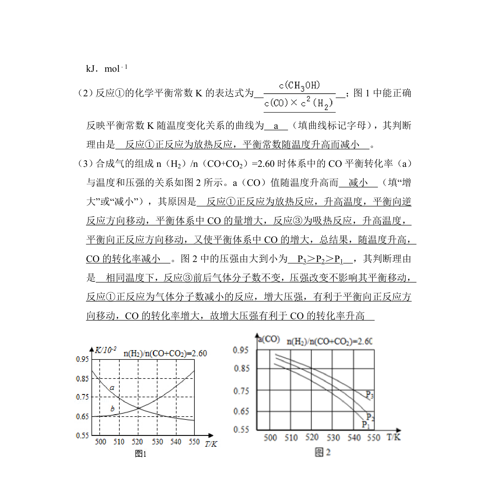
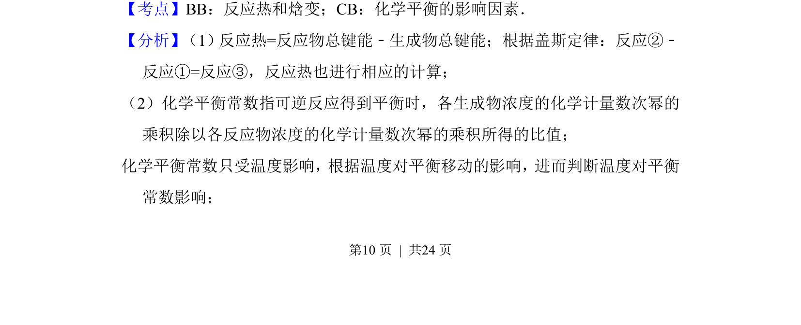
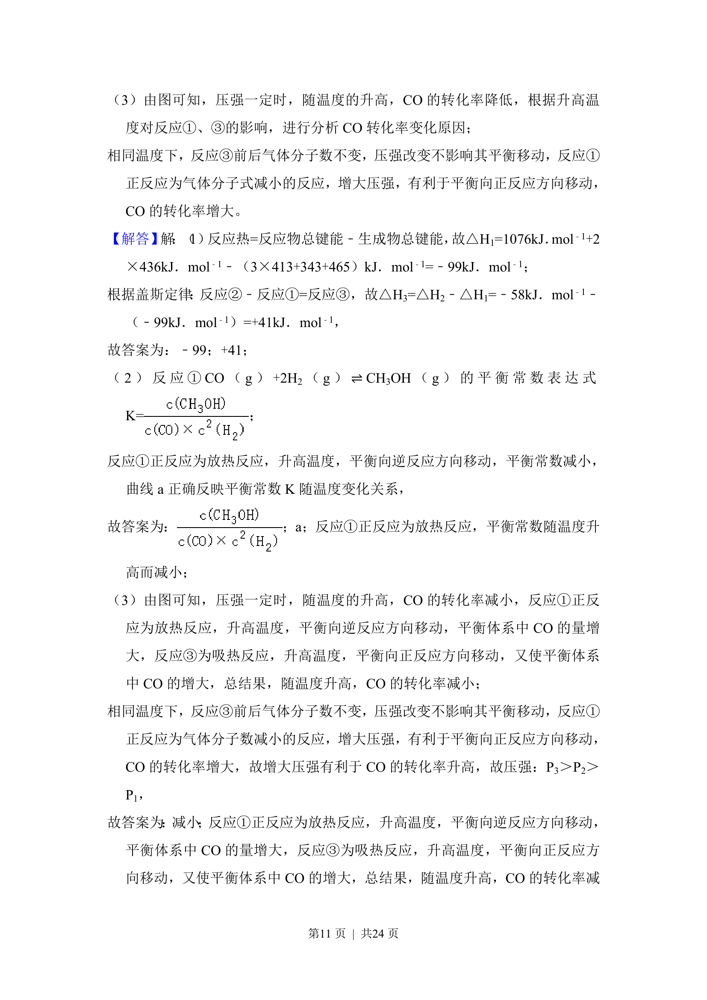
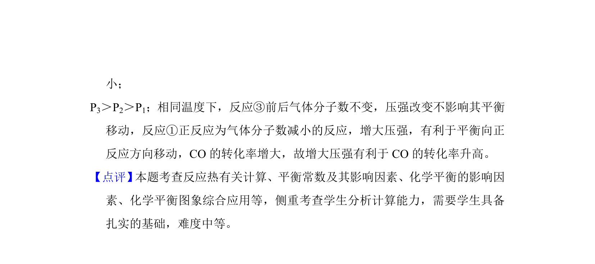

## 题面

## 摘要

该题通过键能数据计算反应①的焓变，并利用已知反应焓变结合盖斯定律求算反应③的焓变

## 关联考点

- [[768-热化学方程式与反应热计算|反应热计算]]
- [[311-盖斯定律|盖斯定律]]
- [[315-键能|键能]]

## 答案与解析

> 📄 原 PDF 第 9 页：`素材/真题/吉林/2008-2024·（吉林）化学高考真题/2015年高考化学试卷（新课标Ⅱ）（解析卷）.pdf`

<!-- 题干文本-start -->
## 题干文本
9．（14分）甲醇既是重要的化工原料，又可作为燃料。利用合成气（主要成分
为CO、CO 2和H 2）在催化剂的作用下合成甲醇，发生的主要反应如下：
①CO（g）+2H2（g）⇌CH3OH（g）△H1
②CO2（g）+3H2（g）⇌CH3OH（g）+H2O（g）△H2
③CO2（g）+H2（g）⇌CO（g）+H2O（g）△H3
回答下列问题：
化学键 H﹣H C﹣O
C≡O
H﹣O C﹣H
E/（kJ．mol﹣1） 436 343 1076 465 413
（1）已知反应①中的相关的化学键键能数据如下：
由此计算△H 1=　﹣99　kJ．mol ﹣1，已知△H 2=﹣58kJ．mol﹣1，则△H 3=　+41
<!-- 题干文本-end -->

<!-- 解析文本-start -->
## 解析文本

<!-- 解析文本-end -->
