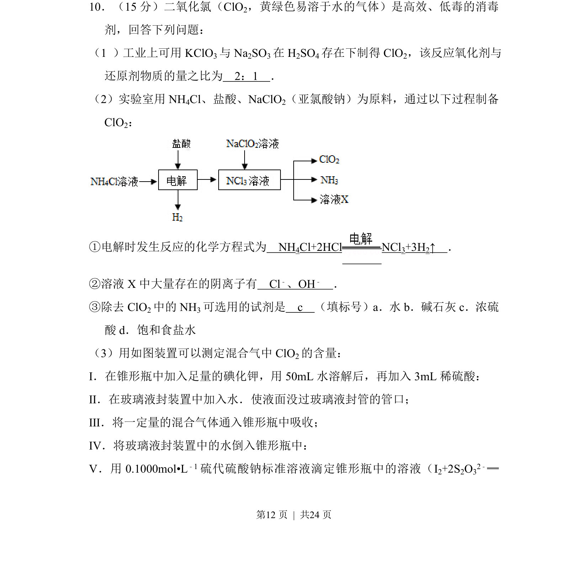
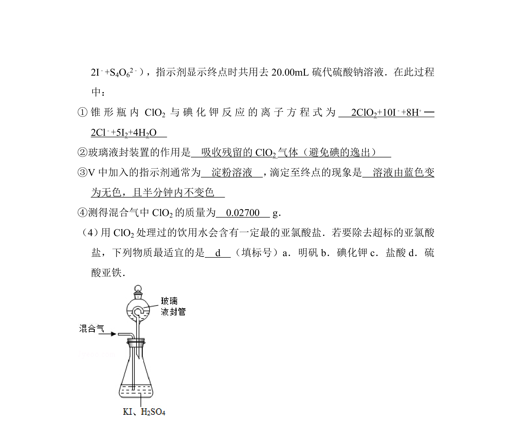
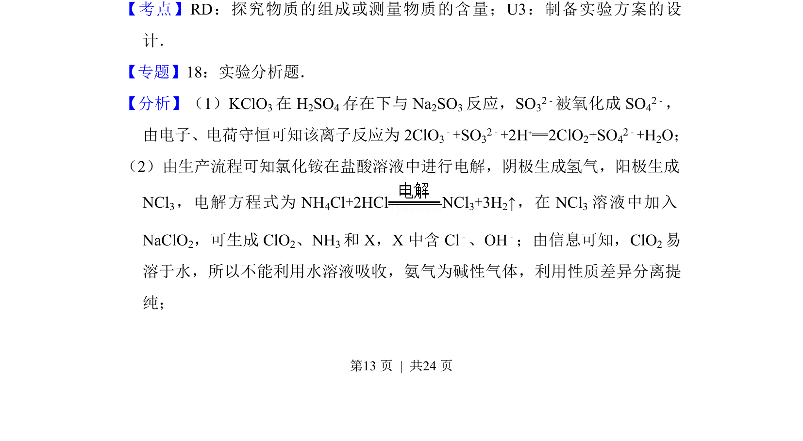
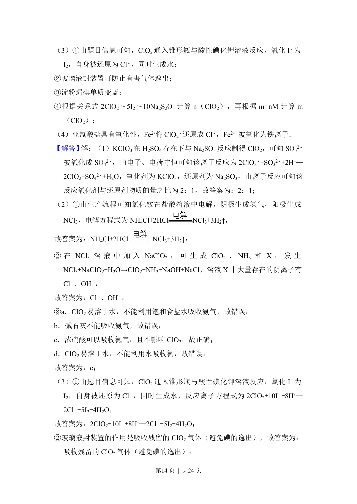
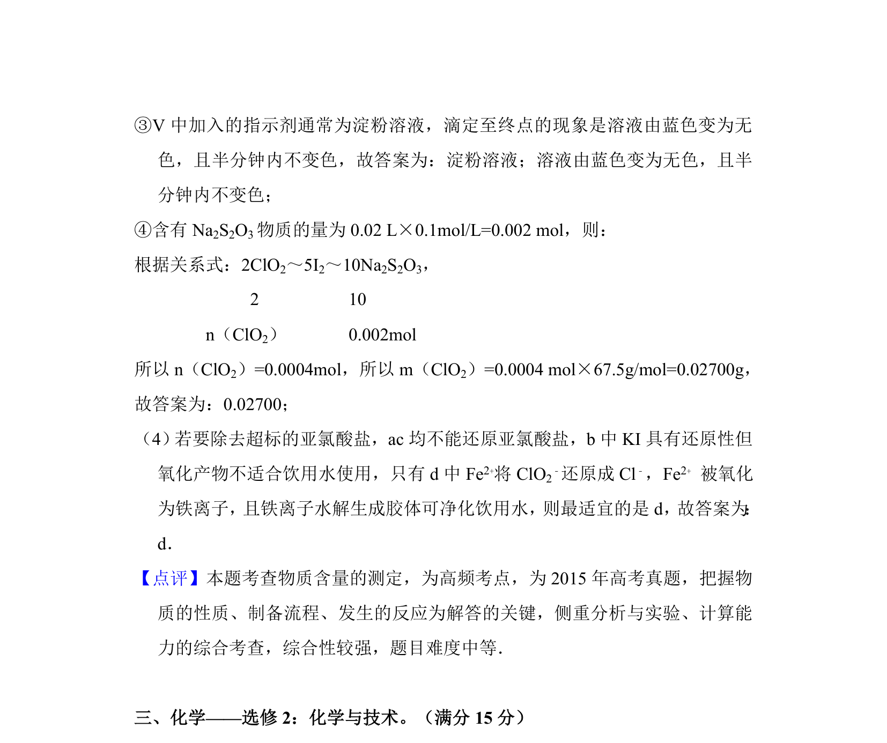

## 题面

## 摘要

考查ClO2的工业制备、实验室电解制备、除杂及碘量法含量测定。

## 关联考点

- [[162-氧化还原反应|氧化还原反应]]
- [[367-电解原理|电解原理]]
- [[774-物质分离提纯|物质分离提纯]]
- [[766-滴定分析|滴定分析]]

## 答案与解析

> 📄 原 PDF 第 12 页：`素材/真题/吉林/2008-2024·（吉林）化学高考真题/2015年高考化学试卷（新课标Ⅱ）（解析卷）.pdf`
