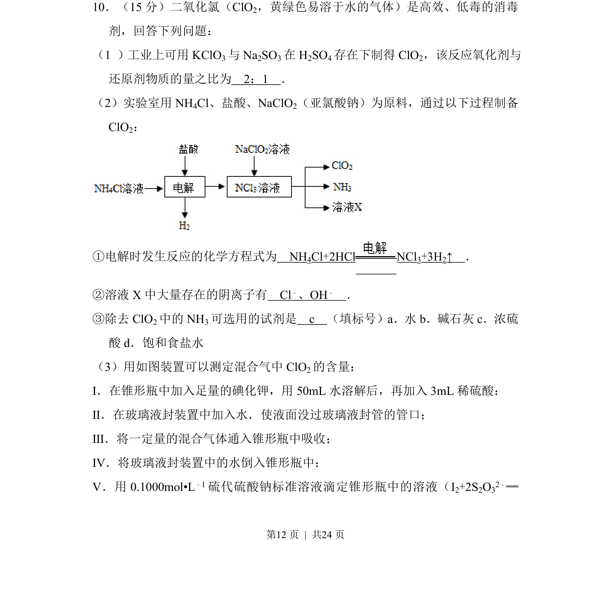
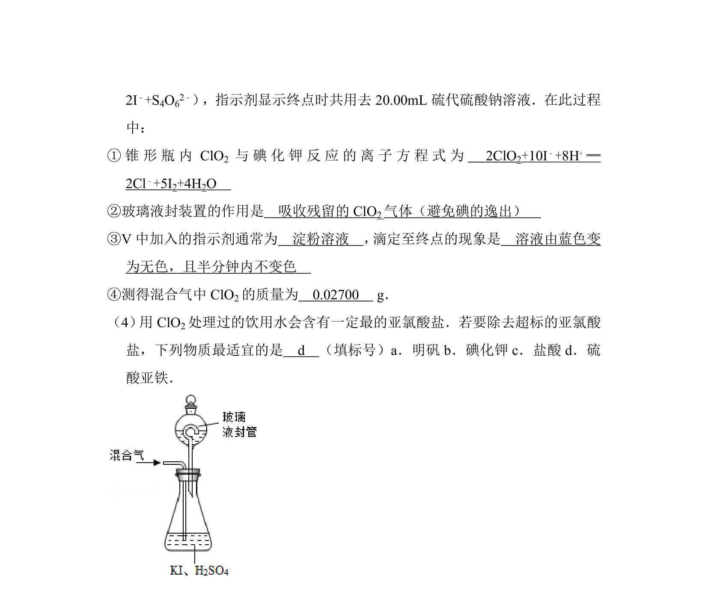
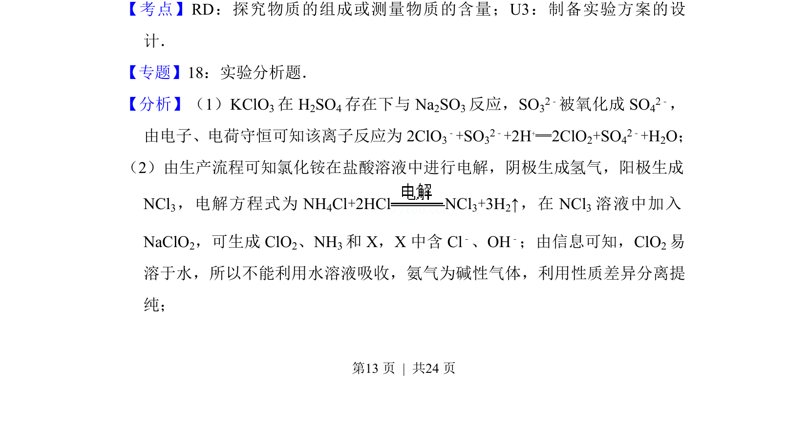
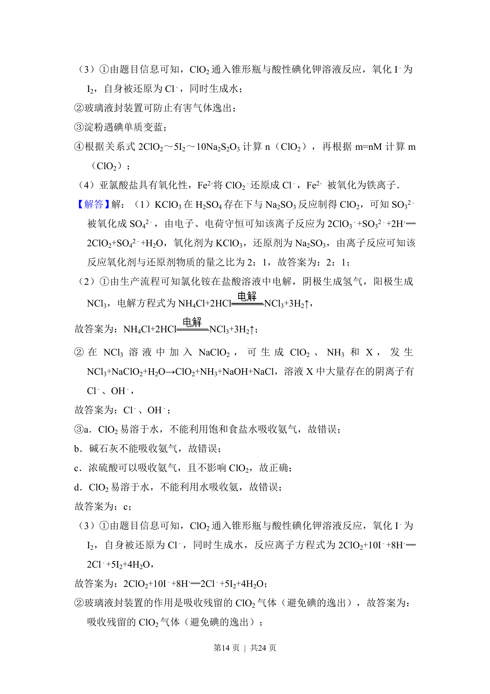
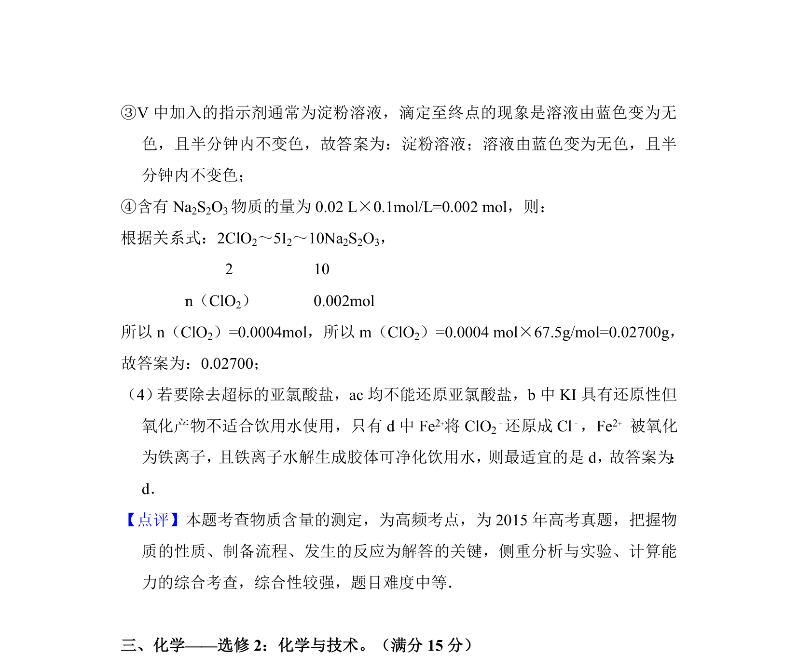

## 题面

## 摘要

考查ClO2的工业制备、实验室电解制备、除杂及碘量法含量测定。

## 关联考点

- [[162-氧化还原反应|氧化还原反应]]
- [[367-电解原理|电解原理]]
- [[773-物质分离提纯|物质分离提纯]]
- [[765-滴定分析|滴定分析]]

## 答案与解析

> 📄 原 PDF 第 12 页：`素材/真题/吉林/2008-2024·（吉林）化学高考真题/2015年高考化学试卷（新课标Ⅱ）（解析卷）.pdf`

<!-- 题干文本-start -->
## 题干文本
10．（15分）二氧化氯（ClO 2，黄绿色易溶于水的气体）是高效、低毒的消毒
剂，回答下列问題：
（1 ）工业上可用KClO 3与Na 2SO3在H 2SO4存在下制得ClO 2，该反应氧化剂与
还原剂物质的量之比为　2：1　．
（2）实验室用NH 4Cl、盐酸、NaClO2（亚氯酸钠）为原料，通过以下过程制备
ClO2：
①电解时发生反应的化学方程式为　NH4Cl+2HCl NCl3+3H2↑　．
②溶液X中大量存在的阴离子有　Cl ﹣、OH﹣　．
③除去ClO 2中的NH 3可选用的试剂是　c　（填标号）a．水b．碱石灰c．浓硫
酸d．饱和食盐水
（3）用如图装置可以测定混合气中ClO 2的含量：
Ⅰ．在锥形瓶中加入足量的碘化钾，用50mL水溶解后，再加入3mL稀硫酸：
Ⅱ．在玻璃液封装置中加入水．使液面没过玻璃液封管的管口；
Ⅲ．将一定量的混合气体通入锥形瓶中吸收；
Ⅳ．将玻璃液封装置中的水倒入锥形瓶中：
Ⅴ．用0.1000mol•L ﹣1硫代硫酸钠标准溶液滴定锥形瓶中的溶液（I 2+2S2O32﹣═
<!-- 题干文本-end -->

<!-- 解析文本-start -->
## 解析文本

<!-- 解析文本-end -->
