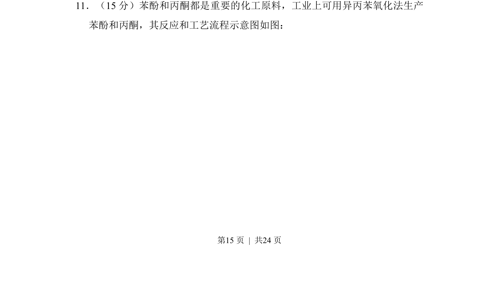
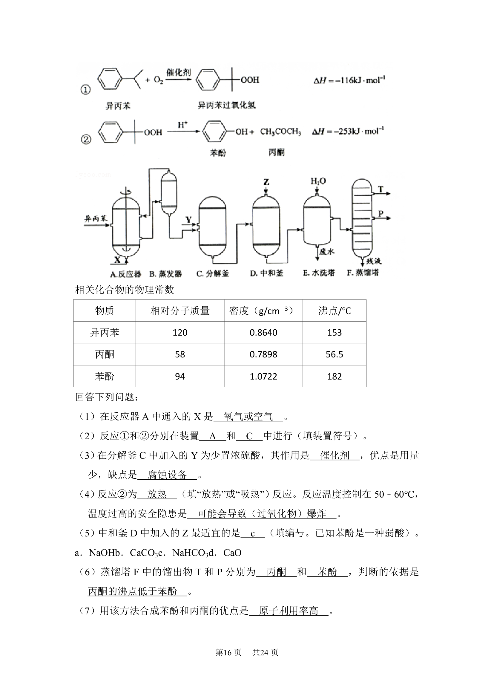
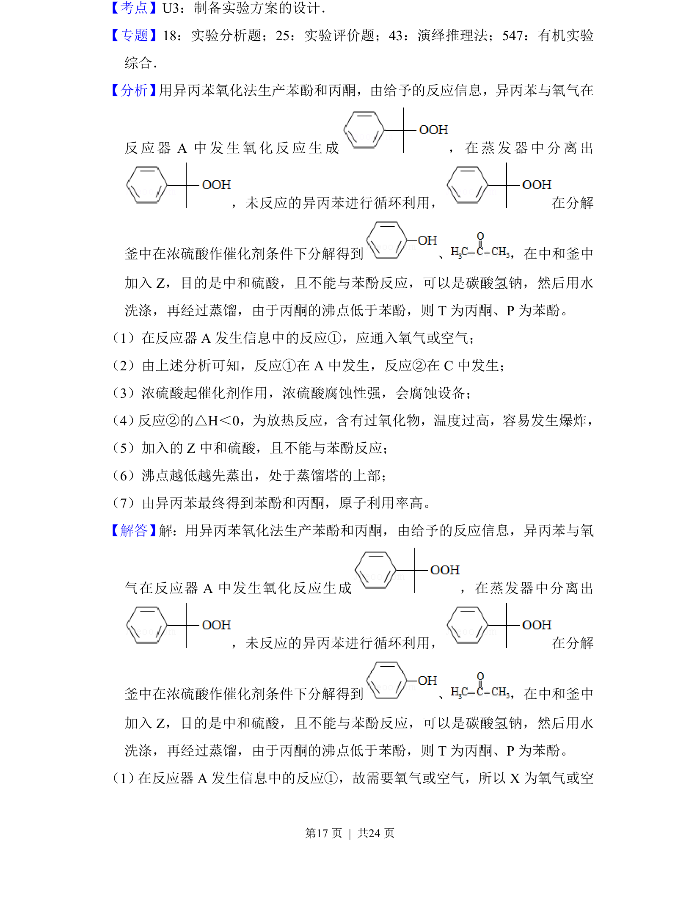
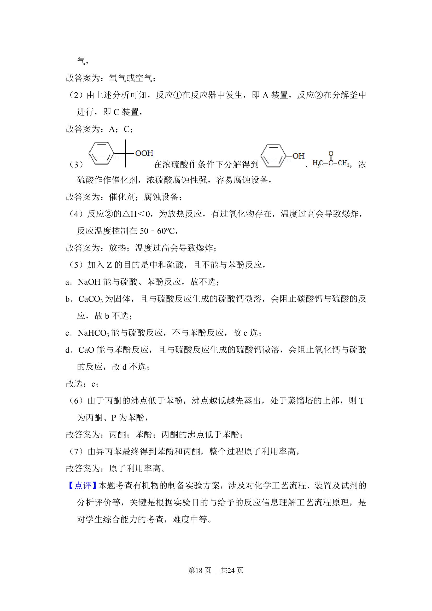

## 题面

## 摘要

考查异丙苯氧化法制苯酚和丙酮的工艺流程及相关反应

## 关联考点

- [[684-异丙苯氧化法|异丙苯氧化法]]
- [[831-苯酚制备|苯酚制备]]
- [[887-丙酮制备|丙酮制备]]
- [[680-工艺流程分析|工艺流程分析]]

## 答案与解析

> 📄 原 PDF 第 15 页：`素材/真题/吉林/2008-2024·（吉林）化学高考真题/2015年高考化学试卷（新课标Ⅱ）（解析卷）.pdf`
