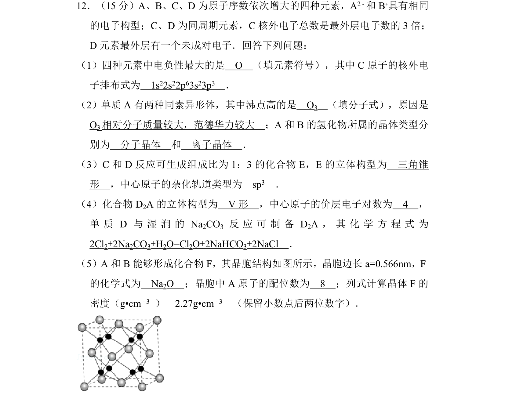
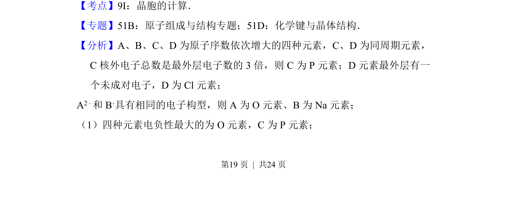
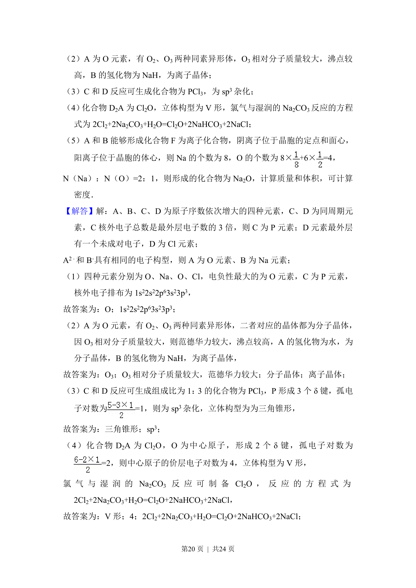
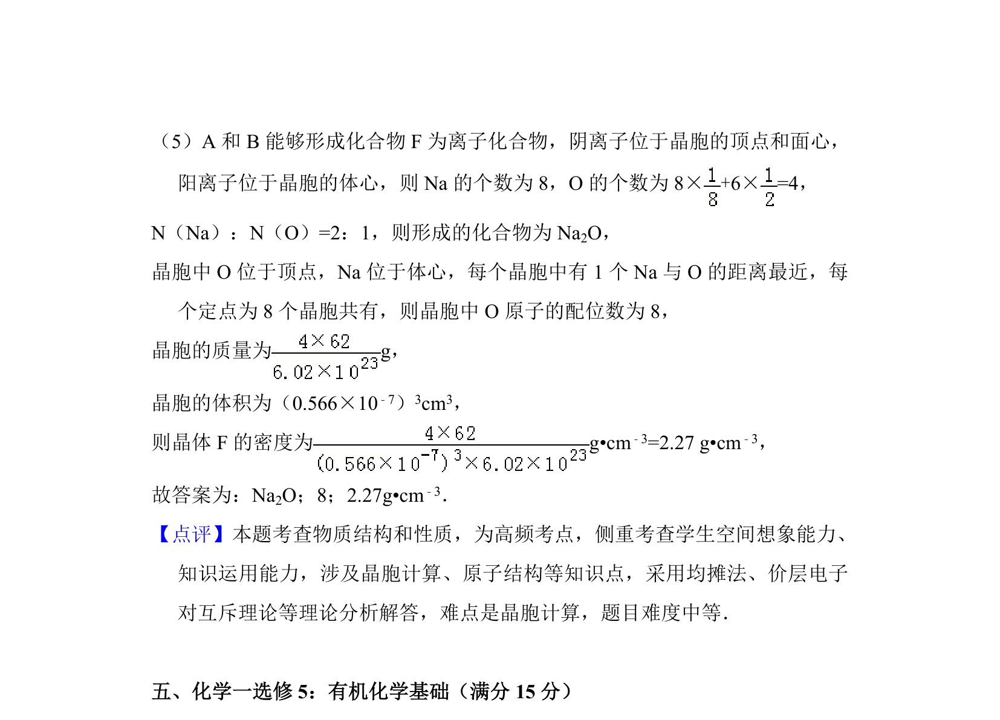

## 题面

## 摘要

本题考查元素推断、物质结构与性质的综合应用，涉及电负性、电子排布、晶体类型、分子构型、杂化方式及晶胞密度计算等。

## 关联考点

- [[252-元素周期律|元素周期律]]
- [[602-分子构型与杂化|分子构型与杂化]]
- [[702-晶胞计算|晶胞计算]]
- [[674-密度求解|密度求解]]

## 答案与解析

> 📄 原 PDF 第 19 页：`素材/真题/吉林/2008-2024·（吉林）化学高考真题/2015年高考化学试卷（新课标Ⅱ）（解析卷）.pdf`
