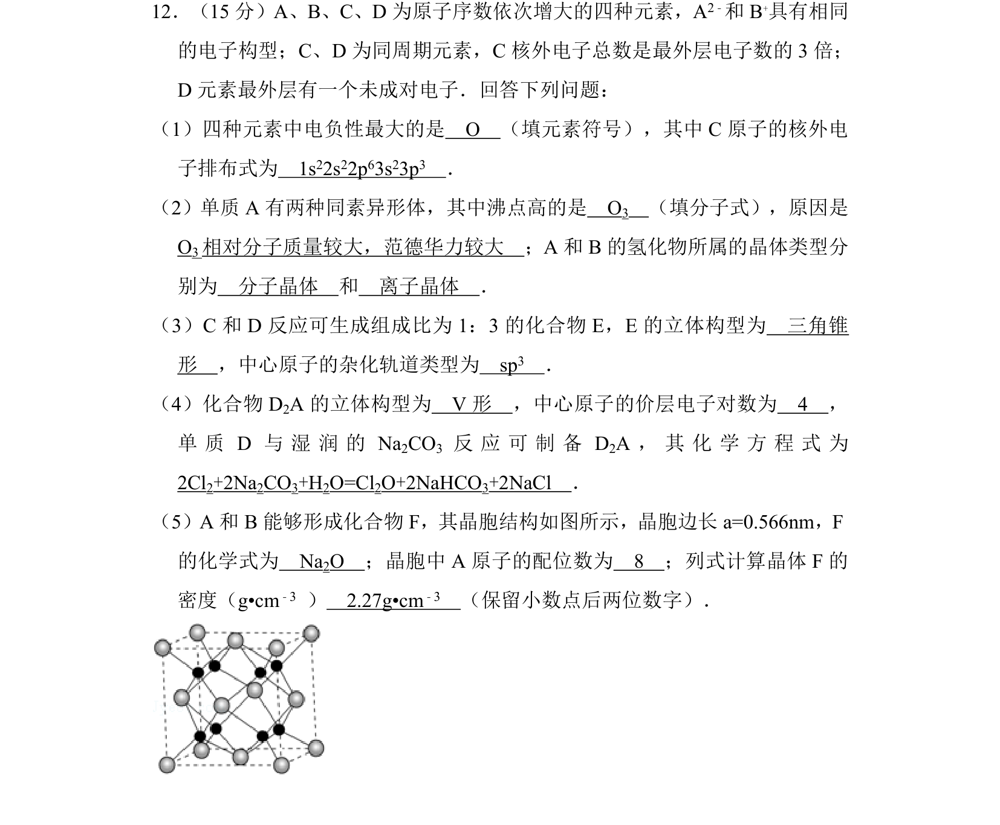
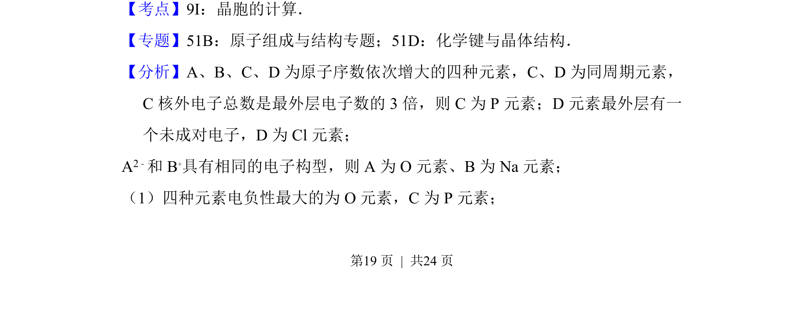
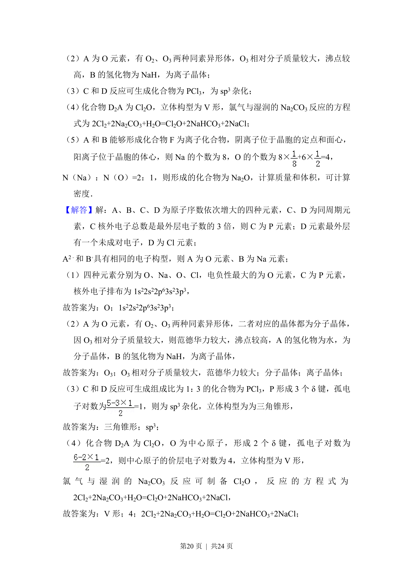
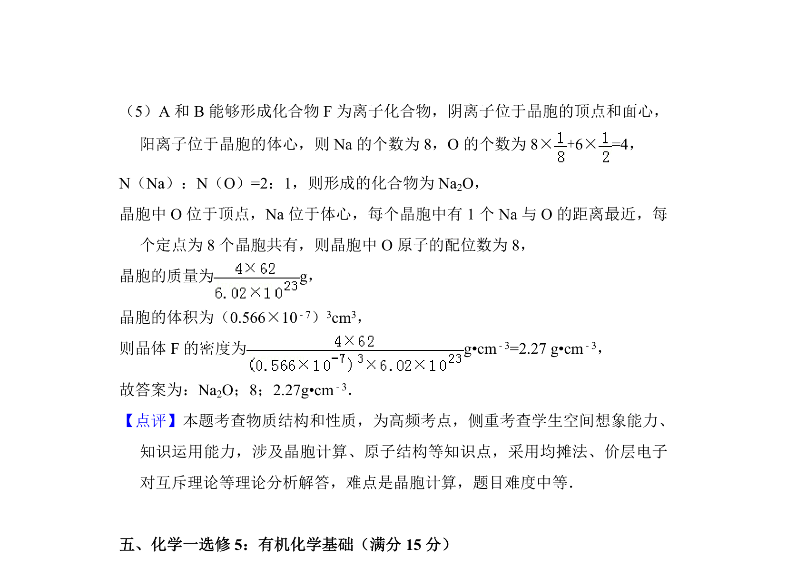

## 题面

## 摘要

本题考查元素推断、物质结构与性质的综合应用，涉及电负性、电子排布、晶体类型、分子构型、杂化方式及晶胞密度计算等。

## 关联考点

- [[252-元素周期律|元素周期律]]
- [[602-分子构型与杂化|分子构型与杂化]]
- [[702-晶胞计算|晶胞计算]]
- [[674-密度求解|密度求解]]

## 答案与解析

> 📄 原 PDF 第 19 页：`素材/真题/吉林/2008-2024·（吉林）化学高考真题/2015年高考化学试卷（新课标Ⅱ）（解析卷）.pdf`

<!-- 题干文本-start -->
## 题干文本
12．（15分）A、B、C、D为原子序数依次增大的四种元素，A 2﹣和B +具有相同
的电子构型；C、D为同周期元素，C核外电子总数是最外层电子数的3倍；
D元素最外层有一个未成对电子．回答下列问题：
（1）四种元素中电负性最大的是　O　（填元素符号），其中C原子的核外电
子排布式为　1s22s22p63s23p3　．
（2）单质A有两种同素异形体，其中沸点高的是　O 3　（填分子式），原因是　
O3相对分子质量较大，范德华力较大　；A和B的氢化物所属的晶体类型分
别为　分子晶体　和　离子晶体　．
（3）C和D反应可生成组成比为1：3的化合物E，E的立体构型为　三角锥
形　，中心原子的杂化轨道类型为　sp3　．
（4）化合物D 2A的立体构型为　V形　，中心原子的价层电子对数为　4　，
单 质D与 湿 润 的Na 2CO3 反 应 可 制 备D2A， 其 化 学 方 程 式 为 　
2Cl2+2Na2CO3+H2O=Cl2O+2NaHCO3+2NaCl　．
（5）A和B能够形成化合物F，其晶胞结构如图所示，晶胞边长a=0.566nm，F
的化学式为　Na2O　；晶胞中A原子的配位数为　8　；列式计算晶体F的
密度（g•cm﹣3 ）　2.27g•cm ﹣3　（保留小数点后两位数字）．
<!-- 题干文本-end -->

<!-- 解析文本-start -->
## 解析文本
【考点】9I：晶胞的计算．菁优网版权所有
【专题】51B：原子组成与结构专题；51D：化学键与晶体结构．
【分析】A、B、C、D为原子序数依次增大的四种元素，C、D为同周期元素，
C核外电子总数是最外层电子数的3倍，则C为P元素；D元素最外层有一
个未成对电子，D为Cl元素；
A2﹣和B +具有相同的电子构型，则A为O元素、B为Na元素；
（1）四种元素电负性最大的为O元素，C为P元素；
<!-- 解析文本-end -->
