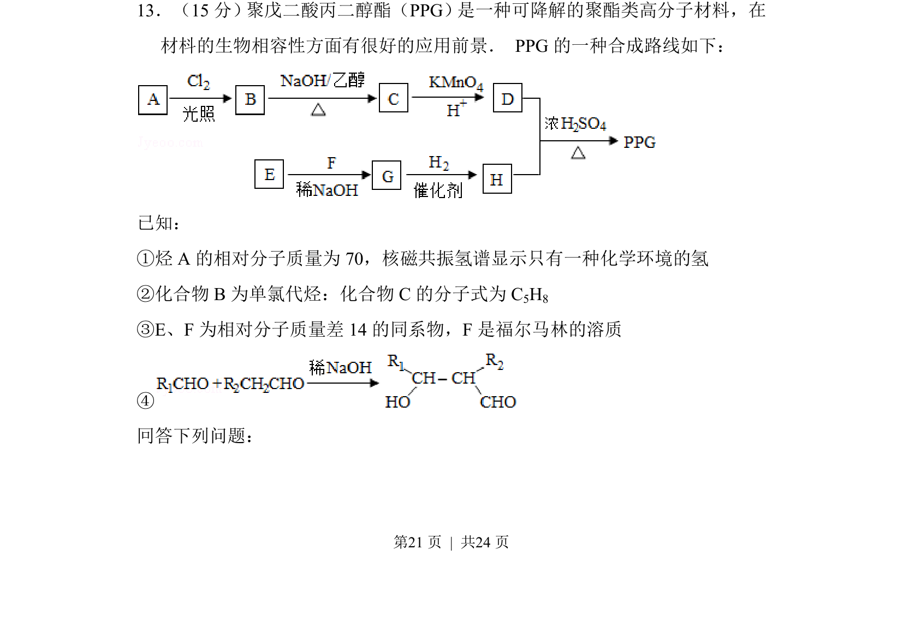
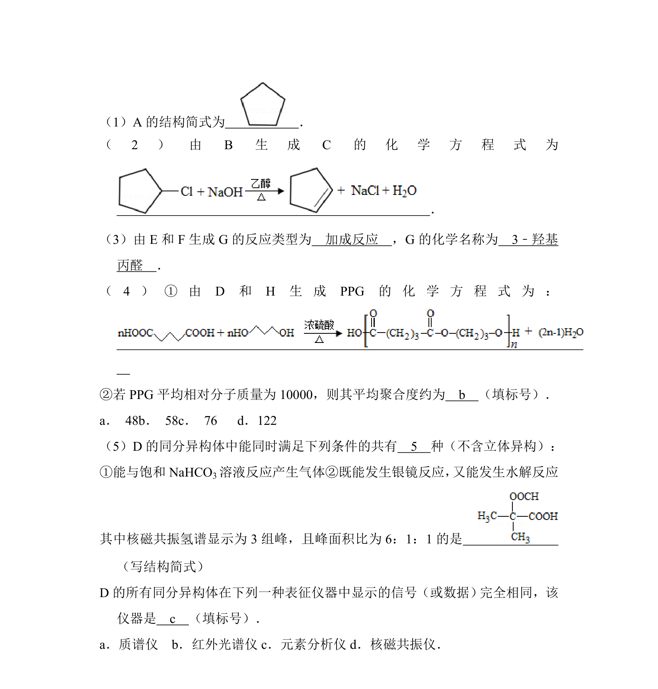
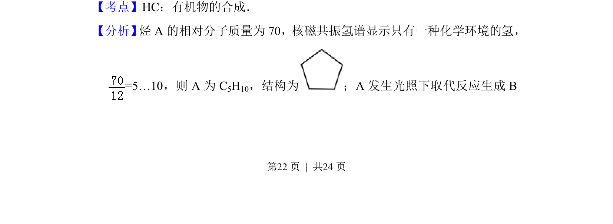
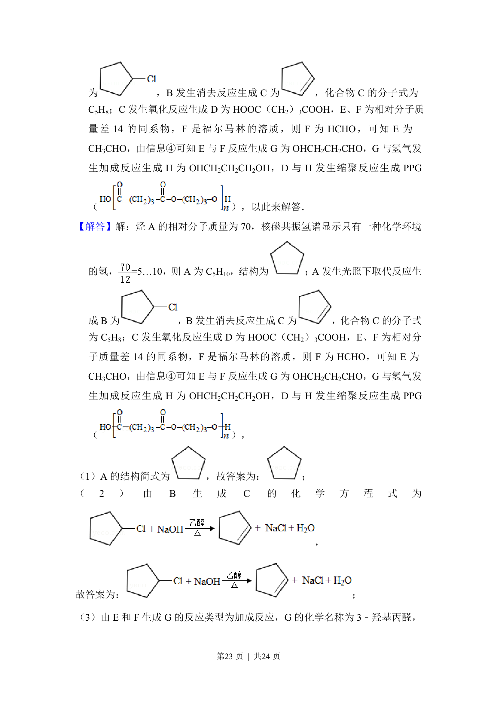
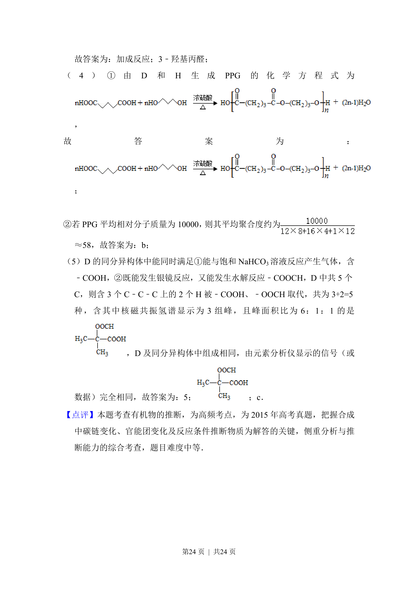

## 题面

## 摘要

有机合成路线推断，涉及高分子聚酯合成与已知条件分析。

## 关联考点

- [[716-有机物结构推断|有机物结构推断]]
- [[724-核磁共振氢谱|核磁共振氢谱]]
- [[659-同系物|同系物]]
- [[271-化学合成|有机合成]]

## 答案与解析

> 📄 原 PDF 第 21 页：`素材/真题/吉林/2008-2024·（吉林）化学高考真题/2015年高考化学试卷（新课标Ⅱ）（解析卷）.pdf`
