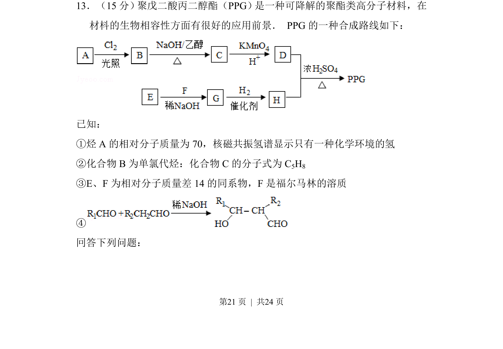
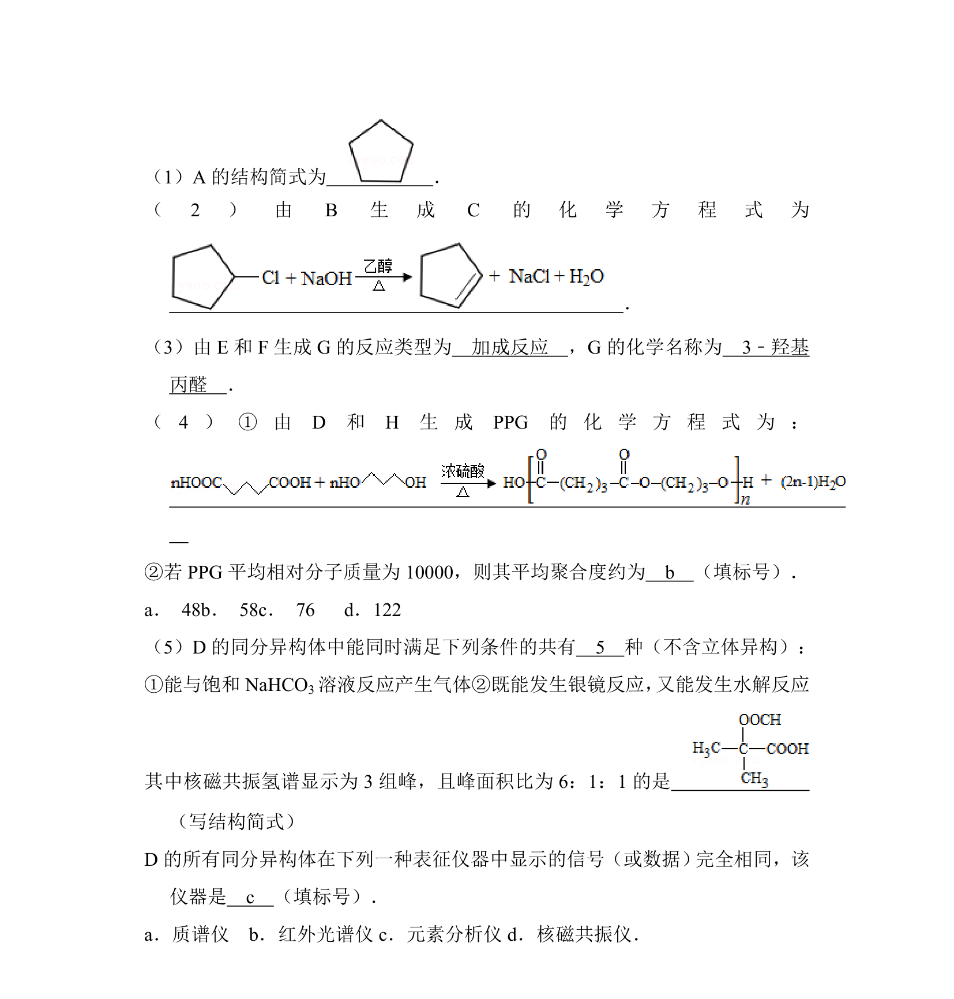
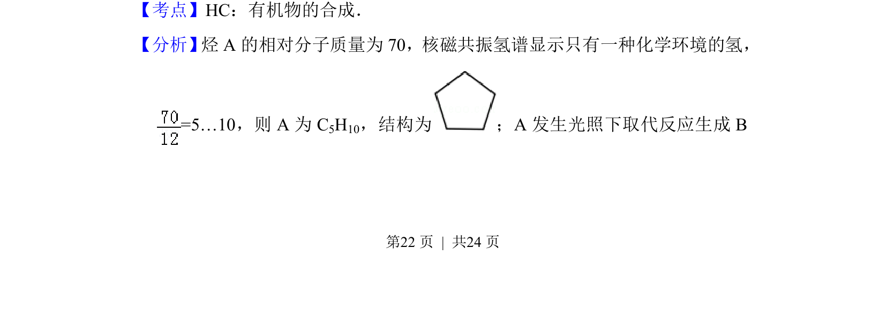
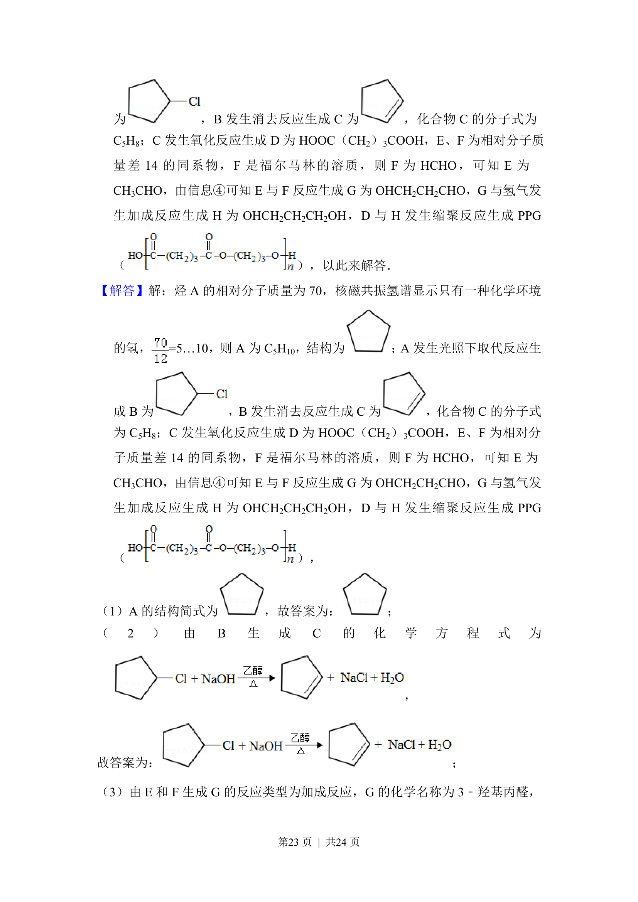
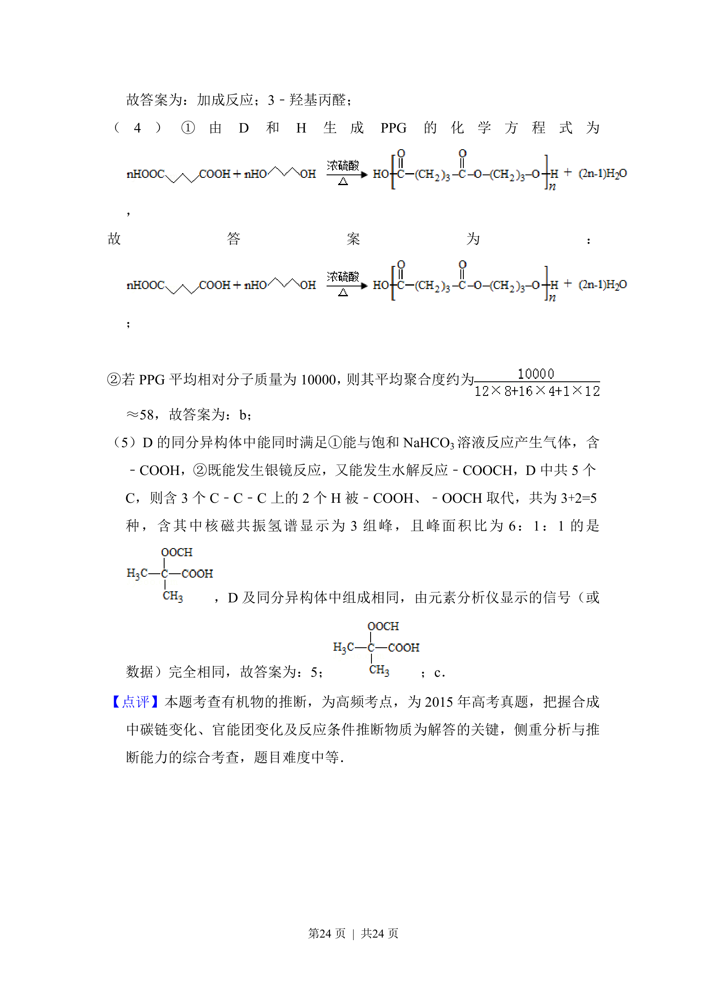

## 题面

## 摘要

有机合成路线推断，涉及高分子聚酯合成与已知条件分析。

## 关联考点

- [[715-有机物结构推断|有机物结构推断]]
- [[723-核磁共振氢谱|核磁共振氢谱]]
- [[658-同系物|同系物]]
- [[271-化学合成|有机合成]]

## 答案与解析

> 📄 原 PDF 第 21 页：`素材/真题/吉林/2008-2024·（吉林）化学高考真题/2015年高考化学试卷（新课标Ⅱ）（解析卷）.pdf`

<!-- 题干文本-start -->
## 题干文本
13．（15分） 聚戊二酸丙二醇酯（PPG） 是一种可降解的聚酯类高分子材料，在
材枓的生物相容性方面有很好的应用前景． PPG的一种合成路线如下：
已知：
①烃A的相对分子质量为70，核磁共振氢谱显示只有一种化学环境的氢
②化合物B为单氯代烃：化合物C的分子式为C 5H8
③E、F为相对分子质量差14的同系物，F是福尔马林的溶质
④
冋答下列问题：
<!-- 题干文本-end -->

<!-- 解析文本-start -->
## 解析文本

<!-- 解析文本-end -->
